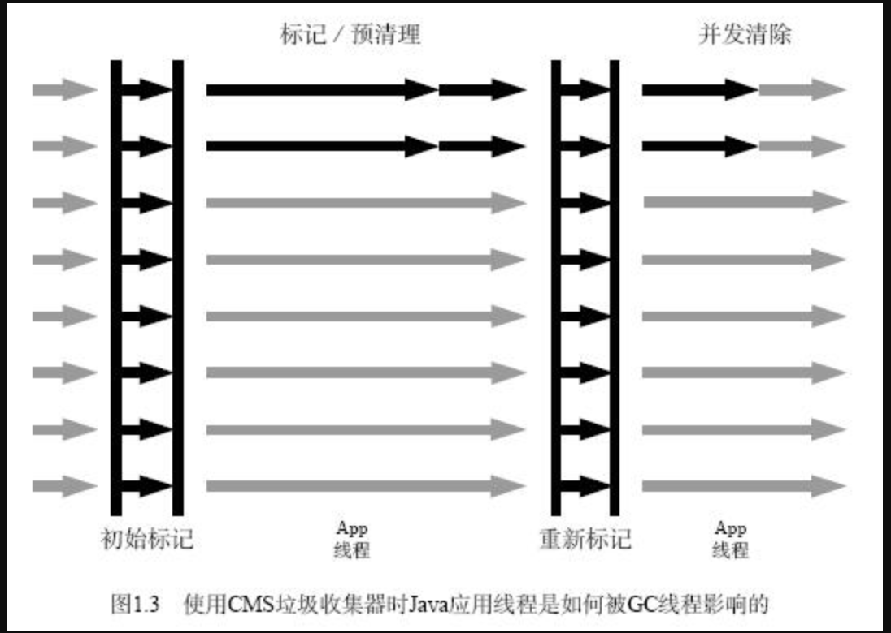

## jvm11-CMS

之前已经详细分析了young gc里面的ParNew的完整实现，现在我们来看一下old gc也就是cms算法的实现。

CMS是jvm第一个真正意义上的对象的分配和回收可以同时进行的回收器算法，之前都是STW后进行并发回收的。

CMS使用的是标记-清除算法，标记清除算法的特点就是容易引起堆碎片化，我们同样的会从内存的分配和内存的回收两个角度来分析CMS。

## Lisp2

那么在学习CMS具体实现之前，我们还是要先学习一下LISP2的算法实现。

Lisp2算法是一个历史悠久的回收算法，在2001年得到了并行回收的改进版本，大约在05、06年有了CMS的实现。Lisp2其实是一个标记-整理的算法。

**Lisp2算法需要遍历三次堆。**

- 第一阶段，回收器从Gc Roots开始，遍历所有存活对象，同时在遍历的过程中，会计算出每个存活对象的最终地址，并把这个指针保存在对象上（jvm中就是对象头）
- 第二次堆遍历过程，回收器将对象头重记录的转发地址来更新所有对该对象的引用，以确保这些指针指向新对象的位置
- 第三次堆遍历过程，将每一个存活对象移动到新的目标位置。

Lisp2算法的整理顺序是滑动顺序（任意顺序、线性顺序和滑动顺序）

##CMS的基本流程

CMS的回收流程：



这个就是CMS的4个流程，初始标记 -> 并发标记 -> 重新标记 -> 并发清除，其中初始标记和重新标记是需要STW的，其他时间都是可以和应用程序同时进行的。

实际上CMS内部区分的state并不是只有4中情况，而是如下所示的9种

```c++
enum CollectorState {
    Resizing            = 0, // 重新调整对大小
    Resetting           = 1, // 重置数据，为下一次的 cms gc 做准备。
    Idling              = 2, // 一次cms gc的初始状态
    InitialMarking      = 3, // 初始标记，GC Roots出发STW标记所有对象
    Marking             = 4, // 并发标记，和用户线程一起运行
    Precleaning         = 5, // 并发与清理，和用户线程一起
    AbortablePreclean   = 6, // 因为某些原因终止预清理。
    FinalMarking        = 7, // 最终标记，STW完善所有标记
    Sweeping            = 8  // 并发清理，清理未标记的对象
  };
```

## 一些基本概念

### Full GC和CMS GC

Full GC和CMS GC我们常常会搞错，以为只要触发了CMS GC就一定是Full GC，其实这是两件完全没有关系的事情，CMS GC只是针对老年代的一个业务程序并行、多GC线程并发的回收，而Full GC则是STW+压缩的GC算法。

###Foreground/Background GC

Foreground/Background GC是两种不同的GC模式，Background GC是有一个后台CMS Thread，会定时（2秒）去看一下是不是需要执行CMS GC，这是和应用程序代码并行的。而Foreground GC则是一个STW的算法，会完完整整的回收并压缩整个堆（压缩这件事情jdk8还有参数可以配置，再之后就没有参数可以配置了，默认每次都压缩）

其实Background GC就是CMS GC，Foreground GC就是Full GC。

##老年代结构

```c++
// ConcurrentMarkSweepGeneration.hpp（997）
class ConcurrentMarkSweepGeneration: public CardGeneration {
  static CMSCollector*       _collector; // 非常重要的一个类，gc相关的逻辑都在这里
  CompactibleFreeListSpace*  _cmsSpace;  // 放对象的那个数组空间，空闲链表分配
	// 还有一个从CardGeneration继承来的非常重要的一个字段
  CardTableRS* _rs; // 继承自CardGeneration，之前讲解理论的时候我们就知道CardTable的目的就是为了记录跨代引用的
}
```

##CMS Heap的初始化

```c++
jint CMSHeap::initialize() {
  // 父类的初始化逻辑
  // 初始化RememberSet
  // 初始化CardTableSet
  // 初始化YoungGeneration，初始化OldGeneration
  jint status = GenCollectedHeap::initialize();
  if (status != JNI_OK) return status;

  // 初始化GC并发线程池
  // 默认会使用基于信号量的任务分发
  // 这个ParallelGCThreads默认配置是0，但是在CmsArguments初始化的时候会针对机器配置进行默认的配置，如果核数 < 8就是核数个GC线程，如果核数大于8会通过如下式子计算
  // 比如72核会如下计算
  // 8 + ((ncpus - 8) * 5) / 8 =》8 + (72 - 8) * (5/8) == 48
  // 主要是为了防止GC线程数量过多
  _workers = new WorkGang("GC Thread", ParallelGCThreads,
                          /* are_GC_task_threads */true,
                          /* are_ConcurrentGC_threads */false);
  if (_workers == NULL) {
    return JNI_ENOMEM;
  }
  // 分配每一个工作线程的内存，然后启动每一个线程，启动的方式就是通过
  _workers->initialize_workers();

  // 创建用于内存回收的CmsCollector
  if (!create_cms_collector()) {
    // 如果创建失败，虚拟机启动失败
    return JNI_ENOMEM;
  }

  return JNI_OK;
}
```

CmsCollector初始化的逻辑非常复杂，下面大致整理一下：

1. 初始化\_markBitMap、\_modUnionTable、\_markStack
2. 初始化一个并发标记用的线程池和任务队列
3. 设置一些阀值
4. 开启**ConcurrentMarkSweepThread**线程，这个线程的作用就是每个2s（可配置）定时看一下是否需要进行一次CMS GC。
5. 初始化一些对象提升所需要的空间

到此为止我们的CMSHeap初始化工作就已经完成了。

> 这里需要注意一点，这里是堆的初始化，那么整个堆的空间是什么时候分配的呢？
>
> 其实是在new这个堆的时候就已经通过malloc分配完成了。
>
> ```java
> template <MEMFLAGS F> class CHeapObj ALLOCATION_SUPER_CLASS_SPEC {
>   public:
>   ALWAYSINLINE void* operator new(size_t size) throw() {
>     return (void*)AllocateHeap(size, F);
>   }
> }
> 
> char* AllocateHeap(size_t size,
>                    MEMFLAGS flags,
>                    AllocFailType alloc_failmode /* = AllocFailStrategy::EXIT_OOM*/) {
>   return AllocateHeap(size, flags, CALLER_PC);
> }
> 
> // allocate using malloc; will fail if no memory available
> char* AllocateHeap(size_t size,
>                    MEMFLAGS flags,
>                    const NativeCallStack& stack,
>                    AllocFailType alloc_failmode /* = AllocFailStrategy::EXIT_OOM*/) {
>   char* p = (char*) os::malloc(size, flags, stack);
>   if (p == NULL && alloc_failmode == AllocFailStrategy::EXIT_OOM) {
>     vm_exit_out_of_memory(size, OOM_MALLOC_ERROR, "AllocateHeap");
>   }
>   return p;
> }
> ```

### 年轻代对象提升到老年代

这里要注意，对象如果符合提升标准，需要从年轻代提升到老年代，优先会分配到PLAB中（见上一章），如果PLAB中的空间不够就会尝试调用老年代的这个方法，所以对于Young GC而言，最好的情况应该是对象的提升在PLAB中进行。下面这段逻辑其实可以理解成是一个兜底逻辑。

```c++
// Things to support parallel young-gen collection.
oop
ConcurrentMarkSweepGeneration::par_promote(int thread_num,
                                           oop old, markOop m,
                                           size_t word_sz) {
  if (CMSHeap::heap()->promotion_should_fail()) {
    return NULL;
  }

  // CMSHeap内部支持young gc的一个ThreadLocal state
  CMSParGCThreadState* ps = _par_gc_thread_states[thread_num];
  PromotionInfo* promoInfo = &ps->promo;
	// gc_prologue阶段会把tracking设置为true
  // 这个track就是把所有的对象都放到一个链表上
  if (promoInfo->tracking() && !promoInfo->ensure_spooling_space()) {
    if (!expand_and_ensure_spooling_space(promoInfo)) {
      return NULL;
    }
  }
  // 计算分配的内存空间大小
  const size_t alloc_sz = CompactibleFreeListSpace::adjustObjectSize(word_sz);
  // 从ThreadLocal中分配内存
  HeapWord* obj_ptr = ps->lab.alloc(alloc_sz);
  if (obj_ptr == NULL) {
	   // 如果分配不出来，就扩容然后再重试一次
     obj_ptr = expand_and_par_lab_allocate(ps, alloc_sz);
	   // 还是分配不出来，就直接return
     if (obj_ptr == NULL) {
       return NULL;
     }
  }
  
  // 通过指针获取oop对象
  oop obj = oop(obj_ptr);
  OrderAccess::storestore();
  // IMPORTANT: See note on object initialization for CMS above.
  // Otherwise, copy the object.  Here we must be careful to insert the
  // klass pointer last, since this marks the block as an allocated object.
  // Except with compressed oops it's the mark word.
  HeapWord* old_ptr = (HeapWord*)old;
  //拷贝对象头
  obj->set_mark_raw(m);
  OrderAccess::storestore();

  // 如果使用了压缩指针
  if (UseCompressedClassPointers) {
    // Copy gap missed by (aligned) header size calculation below
    obj->set_klass_gap(old->klass_gap());
  }
  if (word_sz > (size_t)oopDesc::header_size()) {
    Copy::aligned_disjoint_words(old_ptr + oopDesc::header_size(),
                                 obj_ptr + oopDesc::header_size(),
                                 word_sz - oopDesc::header_size());
  }

  if (promoInfo->tracking()) {
    promoInfo->track((PromotedObject*)obj, old->klass());
  }

  // Finally, install the klass pointer (this should be volatile).
  OrderAccess::storestore();
  obj->set_klass(old->klass());

  // 如果CMS GC已经进入标记阶段，需要在bitMap上标记一下这个对象被移动过，后续需要重新扫描，如果只是young gc的对象提升这块逻辑应该不会触发。
  collector()->promoted(true,          // parallel
                        obj_ptr, old->is_objArray(), word_sz);

  return obj;
}
```

##Background GC

Background GC就是前面提到的**ConcurrentMarkSweepThread**会每隔一段时间去轮询，这个线程的具体实现是这样的：

```c++
// concurrentMarkSweepThread.cpp（71）
void ConcurrentMarkSweepThread::run_service() {
  // 只要还能继续跑
  while (!should_terminate()) {
    // 等2s
    sleepBeforeNextCycle();
    // 如果应当退出就退出
    if (should_terminate()) break;
    GCIdMark gc_id_mark;
    // 设置GCCause
    GCCause::Cause cause = _collector->_full_gc_requested ?
      _collector->_full_gc_cause : GCCause::_cms_concurrent_mark;
    // CMSCollector执行gc逻辑
    _collector->collect_in_background(cause);
  }

  verify_ok_to_terminate();
}
```

下面我们看一下collect_in_background的实现，这段方法非常的长，但是非常的重要，是CMS BackgroundGC的和心逻辑

```c++
// concurrentMarkSweepGeneration.cpp（1709）
void CMSCollector::collect_in_background(GCCause::Cause cause) {
  assert(Thread::current()->is_ConcurrentGC_thread(),
    "A CMS asynchronous collection is only allowed on a CMS thread.");

  CMSHeap* heap = CMSHeap::heap();
  {
    bool safepoint_check = Mutex::_no_safepoint_check_flag;
    // 一些锁
    MutexLockerEx hl(Heap_lock, safepoint_check);
    FreelistLocker fll(this);
    MutexLockerEx x(CGC_lock, safepoint_check);
    // 如果已经存在foregroundGC，那么就跳过本次background gc
    if (_foregroundGCIsActive) {
      assert(!_foregroundGCShouldWait, "Should be clear");
      return;
    } else {
      // 初始状态assert，应当是Idling
      assert(_collectorState == Idling, "Should be idling before start.");
      // 把当前的状态从Idling翻成InitialMarking
      _collectorState = InitialMarking;
      // 计数统计+1
      register_gc_start(cause);
			// 清空堆扩张的原因
      clear_expansion_cause();

      // Clear the MetaspaceGC flag since a concurrent collection
      // is starting but also clear it after the collection.
      MetaspaceGC::set_should_concurrent_collect(false);
    }
    // 看是否需要卸载类
    // CMSClassUnloadingEnabled是否配置true && (间隔的时间比CMSClassUnloadingMaxInterval大 || 老年代太满)
    update_should_unload_classes();
    _full_gc_requested = false;           // acks all outstanding full gc requests
    _full_gc_cause = GCCause::_no_gc;
    // 增加一次Full GC的回收次数
    heap->increment_total_full_collections();
    _collection_count_start = heap->total_full_collections();
  }

  // 回收前大小
  size_t prev_used = _cmsGen->used();

  // 只要当前的收集状态不是Idling，这个状态上面已经翻成了InitialMarking
  while (_collectorState != Idling) {
    {
      // CMS Token是一个锁，主要是这个是GC是backgroundGC，有可能这个时候正好在执行ForegroundGC，所以这里需要一个锁
      // 这个CMSToken其实就是协调ForegroundGC和BackgroundGC的。
      CMSTokenSync x(true); // is cms thread
      // 这个就是如果正在ForegroundGC，就等待ForegroundGC执行完毕
      if (waitForForegroundGC()) {
        // 到了这里就说ForegroundGC已经结束了，刚刚结束一个ForegroundGC，所以什么都不用做了
        assert(_foregroundGCShouldWait == false, "We set it to false in "
               "waitForForegroundGC()");
        log_debug(gc, state)("CMS Thread " INTPTR_FORMAT " exiting collection CMS state %d",
                             p2i(Thread::current()), _collectorState);
        return;
      } else {
        // 这里再检查一下状态，这个地方再检查一下是因为有可能在这个时候刚好结束了一个ForegroundGC
        if (_collectorState == Idling) {
          break;
        }
      }
    }

    // 一个switch case
    switch (_collectorState) {
      case InitialMarking:
        {
          ReleaseForegroundGC x(this);
          stats().record_cms_begin();
          // new一个初始化标记的Operation
          VM_CMS_Initial_Mark initial_mark_op(this);
          // 给VMThread调度
          VMThread::execute(&initial_mark_op);
        }
        // The collector state may be any legal state at this point
        // since the background collector may have yielded to the
        // foreground collector.
        break;
      case Marking:
        // 并发标记
        if (markFromRoots()) { // we were successful
          assert(_collectorState == Precleaning, "Collector state should "
            "have changed");
        } else {
          assert(_foregroundGCIsActive, "Internal state inconsistency");
        }
        break;
      case Precleaning:
        // 预清理
        preclean();
        assert(_collectorState == AbortablePreclean ||
               _collectorState == FinalMarking,
               "Collector state should have changed");
        break;
      case AbortablePreclean:
        // 如果预清理失败才会到这个状态
        abortable_preclean();
        assert(_collectorState == FinalMarking, "Collector state should "
          "have changed");
        break;
      case FinalMarking:
        // 最终标记
        {
          ReleaseForegroundGC x(this);

          VM_CMS_Final_Remark final_remark_op(this);
          VMThread::execute(&final_remark_op);
        }
        assert(_foregroundGCShouldWait, "block post-condition");
        break;
      case Sweeping:
        // 清理
        sweep();
        assert(_collectorState == Resizing, "Collector state change "
          "to Resizing must be done under the free_list_lock");

      case Resizing: {
        // Sweeping has been completed...
        // At this point the background collection has completed.
        // Don't move the call to compute_new_size() down
        // into code that might be executed if the background
        // collection was preempted.
        // 清理完成结束，调用一些计算size的方法，做一些统计收集
        {
          ReleaseForegroundGC x(this);   // unblock FG collection
          MutexLockerEx       y(Heap_lock, Mutex::_no_safepoint_check_flag);
          CMSTokenSync        z(true);   // not strictly needed.
          if (_collectorState == Resizing) {
            compute_new_size();
            save_heap_summary();
            _collectorState = Resetting;
          } else {
            assert(_collectorState == Idling, "The state should only change"
                   " because the foreground collector has finished the collection");
          }
        }
        break;
      }
      case Resetting:
        // 重置到初始状态
        reset_concurrent();
        assert(_collectorState == Idling, "Collector state should "
          "have changed");

        MetaspaceGC::set_should_concurrent_collect(false);

        stats().record_cms_end();
        // Don't move the concurrent_phases_end() and compute_new_size()
        // calls to here because a preempted background collection
        // has it's state set to "Resetting".
        break;
      case Idling:
      default:
        ShouldNotReachHere();
        break;
    }
    log_debug(gc, state)("  Thread " INTPTR_FORMAT " done - next CMS state %d",
                         p2i(Thread::current()), _collectorState);
    assert(_foregroundGCShouldWait, "block post-condition");
  }

  // 一次GC结束，更新统计信息
  heap->counters()->update_counters();

  {
    // 翻一下_foregroundGCShouldWait的状态，让之前阻塞的线程继续执行
    MutexLockerEx x(CGC_lock, Mutex::_no_safepoint_check_flag);
    _foregroundGCShouldWait = false;
    if (_foregroundGCIsActive) {
      CGC_lock->notify();
    }
    assert(!ConcurrentMarkSweepThread::cms_thread_has_cms_token(),
           "Possible deadlock");
  }
  // 日志
  log_info(gc, heap)("Old: " SIZE_FORMAT "K->" SIZE_FORMAT "K("  SIZE_FORMAT "K)",
                     prev_used / K, _cmsGen->used()/K, _cmsGen->capacity() /K);
}
```

这个是整个CMS GC的一个大概流程，虽然具体的实现我们还没有深入研究，但是可以看到CMS的基本做法是一个while循环，然后通过一个switch case来交替不同GC阶段需要做的不同的事情。每一个case结束之后都会把state设置成下一个阶段的state，通过while循环不断推进GC State的变幻一次来达到推进流程的方式。

### InitialMarking

初始化标记做的事情就是并发的便利GC Roots，然后把遍历到的对象在CMSBitMap中标记一下。下面我们看一下具体的实现。

```c++
{
          ReleaseForegroundGC x(this);
          stats().record_cms_begin();
          VM_CMS_Initial_Mark initial_mark_op(this);
          VMThread::execute(&initial_mark_op);
        }
        break;
}
```

CMS的第一个阶段是初始标记，可以看到做法还是一个operation，然后交给VMThread。

> 回顾一下，VMThread会完整的执行一个VM_Operation的周期，比如执行前和执行后的Hook方法、设置并发线程、放到任务队列、设置开始时间戳等。

```c++
// cmsVMOperations.cpp（107）
// 这个就是初始标记的具体实现
void VM_CMS_Initial_Mark::doit() {
  // 这个就是检查当前的手机State是不是变成了Idling。
  if (lost_race()) {
    // Nothing to do.
    return;
  }
  HS_PRIVATE_CMS_INITMARK_BEGIN();
  GCIdMark gc_id_mark(_gc_id);

  _collector->_gc_timer_cm->register_gc_pause_start("Initial Mark");

  // 拿到堆
  CMSHeap* heap = CMSHeap::heap();
  GCCauseSetter gccs(heap, GCCause::_cms_initial_mark);

  VM_CMS_Operation::verify_before_gc();

  // 设置is_gc_active标志为true
  IsGCActiveMark x;
  // 具体执行
  _collector->do_CMS_operation(CMSCollector::CMS_op_checkpointRootsInitial, heap->gc_cause());

  VM_CMS_Operation::verify_after_gc();

  _collector->_gc_timer_cm->register_gc_pause_end();

  HS_PRIVATE_CMS_INITMARK_END();
}
```

```c++
// concurrentMarkSweepGeneration.cpp（5560）
void CMSCollector::do_CMS_operation(CMS_op_type op, GCCause::Cause gc_cause) {
  GCTraceCPUTime tcpu;
  TraceCollectorStats tcs_cgc(cgc_counters());

  switch (op) {
    // 初始标记执行的是这个方法，也就是调用checkpointRootsInitial
    case CMS_op_checkpointRootsInitial: {
      GCTraceTime(Info, gc) t("Pause Initial Mark", NULL, GCCause::_no_gc, true);
      SvcGCMarker sgcm(SvcGCMarker::CONCURRENT);
      checkpointRootsInitial();
      break;
    }
    case CMS_op_checkpointRootsFinal: {
      GCTraceTime(Info, gc) t("Pause Remark", NULL, GCCause::_no_gc, true);
      SvcGCMarker sgcm(SvcGCMarker::CONCURRENT);
      checkpointRootsFinal();
      break;
    }
    default:
      fatal("No such CMS_op");
  }
}

// concurrentMarkSweepGeneration.cpp（2798）
void CMSCollector::checkpointRootsInitial() {
  check_correct_thread_executing();
  TraceCMSMemoryManagerStats tms(_collectorState, CMSHeap::heap()->gc_cause());

  // 收集一些统计信息
  save_heap_summary();
  report_heap_summary(GCWhen::BeforeGC);

  // 获取引用处理器
  ReferenceProcessor* rp = ref_processor();
  assert(_restart_addr == NULL, "Control point invariant");
  {
    // 获取bitMapLock
    MutexLockerEx x(bitMapLock(),
                    Mutex::_no_safepoint_check_flag);
    // 初始标记
    checkpointRootsInitialWork();
    // enable ("weak") refs discovery
    rp->enable_discovery();
    // 之后将CMS的状态变更为Marking
    _collectorState = Marking;
  }
}

// concurrentMarkSweepGeneration.cpp（2822）
void CMSCollector::checkpointRootsInitialWork() {
	// 省略Assert

  // 允许卸载类（GC配置）&& （距离上一次CMS的时间 >= CMSClassUnloadingMaxInterval || CMS已经太满了）
  setup_cms_unloading_and_verification_state();

  GCTraceTime(Trace, gc, phases) ts("checkpointRootsInitialWork", _gc_timer_cm);

  // 如果需要的充值所有的PLAB Chunk，CMSPLABRecordAlways默认是true，所以这段逻辑一般情况下是走不进来的。
  if (_survivor_plab_array != NULL && !CMSPLABRecordAlways) {
    reset_survivor_plab_arrays();
  }

  ResourceMark rm;
  HandleMark  hm;

  MarkRefsIntoClosure notOlder(_span, &_markBitMap);
  CMSHeap* heap = CMSHeap::heap();

  verify_work_stacks_empty();
  verify_overflow_empty();

  // YoungGC也做过这样的事情，做一些填充，重新标记Mark的位置，从top指针开始
  heap->ensure_parsability(false);  
  heap->save_marks();

  // weak reference processing has not started yet.
  ref_processor()->set_enqueuing_is_done(false);

  // 记录一个新的header，所有新建的classLoader都会变成一个链表连到这个header之后。
  ClassLoaderDataGraph::remember_new_clds(true);

  // 清空所有ClassLoader的标记，之后遍历到的时候会重新设置
  ClassLoaderDataGraph::clear_claimed_marks();

  // 记录日志
  print_eden_and_survivor_chunk_arrays();

  {
    DerivedPointerTableDeactivate dpt_deact;
    // 多线程版本
    if (CMSParallelInitialMarkEnabled) {
      // 获取工作线程的数量
      WorkGang* workers = heap->workers();
      assert(workers != NULL, "Need parallel worker threads.");
      uint n_workers = workers->active_workers();

      StrongRootsScope srs(n_workers);

      CMSParInitialMarkTask tsk(this, &srs, n_workers);
      initialize_sequential_subtasks_for_young_gen_rescan(n_workers);
      // If the total workers is greater than 1, then multiple workers
      // may be used at some time and the initialization has been set
      // such that the single threaded path cannot be used.
      if (workers->total_workers() > 1) {
        workers->run_task(&tsk);
      } else {
        tsk.work(0);
      }
    } else {
      // 单线程版本略
      CLDToOopClosure cld_closure(&notOlder, ClassLoaderData::_claim_strong);
      heap->rem_set()->prepare_for_younger_refs_iterate(false); // Not parallel.

      StrongRootsScope srs(1);

      heap->cms_process_roots(&srs,
                             true,   // young gen as roots
                             GenCollectedHeap::ScanningOption(roots_scanning_options()),
                             should_unload_classes(),
                             &notOlder,
                             &cld_closure);
    }
  }

  // Save the end of the used_region of the constituent generations
  // to be used to limit the extent of sweep in each generation.
  save_sweep_limits();
  verify_overflow_empty();
}
```

```c++
// concurrentMarkSweepGeneration.cpp（4308）
void CMSParInitialMarkTask::work(uint worker_id) {
  elapsedTimer _timer;
  ResourceMark rm;
  HandleMark   hm;

  // ---------- scan from roots --------------
  _timer.start();
  CMSHeap* heap = CMSHeap::heap();
  // 生成年轻代根对象遍历闭包函数
  ParMarkRefsIntoClosure par_mri_cl(_collector->_span, &(_collector->_markBitMap));

  // ---------- young gen roots --------------
  // 处理年轻代的根对象
  {
    // 在年轻代执行上面生成的闭包函数
    work_on_young_gen_roots(&par_mri_cl);
    _timer.stop();
    log_trace(gc, task)("Finished young gen initial mark scan work in %dth thread: %3.3f sec", worker_id, _timer.seconds());
  }

  // ---------- remaining roots --------------
  _timer.reset();
  _timer.start();

  // ClassLoaderData的闭包处理函数
  CLDToOopClosure cld_closure(&par_mri_cl, ClassLoaderData::_claim_strong);

  // 在堆上执行遍历根对象
  heap->cms_process_roots(_strong_roots_scope,
                          false,     // yg was scanned above
                          GenCollectedHeap::ScanningOption(_collector->CMSCollector::roots_scanning_options()),
                          _collector->should_unload_classes(),
                          &par_mri_cl,
                          &cld_closure);

  _timer.stop();
  // 记录日志
  log_trace(gc, task)("Finished remaining root initial mark scan work in %dth thread: %3.3f sec", worker_id, _timer.seconds());
}
```

```c++
void CMSParMarkTask::work_on_young_gen_roots(OopsInGenClosure* cl) {
  // 年轻代的3个区域
  ParNewGeneration* young_gen = _collector->_young_gen;
  ContiguousSpace* eden_space = young_gen->eden();
  ContiguousSpace* from_space = young_gen->from();
  ContiguousSpace* to_space   = young_gen->to();

  // 这个地方chunk和index都是在新生代慢速分配过程中的抽样数据（默认所有数据）
  HeapWord** eca = _collector->_eden_chunk_array;
  size_t     ect = _collector->_eden_chunk_index;
  HeapWord** sca = _collector->_survivor_chunk_array;
  size_t     sct = _collector->_survivor_chunk_index;

  // 因为to的空间是所有数据都要遍历
  do_young_space_rescan(cl, to_space, NULL, 0);
  // eden和from只需要处理被抽样的数据
  // 这里为什么这么写有点不是很明白
  do_young_space_rescan(cl, from_space, sca, sct);
  do_young_space_rescan(cl, eden_space, eca, ect);
}

void
CMSParMarkTask::do_young_space_rescan(
  OopsInGenClosure* cl, ContiguousSpace* space,
  HeapWord** chunk_array, size_t chunk_top) {

  ResourceMark rm;
  HandleMark   hm;

  SequentialSubTasksDone* pst = space->par_seq_tasks();

  uint nth_task = 0;
  uint n_tasks  = pst->n_tasks();

  if (n_tasks > 0) {
    assert(pst->valid(), "Uninitialized use?");
    HeapWord *start, *end;
    while (pst->try_claim_task(/* reference */ nth_task)) {
      // 这里就是确定指针的上限和下限
      if (chunk_top == 0) {  // no samples were taken
        assert(nth_task == 0 && n_tasks == 1, "Can have only 1 eden task");
        start = space->bottom();
        end   = space->top();
      } else if (nth_task == 0) {
        start = space->bottom();
        end   = chunk_array[nth_task];
      } else if (nth_task < (uint)chunk_top) {
        assert(nth_task >= 1, "Control point invariant");
        start = chunk_array[nth_task - 1];
        end   = chunk_array[nth_task];
      } else {
        assert(nth_task == (uint)chunk_top, "Control point invariant");
        start = chunk_array[chunk_top - 1];
        end   = space->top();
      }
      // 上面确定了遍历的范围
      MemRegion mr(start, end);
      // 这里只需要对这块区域进行处理即可
      // 这个方法 young gc也出现过，就是下面这段伪代码的含义
      // while((addr = start) < end) {
      //     addr += oop_iterate_size(addr);
      // }
      // 这里用的闭包函数是ParMarkRefsIntoAndScanClosure，
      // 这个闭包函数的作用就是把GC Roots对象在bitMap中标记一下
      space->par_oop_iterate(mr, cl);
    }
    pst->all_tasks_completed();
  }
}
```

接下去是遍历剩余的根对象

```c++
  // ClassLoaderData的闭包处理函数
  CLDToOopClosure cld_closure(&par_mri_cl, ClassLoaderData::_claim_strong);

  // 在堆上执行遍历根对象
  heap->cms_process_roots(_strong_roots_scope,
                          false,     // yg was scanned above
                          GenCollectedHeap::ScanningOption(_collector->CMSCollector::roots_scanning_options()),
                          _collector->should_unload_classes(),
                          &par_mri_cl,
                          &cld_closure);
```

```c++
void CMSHeap::cms_process_roots(StrongRootsScope* scope,
                                bool young_gen_as_roots,
                                ScanningOption so,
                                bool only_strong_roots,
                                OopsInGenClosure* root_closure,
                                CLDClosure* cld_closure) {
  // 一些处理的闭包函数
  MarkingCodeBlobClosure mark_code_closure(root_closure, !CodeBlobToOopClosure::FixRelocations);
  CLDClosure* weak_cld_closure = only_strong_roots ? NULL : cld_closure;

  // 这个就是处理GC Roots集合
  // GC Roots内容和YoungGC基本类似，多了一个关于CodeCache的内容。
  // 由于这里使用的都是基于ParMarkRefsIntoClosure的闭包处理，所以本质上就是遍历到的对象在bitMap中做一个标记
  process_roots(scope, so, root_closure, cld_closure, weak_cld_closure, &mark_code_closure);

  // young_gen_as_roots已经处理完毕了，所以young_gen_as_roots在调用这个方法的时候就是false。
  if (young_gen_as_roots &&
      _process_strong_tasks->try_claim_task(GCH_PS_younger_gens)) {
    root_closure->set_generation(young_gen());
    young_gen()->oop_iterate(root_closure);
    root_closure->reset_generation();
  }

  _process_strong_tasks->all_tasks_completed(scope->n_threads());
}
```

### Marking

初始标记的逻辑已经结束，现在所有的GC Roots bitMap中已经被标记过了。下一步就是并发标记。下面我们看一下并发标记的具体实现。

```c++
case Marking:
// initial marking in checkpointRootsInitialWork has been completed
if (markFromRoots()) { // we were successful
  assert(_collectorState == Precleaning, "Collector state should "
         "have changed");
} else {
  assert(_foregroundGCIsActive, "Internal state inconsistency");
}
break;

bool CMSCollector::markFromRoots() {
	// 并发标记阶段代码线程和GC线程是并行的
  // 这也就意味着，在执行这阶段的时候，也是有可能发生Young GC的
  
  // 一些当前线程类型的断言
  check_correct_thread_executing();
  verify_overflow_empty();

  // Weak ref discovery note: We may be discovering weak
  // refs in this generation concurrent (but interleaved) with
  // weak ref discovery by the young generation collector.

  // 获取执行的CMSToken
  CMSTokenSyncWithLocks ts(true, bitMapLock());
  GCTraceCPUTime tcpu;
  CMSPhaseAccounting pa(this, "Concurrent Mark");
  // 并发标记
  bool res = markFromRootsWork();
  if (res) {
    // 如果成功就执行下一个PreCleaning的任务
    _collectorState = Precleaning;
  } else {
    // 失败就是因为foreground GC接管了这个流程
    assert(_foregroundGCIsActive, "internal state inconsistency");
    assert(_restart_addr == NULL,  "foreground will restart from scratch");
    log_debug(gc)("bailing out to foreground collection");
  }
  verify_overflow_empty();
  return res;
}

bool CMSCollector::markFromRootsWork() {
  // already have locks
  assert_lock_strong(bitMapLock());

  verify_work_stacks_empty();
  verify_overflow_empty();
  bool result = false;
  if (CMSConcurrentMTEnabled && ConcGCThreads > 0) {
    // 多线程标记
    result = do_marking_mt();
  } else {
    // 单线程，生产环境都是多线程，不会进入这段逻辑
    result = do_marking_st();
  }
  return result;
}
```

```c++
// 并发处理的具体实现
bool CMSCollector::do_marking_mt() {
  // 计算出具体的并发线程任务数
  uint num_workers = WorkerPolicy::calc_active_conc_workers(conc_workers()->total_workers(),
                                                            conc_workers()->active_workers(),
                                                            Threads::number_of_non_daemon_threads());
  num_workers = conc_workers()->update_active_workers(num_workers);
  log_info(gc,task)("Using %u workers of %u for marking", num_workers, conc_workers()->total_workers());

  // 老年代的完整空间
  CompactibleFreeListSpace* cms_space  = _cmsGen->cmsSpace();

  // new一个Task
  CMSConcMarkingTask tsk(this,
                         cms_space,
                         // 相当于线程池
                         conc_workers(),
                         // 任务队列
                         task_queues());

  // 按照线程数量计算和分配任务数
  cms_space ->initialize_sequential_subtasks_for_marking(num_workers);
	
  // 开始执行task
  conc_workers()->start_task(&tsk);
  // 如果任务状态是YIELDED，就等待任务完成
  while (tsk.yielded()) {
    // 这个就是如果任务还没有完成，自己就释放所有的锁，然后os::sleep睡一会儿，同时要判断睡醒之后是不是有foreGround GC等，然后重新获取锁执行下面的continue_task
    tsk.coordinator_yield();
    // 继续执行任务，直到完成、失败或者下一次被挂起，继续while循环
    conc_workers()->continue_task(&tsk);
  }
  // 这个就是_restart_addr不为空，可能发生了StackOverflow，所以就从_restart_addr的位置重新开始任务
  // 这里的StackOverflow就是上面说的oop_stack发生了溢出
  while (_restart_addr != NULL) {
    if (_foregroundGCIsActive) {
      _restart_addr = NULL;
      return false;
    }
    // Adjust the task to restart from _restart_addr
    tsk.reset(_restart_addr);
    cms_space ->initialize_sequential_subtasks_for_marking(num_workers,
                  _restart_addr);
    _restart_addr = NULL;
    // Get the workers going again
    conc_workers()->start_task(&tsk);
    while (tsk.yielded()) {
      tsk.coordinator_yield();
      conc_workers()->continue_task(&tsk);
    }
  }
  assert(tsk.completed(), "Inconsistency");
  assert(tsk.result() == true, "Inconsistency");
  return true;
}
```

那么我们重点看一下CMSConcMarkingTask的具体实现

```c++
void CMSConcMarkingTask::work(uint worker_id) {
  elapsedTimer _timer;
  ResourceMark rm;
  HandleMark hm;

  DEBUG_ONLY(_collector->verify_overflow_empty();)

  // Before we begin work, our work queue should be empty
  assert(work_queue(worker_id)->size() == 0, "Expected to be empty");
  // Scan the bitmap covering _cms_space, tracing through grey objects.
  _timer.start();
  // 这里就是执行核心的逻辑
  do_scan_and_mark(worker_id, _cms_space);
  _timer.stop();
  log_trace(gc, task)("Finished cms space scanning in %dth thread: %3.3f sec", worker_id, _timer.seconds());

  // ... do work stealing
  _timer.reset();
  _timer.start();
  // 偷人家的任务
  do_work_steal(worker_id);
  _timer.stop();
  log_trace(gc, task)("Finished work stealing in %dth thread: %3.3f sec", worker_id, _timer.seconds());
  // 这里为什么是>=，因为堆有可能会扩容，所以要大于等于
  assert(_global_finger >=  _cms_space->end(),
         "All tasks have been completed");
  DEBUG_ONLY(_collector->verify_overflow_empty();)
}

// 和Java线程并发执行
void CMSConcMarkingTask::do_scan_and_mark(int i, CompactibleFreeListSpace* sp) {
  SequentialSubTasksDone* pst = sp->conc_par_seq_tasks();
  int n_tasks = pst->n_tasks();
  uint nth_task = 0;

  HeapWord* aligned_start = sp->bottom();
  if (sp->used_region().contains(_restart_addr)) {
    // Align down to a card boundary for the start of 0th task
    // for this space.
    aligned_start = align_down(_restart_addr, CardTable::card_size);
  }

  size_t chunk_size = sp->marking_task_size();
  // 从工作队列中获取一个任务
  while (pst->try_claim_task(/* reference */ nth_task)) {
    // 获取到了任务，根据获取到的任务是第几个任务，来计算本次工作的工作区域
    MemRegion span = MemRegion(aligned_start + nth_task*chunk_size,
                               aligned_start + (nth_task+1)*chunk_size);
    // CAS修改finger，finger就是一个全局的工作进度标示
    HeapWord* finger = span.end();
    // CAS修改
    bump_global_finger(finger);
    // 这个就是CMS所有的使用区域和当前的工作区域求一个交集，其实就是找到当前工作区域哪些地方是正在使用的
    span = span.intersection(sp->used_region());
    // 当前工作区域确实有已经被分配出去的内存区域
    // 下面这段if else其实就是找到这个span区域的开头（具体有些逻辑也不是很清楚，就是可能有些区域的开头可能正好是某个对象的中间？或这块区域还在初始化中？所以可能这块span需要跳开一段距离，这个if else就是找到真正的开始指针）
    if (!span.is_empty()) {
      HeapWord* prev_obj;
      if (nth_task == 0) {
        // For the 0th task, we'll not need to compute a block_start.
        if (span.contains(_restart_addr)) {
          // In the case of a restart because of stack overflow,
          // we might additionally skip a chunk prefix.
          prev_obj = _restart_addr;
        } else {
          prev_obj = span.start();
        }
      } else {
        // We want to skip the first object because
        // the protocol is to scan any object in its entirety
        // that _starts_ in this span; a fortiori, any
        // object starting in an earlier span is scanned
        // as part of an earlier claimed task.
        // Below we use the "careful" version of block_start
        // so we do not try to navigate uninitialized objects.
        prev_obj = sp->block_start_careful(span.start());
        // Below we use a variant of block_size that uses the
        // Printezis bits to avoid waiting for allocated
        // objects to become initialized/parsable.
        while (prev_obj < span.start()) {
          size_t sz = sp->block_size_no_stall(prev_obj, _collector);
          if (sz > 0) {
            prev_obj += sz;
          } else {
            // In this case we may end up doing a bit of redundant
            // scanning, but that appears unavoidable, short of
            // locking the free list locks; see bug 6324141.
            break;
          }
        }
      }
      // 上面已经找到了真正的开始指针，这里就是划出整整需要扫描的区域
      if (prev_obj < span.end()) {
        MemRegion my_span = MemRegion(prev_obj, span.end());
        // 这个就是并发标记的闭包函数
        ParMarkFromRootsClosure cl(this, _collector, my_span,
                                   &_collector->_markBitMap,
                                   work_queue(i),
                                   &_collector->_markStack);
        // 前面初始标记已经标记过_markBitMap了，现在就在我们任务区域里面用cl这个闭包类去处理标记的对象
        _collector->_markBitMap.iterate(&cl, my_span.start(), my_span.end());
      }
    }
  }
  // 等待任务完成
  pst->all_tasks_completed();
}
```

下面我看看一下这个ParMarkFromRootsClosure这个闭包的具体实现。

```c++
// 这个闭包函数有一个do_bit方法，就是拿到一个偏移的bit位
bool ParMarkFromRootsClosure::do_bit(size_t offset) {
  if (_skip_bits > 0) {
    _skip_bits--;
    return true;
  }
  // convert offset into a HeapWord*
  HeapWord* addr = _bit_map->startWord() + offset;
  // 这个可能是一个还没有被初始化的对象
  if (_bit_map->isMarked(addr+1)) {
    // 跳开后面两位
    _skip_bits = 2;  // skip next two marked bits ("Printezis-marks")Printezis是JVM GC方面的专家
    // 转成一个oop对象
    oop p = oop(addr);
    // 这个oop的klazz不存在？基本数据类型？
    if (p->klass_or_null_acquire() == NULL) {
      // in the case of Clean-on-Enter optimization, redirty card
      // and avoid clearing card by increasing  the threshold.
      return true;
    }
  }
  // 处理这个地址
  scan_oops_in_oop(addr);
  return true;
}

void ParMarkFromRootsClosure::scan_oops_in_oop(HeapWord* ptr) {
  // 转成一个oop
  oop obj = oop(ptr);
  // fingle的位置继续向前移动
  _finger = ptr + obj->size();
  // On large heaps, it may take us some time to get through
  // the marking phase. During
  // this time it's possible that a lot of mutations have
  // accumulated in the card table and the mod union table --
  // these mutation records are redundant until we have
  // actually traced into the corresponding card.
  // Here, we check whether advancing the finger would make
  // us cross into a new card, and if so clear corresponding
  // cards in the MUT (preclean them in the card-table in the
  // future).

  // The clean-on-enter optimization is disabled by default,
  // until we fix 6178663.
  if (CMSCleanOnEnter && (_finger > _threshold)) {
    // [_threshold, _finger) represents the interval
    // of cards to be cleared  in MUT (or precleaned in card table).
    // The set of cards to be cleared is all those that overlap
    // with the interval [_threshold, _finger); note that
    // _threshold is always kept card-aligned but _finger isn't
    // always card-aligned.
    HeapWord* old_threshold = _threshold;
    assert(is_aligned(old_threshold, CardTable::card_size),
           "_threshold should always be card-aligned");
    _threshold = align_up(_finger, CardTable::card_size);
    MemRegion mr(old_threshold, _threshold);
    assert(!mr.is_empty(), "Control point invariant");
    assert(_span.contains(mr), "Should clear within span"); // _whole_span ??
    _mut->clear_range(mr);
  }

  // Note: the local finger doesn't advance while we drain
  // the stack below, but the global finger sure can and will.
  HeapWord* volatile* gfa = _task->global_finger_addr();
  ParPushOrMarkClosure pushOrMarkClosure(_collector,
                                         _span, _bit_map,
                                         _work_queue,
                                         _overflow_stack,
                                         _finger,
                                         gfa, this);
  bool res = _work_queue->push(obj);   // overflow could occur here
  assert(res, "Will hold once we use workqueues");
  while (true) {
    oop new_oop;
    if (!_work_queue->pop_local(new_oop)) {
      // We emptied our work_queue; check if there's stuff that can
      // be gotten from the overflow stack.
      if (CMSConcMarkingTask::get_work_from_overflow_stack(
            _overflow_stack, _work_queue)) {
        do_yield_check();
        continue;
      } else {  // done
        break;
      }
    }
    // Skip verifying header mark word below because we are
    // running concurrent with mutators.
    assert(oopDesc::is_oop(new_oop, true), "Oops! expected to pop an oop");
    // now scan this oop's oops
    new_oop->oop_iterate(&pushOrMarkClosure);
    do_yield_check();
  }
  assert(_work_queue->size() == 0, "tautology, emphasizing post-condition");
}
```


## CMS的锁

这里需要讲解一下在这个过程中的并发是如何同步的，我们知道CMS GC分为background和foreground两种模式，万一某一个GC流程走到一半，突然另一个模式的的GC也要执行，这种CMS是如何处理的。


