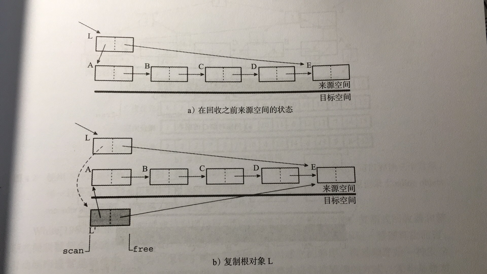
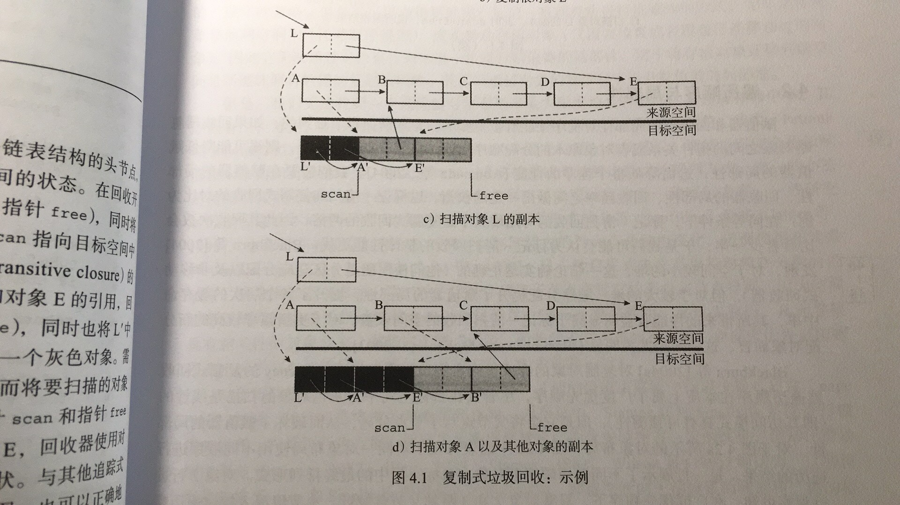
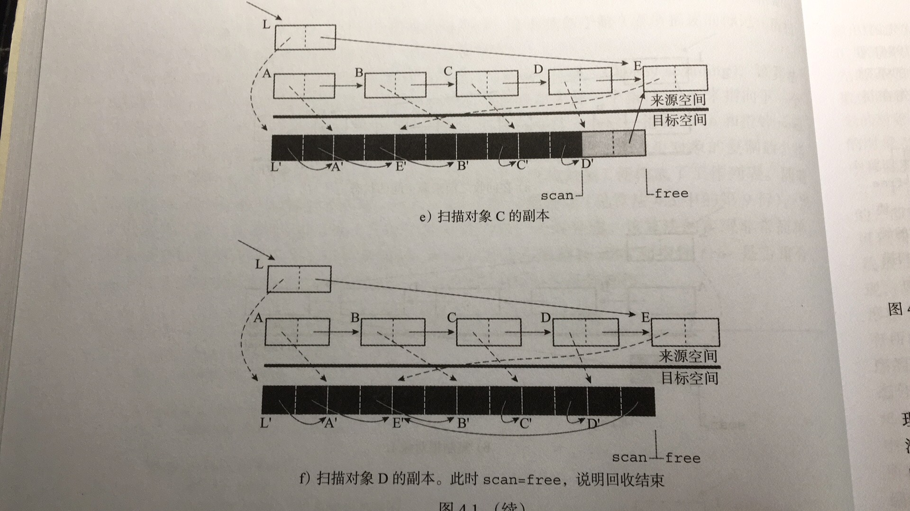

#jvm10-ParNew

ParNew和CMS是两个非常常用的算法，也是Java在互联网时代到目前为止使用的最多的gc算法，而且目前各大互联网公司主流的gc算法还是ParNew和CMS，因此学习这两个算法对我们日常的工作也有非常高的指导意义。

ParNew使用的算法就是之前讲概述的时候提到过的非常重要的**Cheney Scanning**，如果能理解这个算法，对我们理解ParNew的流程和实现有非常重要的帮助。

## Cheney Scanning

1. 记录to_space的bottom指针作为一个标记P
2. 遍历所有的根对象，把所有扫描到的根拷贝到to_space，并且在原对象头上增加一个forwarded_ptr的指针作为标记
3. 第二步处理完之后，所有的根对象都被拷贝to_space的一侧，从bottom开始，此时这些对象都是灰色对象（自己已经被扫描到，但是衍生对象还没有被全部处理完）
4. 从P开始逐个遍历每一个指针，并处理每一个对象，如果把该对象处理完，则把该对象变为黑色，P指针向前移动，直到P指针追上Top指针为止即可。


Cheney Scanning使用了to_space作为一个隐式队列，做到了仅用一个指针就完成了广度优先遍历。这里的使用to_space作为隐式队列含义就是，使用to_space的复制后的对象排列顺序作为先进先出的队列。

下面再引用一段《垃圾回收算法手册》的流程图进一步补充理解：







##ParNew Generation概览

```c++
// parNewGeneration.cpp（312）
// 可以看到ParNewGeneration是基于DefNewGeneration的，所以我们学习的时候可以把单线程相对简单的DefNew算法作为理解ParNew的重点
class ParNewGeneration: public DefNewGeneration {
  // 省略
}
```

ParNewGeneration是DefNewGeneration的一个子类

```c++
class DefNewGeneration: public Generation {
	// 老年代
  Generation* _old_gen;
  AgeTable    _age_table; // 下面解释这个东西的作用
	// Spaces
  // 这里就是我们常说的eden + from + to的Young区分布
  ContiguousSpace* _eden_space;
  ContiguousSpace* _from_space;
  ContiguousSpace* _to_space;
}
```

### AgeTable

AgeTable这里要单独解释一下，这个类的作用就是我们知道Young区的对象的需要到一定的岁数之后会被提升到Old区（默认是15岁，因为对象头记录age只有4个bit位，也就是0-15），但是虚拟机对对象的提升并不是全部都是到了15岁才提升，而是会根据一些情况动态计算本次需要提升的年龄，这个AgeTable就是记录目前所有对象的一个分布情况，他的结构就是一个Map<年龄，该年龄的对象总大小>。

###Closure

```c++
// iterator.hpp（42）
// 这个就是一个类似闭包函数，像是一个操作的感觉，GC的堆会执行各种这样的闭包函数
class Closure : public StackObj { };

// OopClosure就是针对Java对象操作的闭包函数
class OopClosure : public Closure {
 public:
  virtual void do_oop(oop* o) = 0;
  virtual void do_oop(narrowOop* o) = 0;
};
```

上面介绍了Closure，列举几个典型的Closure

```c++
class IsAliveClosure: public BoolObjectClosure {
}

class KeepAliveClosure: public OopClosure {
}

class FastKeepAliveClosure: public KeepAliveClosure {
}
```

## 内存分配的实现

```c++
// 通用内存分配的代码实现（见jvm9）
Generation *young = _young_gen;
assert(young->supports_inline_contig_alloc(),
       "Otherwise, must do alloc within heap lock");
if (young->should_allocate(size, is_tlab)) {
  result = young->par_allocate(size, is_tlab);
  if (result != NULL) {
    // 分配成功就直接返回
    assert(is_in_reserved(result), "result not in heap");
    return result;
  }
}
```

所以我们其实需要关注的是**par_allocate**函数。下面我们就看一下在年轻代分配内存的具体实现。

```c++
// defNewGeneration.cpp（981）
HeapWord* DefNewGeneration::par_allocate(size_t word_size,
                                         bool is_tlab) {
  HeapWord* res = eden()->par_allocate(word_size);
  if (_old_gen != NULL) {
    _old_gen->sample_eden_chunk();
  }
  return res;
}
```

```c++
HeapWord* ContiguousSpace::par_allocate(size_t size) {
  return par_allocate_impl(size);
}

// 这里的实现其实就是用一个死循环，然后不停的通过CAS的原子操作来改变堆顶指针的位置
inline HeapWord* ContiguousSpace::par_allocate_impl(size_t size) {
  do {
    HeapWord* obj = top();
    if (pointer_delta(end(), obj) >= size) {
      HeapWord* new_top = obj + size;
      HeapWord* result = Atomic::cmpxchg(new_top, top_addr(), obj);
      // result can be one of two:
      //  the old top value: the exchange succeeded
      //  otherwise: the new value of the top is returned.
      if (result == obj) {
        assert(is_aligned(obj) && is_aligned(new_top), "checking alignment");
        return obj;
      }
    } else {
      return NULL;
    }
  } while (true);
}
```

> 大家要注意的是内存的分配始终都是有快速分配和慢速分配，进到这里的代码都是慢速分配的路径进来的，如果TLAB和简单的指针碰撞可以分配内存的话是不会进到这里的。

## 内存的回收

```c++
// 触发一次GC的代码（见jvm9）
VM_GenCollectForAllocation op(size, is_tlab, gc_count_before);
// 这里会获取Safepoint的全局锁
// VMThread内部有一个VMOperationQueue，这个Queue有一个优先级的概念，凡是需要Safepoint的都是优先级较高的
// 这个优先级队列的实现也比较粗暴，没有使用类似排序树的数据结构，就是两个数组：high_priority和low_priority，获取队列下一个元素的时候优先从high_priority数组中获取元素
// ParNew是一个需要STW的算法
VMThread::execute(&op);
```

operation具体的实现

```c++
// gcVMOperations.cpp（159）
void VM_GenCollectForAllocation::doit() {
  SvcGCMarker sgcm(SvcGCMarker::MINOR);

  GenCollectedHeap* gch = GenCollectedHeap::heap();
  GCCauseSetter gccs(gch, _gc_cause);
  // satisfy_failed_allocation方法是核心
  _result = gch->satisfy_failed_allocation(_word_size, _tlab);
  assert(gch->is_in_reserved_or_null(_result), "result not in heap");

  if (_result == NULL && GCLocker::is_active_and_needs_gc()) {
    set_gc_locked();
  }
}
```

```c++
// genCollectedHeap（695）
HeapWord* GenCollectedHeap::satisfy_failed_allocation(size_t size, bool is_tlab) {
  GCCauseSetter x(this, GCCause::_allocation_failure);
  HeapWord* result = NULL;

  assert(size != 0, "Precondition violated");
  // 当前是否已经正在gc中
  if (GCLocker::is_active_and_needs_gc()) {
    // 看是否还有足够的空间扩容
    if (!is_maximal_no_gc()) {
      // 扩容并分配
      result = expand_heap_and_allocate(size, is_tlab);
    }
    // 如果无法扩容就返回null
    return result; 
  } else if (!incremental_collection_will_fail(false)) { // 这个方法就是预估本次gc是否大概率会失败，比如上一次分配是不是失败 
    // 如果预估本次回收大概率不会失败，就进行一次young gc
    do_collection(false,                     // full
                  false,                     // clear_all_soft_refs
                  size,                      // size
                  is_tlab,                   // is_tlab
                  GenCollectedHeap::OldGen); // max_generation
  } else {
    log_trace(gc)(" :: Trying full because partial may fail :: ");
    // 直接进行fullgc，因为认为本次young gc大概率会失败，所以就跳开younggc直接进入fullgc
    // 这里需要注意的是这是触发了一次young gc，但是可能直接进行full gc
    do_collection(true,                      // full
                  false,                     // clear_all_soft_refs
                  size,                      // size
                  is_tlab,                   // is_tlab
                  GenCollectedHeap::OldGen); // max_generation
  }

  // 回收完了就分配
  result = attempt_allocation(size, is_tlab, false /*first_only*/);

  // 如果分配的结果不为空，就说明分配成功
  if (result != NULL) {
    assert(is_in_reserved(result), "result not in heap");
    return result;
  }

  // 分配失败，就尝试扩容堆并再次分配
  result = expand_heap_and_allocate(size, is_tlab);
  // 分配如果成功就return
  if (result != NULL) {
    return result;
  }

  // 到了这段逻辑就说明我们尝试了young gc和堆扩容，但是都没有作用，所以就执行一次full gc。这次会尝试回收整个堆内所有能回收的东西，比如SoftReference等
  {
    UIntFlagSetting flag_change(MarkSweepAlwaysCompactCount, 1); // GC并压缩整个堆

    do_collection(true,                      // full
                  true,                      // clear_all_soft_refs
                  size,                      // size
                  is_tlab,                   // is_tlab
                  GenCollectedHeap::OldGen); // max_generation
  }

  // 再次尝试分配
  result = attempt_allocation(size, is_tlab, false /* first_only */);
  if (result != NULL) {
    assert(is_in_reserved(result), "result not in heap");
    return result;
  }

  assert(!soft_ref_policy()->should_clear_all_soft_refs(),
    "Flag should have been handled and cleared prior to this point");

  // 无计可施，OutOfMemory
  return NULL;
}
```

下面看do_collection方法的实现

```c++
// genCollectedHeap（540）
void GenCollectedHeap::do_collection(bool           full,
                                     bool           clear_all_soft_refs,
                                     size_t         size,
                                     bool           is_tlab,
                                     GenerationType max_generation) {
  ResourceMark rm;
  // 省略一堆assert

  if (GCLocker::check_active_before_gc()) {
    return; // GC is disabled (e.g. JNI GetXXXCritical operation)
  }

  GCIdMark gc_id_mark;

  // 看是否需要清理软引用，clear_all_soft_refs是作为参数传进来的，这个soft_ref_policy就是一个策略，这个should_clear_all_soft_refs的变量是在需要的时候主动设置的，比如old gc回收的空间不够，出发full gc的时候就会把这个设置为true
  const bool do_clear_all_soft_refs = clear_all_soft_refs ||
                          soft_ref_policy()->should_clear_all_soft_refs();

  ClearedAllSoftRefs casr(do_clear_all_soft_refs, soft_ref_policy());

  const size_t metadata_prev_used = MetaspaceUtils::used_bytes();

  // 输出gc日志（这里一定要注意，输出这个before_gc的日志的时候真正的gc逻辑还没有开始）
  print_heap_before_gc();

  {
    // 立一个全局Flag
    FlagSetting fl(_is_gc_active, true);

    // 判断是young、old和full gc
    bool complete = full && (max_generation == OldGen);
    bool old_collects_young = complete && !ScavengeBeforeFullGC;
    bool do_young_collection = !old_collects_young && _young_gen->should_collect(full, size, is_tlab);

    FormatBuffer<> gc_string("%s", "Pause ");
    if (do_young_collection) {
      gc_string.append("Young");
    } else {
      gc_string.append("Full");
    }

    // 记录gc的性能耗时等
    GCTraceCPUTime tcpu;
    GCTraceTime(Info, gc) t(gc_string, NULL, gc_cause(), true);

    // gc hook方法，相当于beforeGc()，在执行前做一点事情
    // 主要是一些比如ThreadLocalAllocateBuffer未分配的部分填充，这么做的原因是gc前把这些部分填充之后，这样对整个堆可以从top指针开始线性解析
    gc_prologue(complete);
    // gc次数+1，如果是full gc，就full gc次数+1
    increment_total_collections(complete);

    size_t young_prev_used = _young_gen->used();
    size_t old_prev_used = _old_gen->used();

    bool run_verification = total_collections() >= VerifyGCStartAt;

    bool prepared_for_verification = false;
    bool collected_old = false;

    if (do_young_collection) {
      if (run_verification && VerifyGCLevel <= 0 && VerifyBeforeGC) {
        prepare_for_verify();
        prepared_for_verification = true;
      }

      // 具体的回收
      collect_generation(_young_gen,
                         full,
                         size,
                         is_tlab,
                         run_verification && VerifyGCLevel <= 0,
                         do_clear_all_soft_refs,
                         false);

      if (size > 0 && (!is_tlab || _young_gen->supports_tlab_allocation()) &&
          size * HeapWordSize <= _young_gen->unsafe_max_alloc_nogc()) {
        // Allocation request was met by young GC.
        size = 0;
      }
    }

    bool must_restore_marks_for_biased_locking = false;

    if (max_generation == OldGen && _old_gen->should_collect(full, size, is_tlab)) {
      if (!complete) {
        // The full_collections increment was missed above.
        increment_total_full_collections();
      }

      if (!prepared_for_verification && run_verification &&
          VerifyGCLevel <= 1 && VerifyBeforeGC) {
        prepare_for_verify();
      }

      if (do_young_collection) {
        // We did a young GC. Need a new GC id for the old GC.
        GCIdMark gc_id_mark;
        GCTraceTime(Info, gc) t("Pause Full", NULL, gc_cause(), true);
        collect_generation(_old_gen, full, size, is_tlab, run_verification && VerifyGCLevel <= 1, do_clear_all_soft_refs, true);
      } else {
        // No young GC done. Use the same GC id as was set up earlier in this method.
        collect_generation(_old_gen, full, size, is_tlab, run_verification && VerifyGCLevel <= 1, do_clear_all_soft_refs, true);
      }

      must_restore_marks_for_biased_locking = true;
      collected_old = true;
    }

    // 看是否回收结束
    complete = complete || collected_old;

    // 看回收置换的结果
    if (collected_old) {
      _old_gen->compute_new_size();
    }
    _young_gen->compute_new_size();

    // 如果是full gc
    if (complete) {
      // 卸载不用的类加载器和类等
      ClassLoaderDataGraph::purge();
      MetaspaceUtils::verify_metrics();
      // 重新计算metaspace的大小
      MetaspaceGC::compute_new_size();
      update_full_collections_completed();
    }

    // 增加gc结果
    print_heap_change(young_prev_used, old_prev_used);
    // 打印metaspace的变化结果
    MetaspaceUtils::print_metaspace_change(metadata_prev_used);

    // Track memory usage and detect low memory after GC finishes
    MemoryService::track_memory_usage();

    // gc后置钩子方法
    gc_epilogue(complete);

    if (must_restore_marks_for_biased_locking) {
      BiasedLocking::restore_marks();
    }
  }

  // 打印gc日志
  print_heap_after_gc();

#ifdef TRACESPINNING
  ParallelTaskTerminator::print_termination_counts();
#endif
}
```

下面是重点的collect_generation的实现

```c++
// genCollectedHeap（458）
void GenCollectedHeap::collect_generation(Generation* gen, bool full, size_t size,
                                          bool is_tlab, bool run_verification, bool clear_soft_refs,
                                          bool restore_marks_for_biased_locking) {
  // 打一些trace的信息
  FormatBuffer<> title("Collect gen: %s", gen->short_name());
  GCTraceTime(Trace, gc, phases) t1(title);
  TraceCollectorStats tcs(gen->counters());
  TraceMemoryManagerStats tmms(gen->gc_manager(), gc_cause());

  gen->stat_record()->invocations++;
  gen->stat_record()->accumulated_time.start();

  // 记录gc开始前的堆的start指针
  record_gen_tops_before_GC();

  // 日志
  log_trace(gc)("%s invoke=%d size=" SIZE_FORMAT, heap()->is_young_gen(gen) ? "Young" : "Old", gen->stat_record()->invocations, size * HeapWordSize);

  if (run_verification && VerifyBeforeGC) {
    HandleMark hm;  // Discard invalid handles created during verification
    Universe::verify("Before GC");
  }
  COMPILER2_PRESENT(DerivedPointerTable::clear());

  if (restore_marks_for_biased_locking) {
    // We perform this mark word preservation work lazily
    // because it's only at this point that we know whether we
    // absolutely have to do it; we want to avoid doing it for
    // scavenge-only collections where it's unnecessary
    BiasedLocking::preserve_marks();
  }

  // Do collection work
  {
    // Note on ref discovery: For what appear to be historical reasons,
    // GCH enables and disabled (by enqueing) refs discovery.
    // In the future this should be moved into the generation's
    // collect method so that ref discovery and enqueueing concerns
    // are local to a generation. The collect method could return
    // an appropriate indication in the case that notification on
    // the ref lock was needed. This will make the treatment of
    // weak refs more uniform (and indeed remove such concerns
    // from GCH). XXX

    HandleMark hm;  // 这个类会清理掉在gc过程中生成的所有handle（句柄）
    save_marks();   // 重置所有的mark指针，全部从头开始，这里的mark就是我上面图示中的P指针
    // 这个类封装了Java的Reference类型的类的GC。
    ReferenceProcessor* rp = gen->ref_processor();
    // If the discovery of ("weak") refs in this generation is
    // atomic wrt other collectors in this configuration, we
    // are guaranteed to have empty discovered ref lists.
    if (rp->discovery_is_atomic()) {
      rp->enable_discovery();
      rp->setup_policy(clear_soft_refs);
    } else {
      // collect() below will enable discovery as appropriate
    }
    // 真正的回收逻辑
    gen->collect(full, clear_soft_refs, size, is_tlab);
    if (!rp->enqueuing_is_done()) {
      rp->disable_discovery();
    } else {
      rp->set_enqueuing_is_done(false);
    }
    rp->verify_no_references_recorded();
  }

  COMPILER2_PRESENT(DerivedPointerTable::update_pointers());

  // gc结束的一些记录
  gen->stat_record()->accumulated_time.stop();

  // 更新一些统计数据
  update_gc_stats(gen, full);

  if (run_verification && VerifyAfterGC) {
    HandleMark hm;  // Discard invalid handles created during verification
    Universe::verify("After GC");
  }
}
```

下面我们看ParNew的collect的具体实现，这个算法实现比较长

```c++
// parNewGeneration.cpp（854）
void ParNewGeneration::collect(bool   full,
                               bool   clear_all_soft_refs,
                               size_t size,
                               bool   is_tlab) {
  assert(full || size > 0, "otherwise we don't want to collect");

  // 这也是为什么ParNew一定要和CMS绑定配合使用
  CMSHeap* gch = CMSHeap::heap();

  // 还是记录一些gc开始的时间
  _gc_timer->register_gc_start();

  AdaptiveSizePolicy* size_policy = gch->size_policy();
  // 多线程收集，拿到所有的工作线程
  WorkGang* workers = gch->workers();
  assert(workers != NULL, "Need workgang for parallel work");
  // 活着的工作线程
  uint active_workers =
      WorkerPolicy::calc_active_workers(workers->total_workers(),
                                        workers->active_workers(),
                                        Threads::number_of_non_daemon_threads());
  active_workers = workers->update_active_workers(active_workers);
  log_info(gc,task)("Using %u workers of %u for evacuation", active_workers, workers->total_workers());

  _old_gen = gch->old_gen();

  // 如果老年代已经太满了，如果最差的情况所有年轻代都要晋升，那么就跳过年轻代回收，直接进入老年代。
  // 这里要注意一个很重要的坑，就是上面gc的日志已经打了一部分了，但是其实young gc没有真正的执行就直接跳过了
  if (!collection_attempt_is_safe()) {
    gch->set_incremental_collection_failed();
    return;
  }
  assert(to()->is_empty(), "Else not collection_attempt_is_safe");

  // gc追踪
  _gc_tracer.report_gc_start(gch->gc_cause(), _gc_timer->gc_start());
  gch->trace_heap_before_gc(gc_tracer());

  init_assuming_no_promotion_failure();

  GCTraceTime(Trace, gc, phases) t1("ParNew", NULL, gch->gc_cause());

  // 清空AgeTable
  age_table()->clear();
  // 清空to区域
  to()->clear(SpaceDecorator::Mangle);

  // 老年代在重置一下mark指针
  gch->save_marks();

  // 设置并发数量
  ref_processor()->set_active_mt_degree(active_workers);

  // Need to initialize the preserved marks before the ThreadStateSet c'tor.
  _preserved_marks_set.init(active_workers);

  // TaskTerminator就是让所有并发任务结束的一个类
  TaskTerminator _term(active_workers, task_queues());
  // 这个就是每个线程都有一个管理的上下文State叫ParScanThreadState，然后所有线程的集合就是ParScanThreadStateSet，ParScanThreadState里面放的就是每个线程所需要的闭包函数，以及一些相关的上下文和需要的私有变量。这里相当于就是把一个大的任务包切割成gc线程个数的小任务。然后每一个线程都是操作这个上下文中的一些数据，比如AgetTable、p等空间都是当前线程上下文的，这样的目的也是希望通过ThreadLocal来提高性能，防止线程之间频繁的争用锁或者频繁的CAS自旋
  ParScanThreadStateSet thread_state_set(active_workers,
                                         *to(), *this, *_old_gen, *task_queues(),
                                         _overflow_stacks, _preserved_marks_set,
                                         desired_plab_sz(), _term);

  thread_state_set.reset(active_workers, promotion_failed());

  {
    StrongRootsScope srs(active_workers);

    // ParNew任务Task
    ParNewGenTask tsk(this, _old_gen, reserved().end(), &thread_state_set, &srs);
    // rem_set()获取到的就是CardTable，让CardTable准备好年轻代的扫描，就是设置还没有用过的CardTable下标
    gch->rem_set()->prepare_for_younger_refs_iterate(true);
    // 并发执行
    if (workers->total_workers() > 1) {
      // 这个地方会阻塞到并发执行完成
      workers->run_task(&tsk);
    } else {
      // 如果没有并发就直接跑tsk任务
      tsk.work(0);
    }
  }

  // 重新设置active_worker，做一些后置处理
  thread_state_set.reset(0 /* Bad value in debug if not reset */,
                         promotion_failed());

  // 如果失败了就设置一下状态
  if (promotion_failed()) {
    thread_state_set.trace_promotion_failed(gc_tracer());
  }

  // 处理扫描过程中发现的弱引用
  ReferenceProcessor* rp = ref_processor();
  // new相关所需要的闭包函数，相当于就是一个task
  IsAliveClosure is_alive(this);
  ScanWeakRefClosure scan_weak_ref(this);
  KeepAliveClosure keep_alive(&scan_weak_ref);
  ScanClosure               scan_without_gc_barrier(this, false);
  ScanClosureWithParBarrier scan_with_gc_barrier(this, true);
  set_promo_failure_scan_stack_closure(&scan_without_gc_barrier);
  // 这个就是我的图中去遍历每一个To space中的对象的函数
  // 这个Closure的实现里面会同时遍历eden、from和to三个区域，但是实际上因为初始化的时候saved_mark和top指针的位置是一样的，只有to会因为对象的复制有新的对象过去，所以虽然同时出列了三个space但是实际上只有to的部分是有事情做的
  EvacuateFollowersClosureGeneral<ScanClosure, ScanClosureWithParBarrier> evacuate_followers(
      gch, &scan_without_gc_barrier, &scan_with_gc_barrier);
  rp->setup_policy(clear_all_soft_refs);
  // Can  the mt_degree be set later (at run_task() time would be best)?
  rp->set_active_mt_degree(active_workers);
  ReferenceProcessorStats stats;
  ReferenceProcessorPhaseTimes pt(_gc_timer, rp->max_num_queues());
  // 如果正在多线程处理，就扔到线程池中
  // 这一步的任务处理相当于就是我给出的图中A对象已经copy完毕，接下去要去移动B、C对象以及B、C对象
  if (rp->processing_is_mt()) {
    ParNewRefProcTaskExecutor task_executor(*this, *_old_gen, thread_state_set);
    // 这个里面回去对软弱虚三种引用进行处理，也都是并发进行的。
    // 这个方法也会阻塞知道所有的task执行完毕
    stats = rp->process_discovered_references(&is_alive, &keep_alive,
                                              &evacuate_followers, &task_executor,
                                              &pt);
  } else {
    thread_state_set.flush();
    gch->save_marks();
    // 否则就单独线程处理
    stats = rp->process_discovered_references(&is_alive, &keep_alive,
                                              &evacuate_followers, NULL,
                                              &pt);
  }
  _gc_tracer.report_gc_reference_stats(stats);
  _gc_tracer.report_tenuring_threshold(tenuring_threshold());
  // 打印reference的信息
  pt.print_all_references();

  assert(gch->no_allocs_since_save_marks(), "evacuation should be done at this point");

  // 用两个闭包方法来便利所有的弱引用
  WeakProcessor::weak_oops_do(&is_alive, &keep_alive);

  // Verify that the usage of keep_alive only forwarded
  // the oops and did not find anything new to copy.
  assert(gch->no_allocs_since_save_marks(), "unexpectedly copied objects");

  // 如果gc没有失败
  if (!promotion_failed()) {
    // eden区清空
    eden()->clear(SpaceDecorator::Mangle);
    // from区清空
    from()->clear(SpaceDecorator::Mangle);
    // 是否要清理堆区，一个配置
    if (ZapUnusedHeapArea) {
      // 清理to区域的未使用空间
      to()->mangle_unused_area();
    }
    // 交换from和to
    swap_spaces();

    // gc成功，设置一些记录信息
    size_policy->reset_gc_overhead_limit_count();

    assert(to()->is_empty(), "to space should be empty now");

    adjust_desired_tenuring_threshold();
  } else {
    // 处理gc失败
    handle_promotion_failed(gch, thread_state_set);
  }
  _preserved_marks_set.reclaim();
  // 重新设置top指针
  from()->set_concurrent_iteration_safe_limit(from()->top());
  to()->set_concurrent_iteration_safe_limit(to()->top());

  // plab的作用下面解释
  plab_stats()->adjust_desired_plab_sz();

  TASKQUEUE_STATS_ONLY(thread_state_set.print_termination_stats());
  TASKQUEUE_STATS_ONLY(thread_state_set.print_taskqueue_stats());

  // 下面就是更新相关的元数据和trace信息
  jlong now = os::javaTimeNanos() / NANOSECS_PER_MILLISEC;
  update_time_of_last_gc(now);

  rp->set_enqueuing_is_done(true);
  rp->verify_no_references_recorded();

  gch->trace_heap_after_gc(gc_tracer());

  _gc_timer->register_gc_end();

  _gc_tracer.report_gc_end(_gc_timer->gc_end(), _gc_timer->time_partitions());
}
```

### PLAB

每一次YoungGC的过程中肯定会有对象会被拷贝，那么由于ParNew是一个并发的GC算法，如果每一个存活对象都尝试拷贝到servitor区域肯定会多线程发生频繁的竞争，因此为了提高copy的效率，就有了这个PLAB（Promotion Local Allocation Buffer）。

每一个GC线程都有一个自己的PLAB区域，这个PLAB年轻代老年代都是共有的。那么PLAB的size也是可以配置的，如果size设置的太小就有可能因为PLAB不够而需要从全局的chunklist中申请，这个是需要全局锁的。

###ParNewGenTask的执行

上面把ParNewGenTask递交到任务队列中，该任务队列就是一个死循环做任务分配

```c++
// 这个GangWorker有一个task dispatcher来做统一的任务分配
void GangWorker::loop() {
  while (true) {
    WorkData data = wait_for_task();

    run_task(data);

    signal_task_done();
  }
}

void GangWorker::run_task(WorkData data) {
  // 省略无关代码
  GCIdMark gc_id_mark(data._task->gc_id());
  // 线程获取到task执行work方法，同时把worker_id作为参数传入
  data._task->work(data._worker_id);
}
```

ParNewGenTask就实现了work方法，获取传入的worker_id

```c++
void ParNewGenTask::work(uint worker_id) {
  CMSHeap* heap = CMSHeap::heap();
  ResourceMark rm;
  HandleMark hm;

  // 获取到任务的worker_id的上下文，其实就是拿到任务内容
  ParScanThreadState& par_scan_state = _state_set->thread_state(worker_id);
  assert(_state_set->is_valid(worker_id), "Should not have been called");

  par_scan_state.set_young_old_boundary(_young_old_boundary);

  CLDScanClosure cld_scan_closure(&par_scan_state.to_space_root_closure(),
                                  heap->rem_set()->cld_rem_set()->accumulate_modified_oops());

  par_scan_state.start_strong_roots();
  // 遍历gc roots
  // 这里就是相当于把我图中的A、B、C对象拷贝过去
  heap->young_process_roots(_strong_roots_scope,
                            // 遍历过程中使用的三个闭包函数作为参数传入，其实就是用这些方法来处理每一个gc root的对象
                           &par_scan_state.to_space_root_closure(),
                           &par_scan_state.older_gen_closure(),
                           &cld_scan_closure);

  par_scan_state.end_strong_roots();

  // 这里是偷别人的工作，因为GC Roots引出的对象数量不同，多线程下可能有的很快有得很慢，所以如果自己做的快，就去偷别人的任务，实际上是一个负载均衡
  par_scan_state.evacuate_followers_closure().do_void();

  // This will collapse this worker's promoted object list that's
  // created during the main ParNew parallel phase of ParNew. This has
  // to be called after all workers have finished promoting objects
  // and scanning promoted objects. It should be safe calling it from
  // here, given that we can only reach here after all thread have
  // offered termination, i.e., after there is no more work to be
  // done. It will also disable promotion tracking for the rest of
  // this GC as it's not necessary to be on during reference processing.
  _old_gen->par_oop_since_save_marks_iterate_done((int) worker_id);
}
```

这些task实际上又回到了我们实现的堆的方法，堆自己提供了遍历gc roots的方法

```c++
void GenCollectedHeap::young_process_roots(StrongRootsScope* scope,
                                           OopsInGenClosure* root_closure,
                                           OopsInGenClosure* old_gen_closure,
                                           CLDClosure* cld_closure) {
  MarkingCodeBlobClosure mark_code_closure(root_closure, CodeBlobToOopClosure::FixRelocations);

  // 遍历
  process_roots(scope, SO_ScavengeCodeCache, root_closure,
                cld_closure, cld_closure, &mark_code_closure);

  if (_process_strong_tasks->try_claim_task(GCH_PS_younger_gens)) {
    root_closure->reset_generation();
  }

  // 在回收年轻代的过程中，来年代的存活对象也是gc roots的一部分，所以gc线程也要老年代中寻找存活对象作为gc roots
  old_gen_closure->set_generation(_old_gen);
  // 这个rem_set就是记录分代间指针关系的RememberSet
  rem_set()->younger_refs_iterate(_old_gen, old_gen_closure, scope->n_threads());
  old_gen_closure->reset_generation();

  _process_strong_tasks->all_tasks_completed(scope->n_threads());
}
```

下面就是遍历Gc roots的核心实现

```c++
void GenCollectedHeap::process_roots(StrongRootsScope* scope,
                                     ScanningOption so,
                                     OopClosure* strong_roots,
                                     CLDClosure* strong_cld_closure,
                                     CLDClosure* weak_cld_closure,
                                     CodeBlobToOopClosure* code_roots) {
	// ClassLoaderData，这个就是类加载中出现的ClassLoaderDataGraph，这个Graph中放的就是ClassLoaderData，主要是存放加载的类相关的信息
  if (_process_strong_tasks->try_claim_task(GCH_PS_ClassLoaderDataGraph_oops_do)) {
    ClassLoaderDataGraph::roots_cld_do(strong_cld_closure, weak_cld_closure);
  }

  // CodeCache中的对象
  CodeBlobToOopClosure* roots_from_code_p = (so & SO_AllCodeCache) ? NULL : code_roots;

  bool is_par = scope->n_threads() > 1;
  // 这个就是每一个JavaThread中的对象的遍历，通过StackFrameStream，这个Stream就是当前线程中每一个栈帧的遍历；当然除了栈帧上的对象之外还有其他对象，比如线程内部的MonitorChunk、HandleArea等，还有本线程的一些JNIHandle、线程上等待抛出的异常、ThreadLocal里的对象等
  Threads::possibly_parallel_oops_do(is_par, strong_roots, roots_from_code_p);

  if (_process_strong_tasks->try_claim_task(GCH_PS_Universe_oops_do)) {
    // 这个就是一些java中核心类的mirror遍历，简单拷贝一小段感受一下
    // void Universe::oops_do(OopClosure* f) {
    //   f->do_oop((oop*) &_int_mirror);
  	//   f->do_oop((oop*) &_double_mirror);
    //   f->do_oop((oop*) &_byte_mirror);
    //   f->do_oop((oop*) &_bool_mirror);
    //   f->do_oop((oop*) &_char_mirror);
    //   f->do_oop((oop*) &_long_mirror);
    //   f->do_oop((oop*) &_short_mirror);
    //   f->do_oop((oop*) &_void_mirror);
		//   省略其他mirror类
    // }
    Universe::oops_do(strong_roots);
  }
  // Global (strong) JNI handles
  // 这个是JNI函数中的句柄，Java Native Interface
  if (_process_strong_tasks->try_claim_task(GCH_PS_JNIHandles_oops_do)) {
    JNIHandles::oops_do(strong_roots);
  }

  if (_process_strong_tasks->try_claim_task(GCH_PS_ObjectSynchronizer_oops_do)) {
    // 这个就是对于所有存活的ObjectMonitor进行处理，ObjectMonitor就是传说中的synchronized相关的重量级锁的实现
    ObjectSynchronizer::oops_do(strong_roots);
  }
  if (_process_strong_tasks->try_claim_task(GCH_PS_Management_oops_do)) {
    // jvm监控相关的两个MemoryService和ThreadService的遍历，MemoryService管理MemoryPool和MemoryManager，主要就是看内存使用情况相关的实现
    // ThreadService基本上也差不多，就是看ThreadDump的情况
    Management::oops_do(strong_roots);
  }
  if (_process_strong_tasks->try_claim_task(GCH_PS_jvmti_oops_do)) {
    // jvmti相关，JVM Tool Interface，这个接口主要是一些核心事件的回调函数，比如我们常用的debug功能jdwp库就是jvmti的一个实现
    JvmtiExport::oops_do(strong_roots);
  }
  if (UseAOT && _process_strong_tasks->try_claim_task(GCH_PS_aot_oops_do)) {
    // 静态编译相关
    AOTLoader::oops_do(strong_roots);
  }

  if (_process_strong_tasks->try_claim_task(GCH_PS_SystemDictionary_oops_do)) {
    // ClassLoader相关的对象
    SystemDictionary::oops_do(strong_roots);
  }

  // 下面两个都是CodeCache相关的内容
  if (_process_strong_tasks->try_claim_task(GCH_PS_CodeCache_oops_do)) {
    if (so & SO_ScavengeCodeCache) {
      // We only visit parts of the CodeCache when scavenging.
      CodeCache::scavenge_root_nmethods_do(code_roots);
    }
    if (so & SO_AllCodeCache) {
      // CMSCollector uses this to do intermediate-strength collections.
      // We scan the entire code cache, since CodeCache::do_unloading is not called.
      CodeCache::blobs_do(code_roots);
    }
    // Verify that the code cache contents are not subject to
    // movement by a scavenging collection.
  }
}
```

以上这段逻辑遍历了GC Roots对象，遍历的方式就是通过定义找到相关对象的集合，然后通过Closure函数来处理，我们上面看的所有的逻辑都没有深入看过相关的Closure的逻辑处理。下面我们选择一个比较重要的Closure类，深入理解Closure的实现。

###ParRootScanWithoutBarrierClosure

这个闭包类的作用就是用来处理线程栈上的存活对象。

```c++
void ParRootScanWithoutBarrierClosure::do_oop(oop* p) {
  ParScanClosure::do_oop_work(p, false, true); 
}

template <class T>
inline void ParScanClosure::do_oop_work(T* p,
                                        bool gc_barrier,
                                        bool root_scan) {
  // 这里传进来的p，就是我们实际的oop对象
  // 这里就是获取这个oop实际在堆上真正的内存地址
  T heap_oop = RawAccess<>::oop_load(p);
  // 是否开启了压缩指针
  if (!CompressedOops::is_null(heap_oop)) {
    oop obj = CompressedOops::decode_not_null(heap_oop);
    if ((HeapWord*)obj < _boundary) {
      // OK, we need to ensure that it is copied.
      // We read the klass and mark in this order, so that we can reliably
      // get the size of the object: if the mark we read is not a
      // forwarding pointer, then the klass is valid: the klass is only
      // overwritten with an overflow next pointer after the object is
      // forwarded.
      // 这里就是获取对象所在的类
      Klass* objK = obj->klass();
      // 获取对象头
      markOop m = obj->mark_raw();
      // 拷贝之后的新对象
      oop new_obj;
      // 如果对象头已经被标记过了
      if (m->is_marked()) {
        // 获取新对象
        new_obj = ParNewGeneration::real_forwardee(obj);
        RawAccess<IS_NOT_NULL>::oop_store(p, new_obj);
      } else {
        // 如果还没有被拷贝过，就获取对象所在的类
        size_t obj_sz = obj->size_given_klass(objK);
        // 这个就是真正的拷贝逻辑，这个拷贝逻辑是现在ParNewGeneration上，下面回继续分析
        new_obj = _g->copy_to_survivor_space(_par_scan_state, obj, obj_sz, m);
        // 一个底层的类，就是把这个对象存到这个地址上
        RawAccess<IS_NOT_NULL>::oop_store(p, new_obj);
        if (root_scan) {
          // 这里就是从根对象出发继续遍历由根对象持有的其他对象。相当于我例子中的B、C两个对象
          (void)_par_scan_state->trim_queues(10 * ParallelGCThreads);
        }
      }
      // 是否在扫描classLoaderData（cld）
      if (is_scanning_a_cld()) {
        do_cld_barrier();
      } else if (gc_barrier) {
        // 如果需要gc barrier，这个方法里面会给每个对象包一层代理？（这个感觉不是很确定，有点不怎么能看懂）
        // Now call parent closure
        par_do_barrier(p);
      }
    }
  }
}
```

下面是复制对象的逻辑

```c++
oop ParNewGeneration::copy_to_survivor_space(ParScanThreadState* par_scan_state,
                                             oop old,
                                             size_t sz,
                                             markOop m) {
  // The sequential code read "old->age()" below.  That doesn't work here,
  // since the age is in the mark word, and that might be overwritten with
  // a forwarding pointer by a parallel thread.  So we must save the mark
  // word in a local and then analyze it.
  oopDesc dummyOld;
  dummyOld.set_mark_raw(m);

  oop new_obj = NULL;
  oop forward_ptr;

  // 如果这个对象的年龄小于晋升年龄
  if (dummyOld.age() < tenuring_threshold()) {
    // 这个就是从ThreadLocal中分配一块空间，其实就是to space的空间里面进行划分，一部分画出来给当前线程使用，这里的分配逻辑就是每一个线程都有一个自己的allocate_buf，优先从这个buffer里面进行分配，如果分配失败就到to_space里面再申请一块新的（申请到的最小buffer也是配置的）。
    // 这里面管理这块Buffer的类其实就是上面提到的PLAB
    // 要注意的是PLAB依然是to_space中的一个小部分，只是逻辑上这块buffer的部分只有这一个线程来使用
    new_obj = (oop)par_scan_state->alloc_in_to_space(sz);
  }

  // 如果PLAB没有分配出来这块空间，有两种可能，一种是to_space空间不够了，还有一种就是这个对象要提升到老年代了
  if (new_obj == NULL) {
    // 原子的尝试通过设置一个占位指针，来表明对这个对象的控制权，相当于cas加锁
    forward_ptr = old->forward_to_atomic(ClaimedForwardPtr, m);
    // 如果占位符已经有了，说明已经有别的线程先于我们做了这件事情了
    if (forward_ptr != NULL) {
      // someone else beat us to it.
        return real_forwardee(old);
    }

    // 这个就是to空间已经满了，剩余对象就直接晋升到老年代
    // 这里有两种情况会发生，第一个就是老年代对象要去老年代，这个是正常的逻辑
    // 还有一个就是to_space空间不够提前提升到老年代，这个可能严重影响性能，应当禁止和避免这样的情况！！！
    if (!_promotion_failed) {
      // 尝试提升到老年代
      new_obj = _old_gen->par_promote(par_scan_state->thread_num(),
                                      old, m, sz);
    }

    // 如果对象没有被分配出来，就说提升到老年代失败
    if (new_obj == NULL) {
      // promotion failed, forward to self
      _promotion_failed = true;
      new_obj = old;

      par_scan_state->preserved_marks()->push_if_necessary(old, m);
      par_scan_state->register_promotion_failure(sz);
    }

    old->forward_to(new_obj);
    forward_ptr = NULL;
  } else {
    // 这里的逻辑就是PLAB已经分配出来了一块内存
		// 进行拷贝
    Copy::aligned_disjoint_words((HeapWord*)old, (HeapWord*)new_obj, sz);
    // forward_ptr指针从老对象指向新对象
    forward_ptr = old->forward_to_atomic(new_obj, m);
    // 设置markword
    new_obj->set_mark_raw(m);
    // 年龄+1
    new_obj->incr_age();
    // 更新AgeTable
    par_scan_state->age_table()->add(new_obj, sz);
  }

  // 如果forward_ptr指针为空，就说明新对象没有被分配出来
  if (forward_ptr == NULL) {
    oop obj_to_push = new_obj;
    // 是否应该被部分扫描，就是只有对象是数组且长度过大时才会返回true
    if (par_scan_state->should_be_partially_scanned(obj_to_push, old)) {
      // 数组的长度会被用作next element的指针，数组真实长度可以通过real_forwardee()方法获取
      arrayOop(old)->set_length(0);
      obj_to_push = old;
      assert(obj_to_push->is_forwarded() && obj_to_push->forwardee() != obj_to_push,
             "push forwarded object");
    }
    // Push it on one of the queues of to-be-scanned objects.
    bool simulate_overflow = false;
    // 尝试把这个对象放到工作队列中，如果方式白进入下面的逻辑
    if (simulate_overflow || !par_scan_state->work_queue()->push(obj_to_push)) {
      // 放到overflow队列中
      push_on_overflow_list(old, par_scan_state);
      TASKQUEUE_STATS_ONLY(par_scan_state->taskqueue_stats().record_overflow(0));
    }

    return new_obj;
  }

  // 新对象已经被放在当前分代中，一般情况下不应该发生
  if (is_in_reserved(new_obj)) {
    // Must be in to_space.
    assert(to()->is_in_reserved(new_obj), "Checking");
    if (forward_ptr == ClaimedForwardPtr) {
      // Wait to get the real forwarding pointer value.
      forward_ptr = real_forwardee(old);
    }
    // 逆向操作，把分配的内容再还回去
    par_scan_state->undo_alloc_in_to_space((HeapWord*)new_obj, sz);
  }

  return forward_ptr;
}
```

到了这里对于一个对象的操作就已经完成了，所有遍历到的对象会被复制到survivor区域之中。

###对象的遍历的负载均衡

在ParScanClosure::do_oop_work方法中，有这样一行

```c++
(void)_par_scan_state->trim_queues(10 * ParallelGCThreads);
```

我们来看一下这个trim_queues方法的实现

```c++
void ParScanThreadState::trim_queues(int max_size) {
  // 拿到工作队列
  ObjToScanQueue* queue = work_queue();
  do {
    // 这个max_size就是10 * ParallelGCThreads,
    while (queue->size() > (juint)max_size) {
      oop obj_to_scan;
      // 从工作队列中弹出一个对象
      if (queue->pop_local(obj_to_scan)) {
        // 如果是young区的对象
        if ((HeapWord *)obj_to_scan < young_old_boundary()) {
          // 如果是数组、已经被扫描过了并且他的拷贝后对象不是它本身
          if (obj_to_scan->is_objArray() &&
              obj_to_scan->is_forwarded() &&
              obj_to_scan->forwardee() != obj_to_scan) {
            // 扫描数组并处理
            scan_partial_array_and_push_remainder(obj_to_scan);
          } else {
            // to的闭包函数处理
            // 这里实际上最后调用到的是每一个Klass对象的oop_iterate方法。
            // 这个oop_iterate方法会把每一个对象都放到ReferenceProcessor里面的各个队列中，后面要对收集到的每一个Reference进行处理的时候，就会根据这里收集到的数据来处理
            obj_to_scan->oop_iterate(&_to_space_closure);
          }
        } else {
          // 老年代的闭包方法处理
          // 这里实际上最后调用到的是每一个Klass对象的oop_iterate方法，和上面的区别就是穿进去的闭包处理函数不同
          // 这里之所以要处理老年代是因为，有些对象是有可能已经被提升到老年代的
          obj_to_scan->oop_iterate(&_old_gen_closure);
        }
      }
    }
    // For the  case of compressed oops, we have a private, non-shared
    // overflow stack, so we eagerly drain it so as to more evenly
    // distribute load early. Note: this may be good to do in
    // general rather than delay for the final stealing phase.
    // If applicable, we'll transfer a set of objects over to our
    // work queue, allowing them to be stolen and draining our
    // private overflow stack.
  } while (ParGCTrimOverflow && young_gen()->take_from_overflow_list(this));
}
```

根对象遍历完之后，下面就是如何处理根对象延伸出来的每一个对象。

```c++
EvacuateFollowersClosureGeneral<ScanClosure, ScanClosureWithParBarrier> evacuate_followers(
      gch, &scan_without_gc_barrier, &scan_with_gc_barrier);
```

上面的代码里面有这样一段代码，这段代码的作用就是处理to_space里面的所有的对象，然后这个处理遍历到的对象，直到save_mark指针追上top指针为止。

```c++
template <typename OopClosureType1, typename OopClosureType2>
void EvacuateFollowersClosureGeneral<OopClosureType1, OopClosureType2>::do_void() {
  do {
    _heap->oop_since_save_marks_iterate(_scan_cur_or_nonheap,
                                        _scan_older);
  } while (!_heap->no_allocs_since_save_marks());
}

template <typename OopClosureType1, typename OopClosureType2>
void CMSHeap::oop_since_save_marks_iterate(OopClosureType1* cur,
                                           OopClosureType2* older) {
  young_gen()->oop_since_save_marks_iterate(cur);
  old_gen()->oop_since_save_marks_iterate(older);
}

template <typename OopClosureType>
void DefNewGeneration::oop_since_save_marks_iterate(OopClosureType* cl) {
  cl->set_generation(this);
  eden()->oop_since_save_marks_iterate(cl);
  to()->oop_since_save_marks_iterate(cl);
  from()->oop_since_save_marks_iterate(cl);
  cl->reset_generation();
  save_marks();
}

template <typename OopClosureType>
void ContiguousSpace::oop_since_save_marks_iterate(OopClosureType* blk) {
  HeapWord* t;
  HeapWord* p = saved_mark_word();
  assert(p != NULL, "expected saved mark");

  const intx interval = PrefetchScanIntervalInBytes;
  do {
    t = top();
    while (p < t) {
      Prefetch::write(p, interval);
      debug_only(HeapWord* prev = p);
      oop m = oop(p);
      // 这个oop_iterate_size就是上面我给出的图中处理B、C对象
      p += m->oop_iterate_size(blk);
    }
    // 这个就是指针追上top指针
  } while (t < top());

  set_saved_mark_word(p);
}
```

##ReferenceProcessor

```c++
ReferenceProcessorStats ReferenceProcessor::process_discovered_references(
  BoolObjectClosure*            is_alive,
  OopClosure*                   keep_alive,
  VoidClosure*                  complete_gc,
  AbstractRefProcTaskExecutor*  task_executor,
  ReferenceProcessorPhaseTimes* phase_times) {

  double start_time = os::elapsedTime();

  disable_discovery();

  // If discovery was concurrent, someone could have modified
  // the value of the static field in the j.l.r.SoftReference
  // class that holds the soft reference timestamp clock using
  // reflection or Unsafe between when discovery was enabled and
  // now. Unconditionally update the static field in ReferenceProcessor
  // here so that we use the new value during processing of the
  // discovered soft refs.

  _soft_ref_timestamp_clock = java_lang_ref_SoftReference::clock();

  ReferenceProcessorStats stats(total_count(_discoveredSoftRefs),
                                total_count(_discoveredWeakRefs),
                                total_count(_discoveredFinalRefs),
                                total_count(_discoveredPhantomRefs));

  {
		// Phase 1: Re-evaluate soft ref policy.
    RefProcTotalPhaseTimesTracker tt(RefPhase1, phase_times, this);
    // 这个process_xxxx_xxx_xxx的函数逻辑和下面的几个函数的做法比较类似，这里就同意介绍一下，其实就是上面在遍历每一个对象调用oop_iterate方法的时候，就回把一些Reference类型的对象放到一个队列里面，这里就是遍历这些队列，然后通过is_alive、keep_alive这些闭包函数来处理这些对象。
    process_soft_ref_reconsider(is_alive, keep_alive, complete_gc,
                                task_executor, phase_times);
  }

  update_soft_ref_master_clock();

  {
		// Phase 2: Drop Soft/Weak/Final references with a NULL or live referent, and clear
  	// and enqueue non-Final references.
    RefProcTotalPhaseTimesTracker tt(RefPhase2, phase_times, this);
    process_soft_weak_final_refs(is_alive, keep_alive, complete_gc, task_executor, phase_times);
  }

  {
    // Phase 3: Keep alive followers of Final references, and enqueue.
    RefProcTotalPhaseTimesTracker tt(RefPhase3, phase_times, this);
    process_final_keep_alive(keep_alive, complete_gc, task_executor, phase_times);
  }

  {
    // Phase 4: Drop and keep alive live Phantom references, or clear and enqueue if dead.
    RefProcTotalPhaseTimesTracker tt(RefPhase4, phase_times, this);
    process_phantom_refs(is_alive, keep_alive, complete_gc, task_executor, phase_times);
  }

  if (task_executor != NULL) {
    // Record the work done by the parallel workers.
    // 这个方法会把多线程中的每一个线程的ThreadLocal变量都统一收集起来
    // 主要是一些监控类的数据收集
    task_executor->set_single_threaded_mode();
  }

  phase_times->set_total_time_ms((os::elapsedTime() - start_time) * 1000);

  return stats;
}
```

