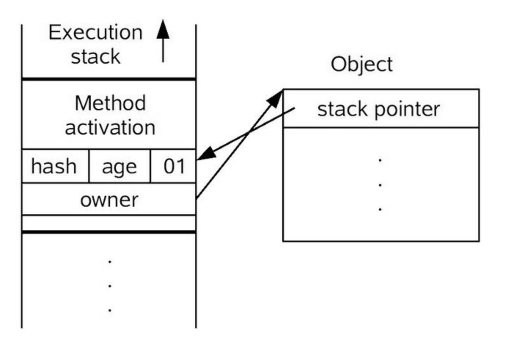
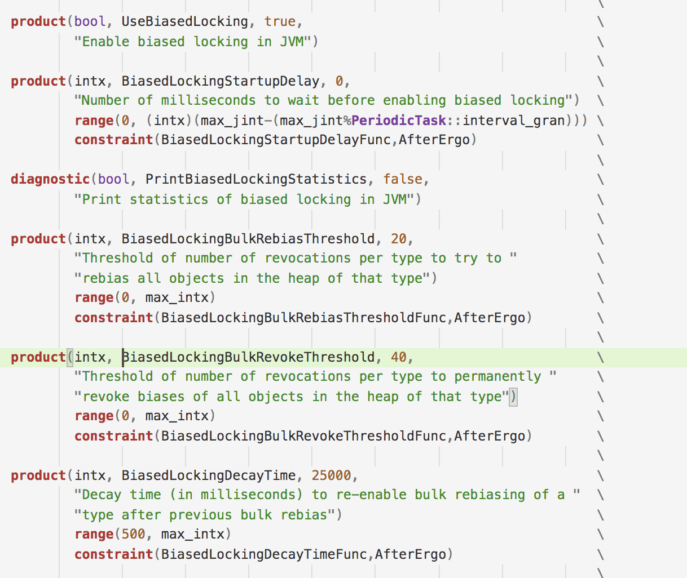

#jvm13-偏向锁

最后给大家分享一下synchronized的具体实现。synchronized是我们常用的锁的机制。所以我们非常有必要了解这个关键字的具体实现。

对于编译后的代码而言，其实就是monitorenter和monitorexit两个字节码指令。

## 自旋锁、偏向锁、轻量级锁和重量级锁

在讲解具体的源码实现之前，我们需要先了解一下相关的概念。

### 自旋锁

一般的锁当竞争失败时会把自己挂起，等待别人释放锁之后来唤醒，但是这样就涉及到线程上下文的切换，所以自旋锁其实就是不把自己挂起通过一个循环空循环一段时间，如果循环之后能获得锁就直接执行。

这样的好处就是可以减少一次上下文切换，坏处就是如果自旋了一段时间之后还是拿不到锁那么这样的自旋其实就是在浪费CPU资源。

所以一般如果是一个计算密集型或者持有锁的时间较长，那么可以关闭虚拟机的自旋锁优化。因为这种情况下大部分自旋之后都不会获取锁。

###重量级锁

重量级锁的实现比较复杂，这也是为什么当虚拟机要使用重量级锁的时候性能会先相对比较差。具体重量级锁实现的流程后面会分析。

### 轻量级锁

轻量级锁就是一个CAS，就是会更改对象头中一个的一个字段，指向自己的当前线程。通常可以结合自旋锁做优化，因为轻量级锁针对性的优化点就是虽然多线程运行，但是几乎没有锁的竞争或者存在非常少量的竞争，那么就通过CAS修改一下header来简单实现。如果在轻量级锁的过程中发生了锁的竞争，那么轻量级锁就会膨胀到重量级锁。

这里具体的改动其实是，对象头的部分变成一个指针指向当前线程栈上的BasicLockObject，然后原来的对象头整个拷贝到这个BasicLockObject，这样原来的对象头内容也保留了，同时也通过这个指针就知道了这个对象已经有轻量级锁附加在上面了。



###偏向锁

偏向锁的实现在虚拟机中也非常复杂，偏向锁解决的场景就是自始至终，某一个对象只有一个线程进入，那么每次进入锁的同步块连CAS都是多余的。那么就通过在对象头上直接偏移到线程id上，后面当前线程进入锁的同步代码块都不需要再做任何事情就可以直接操作了。

##偏向锁

偏向锁可配置的内容



有几个参数可以配置偏向锁相关的内容：

- UseBiasedLocking。显然这个就是是否启用偏向锁，默认启用。
- BiasedLockingStartupDelay。在可以使用偏向锁之前需要等待的毫秒数，默认0。
- PrintBiasedLockingStatistics。是否打印偏向锁的实用信息，默认不打印。
- BiasedLockingBulkRebiasThreshold。当偏向锁竞争数量到这个值时，虚拟机会批量重定向这个类的所有对象的偏向锁。
- BiasedLockingBulkRevokeThreshold。当偏向锁竞争到这个数量时，虚拟机永久撤销对这个类下的所有对象使用偏向锁。
- BiasedLockingDecayTime。下一个批量重定向和前一个批量重定向必须间隔的时间。

其中有两个参数我们需要额外说明，

1. BiasedLockingBulkRebiasThreshold。这个批量重定向，批量重定向主要解决的问题就是，如果有一个线程A，在自己工作期间创建了很多对象，而后这些对象又被另外一个线程B操作（A和B交替执行不会并行执行）。此时就需要把这部分对象批量重定向，而不是每一个再去做重定向。
2. BiasedLockingBulkRevokeThreshold。这个是批量撤销，主要是一个类似生产者和消费者模型下，锁的竞争原本就是非常激烈的，所以这个时候再去用偏向锁无法做到足够的优化。因此就需要一个机制可以撤销重定向。

在分析偏向锁之前，我们先来回顾一下对象头的组成，下面以64位jvm为例：

```
unused:25 hash:31 -->| unused:1   age:4    biased_lock:1 lock:2 (normal object)
JavaThread*:54 epoch:2 unused:1   age:4    biased_lock:1 lock:2 (biased object)
```

可以看到一个普通对象，前25位没有用，后31位存放了hash值，一位没有使用，4位年龄，一位偏向锁，两位锁。

但是对于一个偏向锁的对象而言，前54位指向的是偏向线程的线程的指针。epoch就是这是第几代偏向锁。后面几位含义相同。

对于monitorenter这个字节码的指令，其最核心的实现就是下面这段代码，

```c++
CASE(_monitorenter): {
  oop lockee = STACK_OBJECT(-1);
  // find a free monitor or one already allocated for this object
  // if we find a matching object then we need a new monitor
  // since this is recursive enter
  // 先从栈上找一个空闲的BasicObjectLock对象，来存放持有锁的对象。
  BasicObjectLock* limit = istate->monitor_base();
  BasicObjectLock* most_recent = (BasicObjectLock*) istate->stack_base();
  BasicObjectLock* entry = NULL;
  // 找到一个空闲的对象或者找到一个已经持有该对象的锁对象（表示锁的重入）
  while (most_recent != limit ) {
    if (most_recent->obj() == NULL) entry = most_recent;
    else if (most_recent->obj() == lockee) break;
    most_recent++;
  }
  // 如果找到就执行这段逻辑，找不到就退回去在栈上新建一个对象重试这块逻辑
  if (entry != NULL) {
    // 设置锁对象
    entry->set_obj(lockee);
    int success = false;
    uintptr_t epoch_mask_in_place = (uintptr_t)markOopDesc::epoch_mask_in_place;

    // 获取对象头
    markOop mark = lockee->mark();
    intptr_t hash = (intptr_t) markOopDesc::no_hash;
    // 看是不是使用偏向锁
    if (mark->has_bias_pattern()) {
      uintptr_t thread_ident;
      uintptr_t anticipated_bias_locking_value;
      thread_ident = (uintptr_t)istate->thread();
      // 这个就是看该对象头上的偏向锁是不是已经指向了当前线程
      anticipated_bias_locking_value =
        (((uintptr_t)lockee->klass()->prototype_header() | thread_ident) ^ (uintptr_t)mark) &
        ~((uintptr_t) markOopDesc::age_mask_in_place);

      // 如果已经指向了当前线程，什么事情都不用做，直接执行同步块代码即可
      if  (anticipated_bias_locking_value == 0) {
        if (PrintBiasedLockingStatistics) {
          (* BiasedLocking::biased_lock_entry_count_addr())++;
        }
        // 这个就是成功
        success = true;
      }
      // 如果指向的不是当前的线程
      else if ((anticipated_bias_locking_value & markOopDesc::biased_lock_mask_in_place) != 0) {
        markOop header = lockee->klass()->prototype_header();
        // 这个if不知道有什么用，这个if条件是一定进不去的，我猜属于历史遗留代码
        if (hash != markOopDesc::no_hash) {
          header = header->copy_set_hash(hash);
        }
        // 通过cas撤销当前锁对象的偏向，因为该对象的偏向并没有偏向当前线程，也就是偏向锁假设的只有一个线程会进入锁同步部分是不成立的
        if (lockee->cas_set_mark(header, mark) == mark) {
          if (PrintBiasedLockingStatistics)
            (*BiasedLocking::revoked_lock_entry_count_addr())++;
        }
      }
      // 锁的代数不同
      else if ((anticipated_bias_locking_value & epoch_mask_in_place) !=0) {
        // 尝试重定向，把当前线程的id放到对象头上
        markOop new_header = (markOop) ( (intptr_t) lockee->klass()->prototype_header() | thread_ident);
        // 该if条件同上，感觉没什么用
        if (hash != markOopDesc::no_hash) {
          new_header = new_header->copy_set_hash(hash);
        }
        // 把该对象偏向自己
        // 先CAS修改一下
        if (lockee->cas_set_mark(new_header, mark) == mark) {
          if (PrintBiasedLockingStatistics)
            (* BiasedLocking::rebiased_lock_entry_count_addr())++;
        }
        else {
          // 如果不成功就调用InterpreterRuntime::monitorenter方法，该方法后面分析
          CALL_VM(InterpreterRuntime::monitorenter(THREAD, entry), handle_exception);
        }
        success = true;
      }
      else {
        // 匿名偏向
        // 该段的方法和上面大致差不多，就是把当前线程设置到对象头上
        markOop header = (markOop) ((uintptr_t) mark & ((uintptr_t)markOopDesc::biased_lock_mask_in_place |
                                                        (uintptr_t)markOopDesc::age_mask_in_place |
                                                        epoch_mask_in_place));
        if (hash != markOopDesc::no_hash) {
          header = header->copy_set_hash(hash);
        }
        markOop new_header = (markOop) ((uintptr_t) header | thread_ident);
        if (lockee->cas_set_mark(new_header, header) == header) {
          if (PrintBiasedLockingStatistics)
            (* BiasedLocking::anonymously_biased_lock_entry_count_addr())++;
        }
        else {
          CALL_VM(InterpreterRuntime::monitorenter(THREAD, entry), handle_exception);
        }
        success = true;
      }
    }

    // 如果success是false，就说明偏向锁没有成功
    // 需要进行锁的升阶，使用轻量级锁或重量级锁
    if (!success) {
      markOop displaced = lockee->mark()->set_unlocked();
      // 对象头拷贝一份
      entry->lock()->set_displaced_header(displaced);
      bool call_vm = UseHeavyMonitors;
      // 轻量级锁+重量级锁
      if (call_vm || lockee->cas_set_mark((markOop)entry, displaced) != displaced) {
        // Is it simple recursive case?
        if (!call_vm && THREAD->is_lock_owned((address) displaced->clear_lock_bits())) {
          entry->lock()->set_displaced_header(NULL);
        } else {
          // 调用InterpreterRuntime::monitorenter
          CALL_VM(InterpreterRuntime::monitorenter(THREAD, entry), handle_exception);
        }
      }
    }
    UPDATE_PC_AND_TOS_AND_CONTINUE(1, -1);
  } else {
    // 这个else就是栈上找不到持有锁的BasicLockObject
    istate->set_msg(more_monitors);
    UPDATE_PC_AND_RETURN(0); // Re-execute
  }
}
```

上面一段就是虚拟机的解释器执行的逻辑，基本的逻辑就是先看一下当前的线程是不是持有了偏向锁，如果持有锁就直接执行，否则就尝试CAS进行修改或者进行锁的升级，那么锁的升级执行的方法都是InterpreterRuntime::monitorenter方法，那么我们在看一下这个方法的具体实现

```c++
IRT_ENTRY_NO_ASYNC(void, InterpreterRuntime::monitorenter(JavaThread* thread, BasicObjectLock* elem))
  // 打印
  if (PrintBiasedLockingStatistics) {
    Atomic::inc(BiasedLocking::slow_path_entry_count_addr());
  }
  Handle h_obj(thread, elem->obj());
  // 核心实现
  if (UseBiasedLocking) {
    // 快速
    ObjectSynchronizer::fast_enter(h_obj, elem->lock(), true, CHECK);
  } else {
    // 慢速
    ObjectSynchronizer::slow_enter(h_obj, elem->lock(), CHECK);
  }
IRT_END
```

fast_enter部分就是使用了偏向锁，slowenter部分没有使用偏向锁（先轻量级锁，后重量级锁）。

```c++
void ObjectSynchronizer::fast_enter(Handle obj, BasicLock* lock,
                                    bool attempt_rebias, TRAPS) {
  // 是否使用偏向锁
  if (UseBiasedLocking) {
    // 当前必须不再安全点中
    if (!SafepointSynchronize::is_at_safepoint()) {
      // 尝试通过偏向锁获取同步权利
      // 这个方法就是根据不同的情况撤销或重定向偏向锁
      BiasedLocking::Condition cond = BiasedLocking::revoke_and_rebias(obj, attempt_rebias, THREAD);
      // 如果获取成功就直接返回
      if (cond == BiasedLocking::BIAS_REVOKED_AND_REBIASED) {
        return;
      }
    } else {
      assert(!attempt_rebias, "can not rebias toward VM thread");
      BiasedLocking::revoke_at_safepoint(obj);
    }
    assert(!obj->mark()->has_bias_pattern(), "biases should be revoked by now");
  }

  // 轻量级锁+重量级锁的逻辑
  slow_enter(obj, lock, THREAD);
}
```

```c++
// 这个方法就是偏向锁的核心逻辑，revoke是撤销，rebias是再次偏向，其实就是撤销或者偏向自己
BiasedLocking::revoke_and_rebias(obj, attempt_rebias, THREAD);
```

下面这段方法的内容非常的长，我们一段段来解析。

第一段是一个相对比较快速的处理，做一些简单的判断然后

```c++
// 先获取对象的对象头
markOop mark = obj->mark();
// 是不是匿名偏向
// [0           | epoch | age | 1 | 01]当对象头是这样的格式的时候就是匿名偏向，其实就是没有线程id的时候
// 是不是要尝试获取偏向锁
// 如果我们是sycronized方法进来的话，attempt_rebias是true
if (mark->is_biased_anonymously() && !attempt_rebias) {
  // 偏向的对象头
  markOop biased_value       = mark;
  // 没有偏向的对象头，其实就是从一个通用的对象头模版拷贝一份出来，然后设置一下gc的年龄
  markOop unbiased_prototype = markOopDesc::prototype()->set_age(mark->age());
  // 通过cas把没有偏向的对象头设置上去
  markOop res_mark = obj->cas_set_mark(unbiased_prototype, mark);
  // 如果cas成功
  if (res_mark == biased_value) {
    // 返回撤销偏向成功
    return BIAS_REVOKED;
  }
// 是否使用偏向锁
} else if (mark->has_bias_pattern()) {
  Klass* k = obj->klass();
  markOop prototype_header = k->prototype_header();
  // 获取类上的对象头原型
  // 如果该类不允许使用偏向锁
  if (!prototype_header->has_bias_pattern()) {
		// 就把没有偏向锁的对象头和当前对象的对象头CAS一下
    markOop biased_value       = mark;
    markOop res_mark = obj->cas_set_mark(prototype_header, mark);
		// 这里不用关注结果的原因是，如果CAS失败，就说明别的线程也在翻转这个状态，所以直接返回。
    return BIAS_REVOKED;
  // 如果对象头原型的偏向锁代数和当前对象的代数不同
  // 代数不同的意思就是已经发生过一次批量重定向了，而类的原型header是会被更新的，因此是该对象的代数比当前类代数要老，所以可以直接翻转类的偏向锁即可。
  } else if (prototype_header->bias_epoch() != mark->bias_epoch()) {
    // 如果需要获取偏向锁
    if (attempt_rebias) {
      markOop biased_value       = mark;
      // encode一下，就是变成一个有偏向锁的header，注意这里要一个JavaThread
      markOop rebiased_prototype = markOopDesc::encode((JavaThread*) THREAD, mark->age(), prototype_header->bias_epoch());
      // CAS去设置偏向锁
      markOop res_mark = obj->cas_set_mark(rebiased_prototype, mark);
      // 如果设置成功就直接返回
      if (res_mark == biased_value) {
        return BIAS_REVOKED_AND_REBIASED;
      }
    } else {
      // 这里是撤销偏向锁的逻辑，和上面撤销的过程基本一致。
      markOop biased_value       = mark;
      markOop unbiased_prototype = markOopDesc::prototype()->set_age(mark->age());
      markOop res_mark = obj->cas_set_mark(unbiased_prototype, mark);
      if (res_mark == biased_value) {
        return BIAS_REVOKED;
      }
    }
  }
}
```

下面就是根据一些算法来计算一个结果，之后根据这个结果来做不同的操作。

```c++
// 根据该对象计算一个结果
HeuristicsResult heuristics = update_heuristics(obj(), attempt_rebias);
// 不用偏向
if (heuristics == HR_NOT_BIASED) {
  return NOT_BIASED;
} else if (heuristics == HR_SINGLE_REVOKE) { // 单次撤销
  Klass *k = obj->klass();
  markOop prototype_header = k->prototype_header();
  // 这个对象的偏向锁指向当前线程
  if (mark->biased_locker() == THREAD &&
      // 锁的代数相同
      prototype_header->bias_epoch() == mark->bias_epoch()) {
    ResourceMark rm;
    log_info(biasedlocking)("Revoking bias by walking my own stack:");
    EventBiasedLockSelfRevocation event;
    // 撤销并返回撤销结果
    BiasedLocking::Condition cond = revoke_bias(obj(), false, false, (JavaThread*) THREAD, NULL);
    ((JavaThread*) THREAD)->set_cached_monitor_info(NULL);
    if (event.should_commit()) {
      post_self_revocation_event(&event, k);
    }
    return cond;
  } else {
    EventBiasedLockRevocation event;
    VM_RevokeBias revoke(&obj, (JavaThread*) THREAD);
    // 生成VM_OPERATION，并交给VMThread去执行撤销的逻辑
    VMThread::execute(&revoke);
    if (event.should_commit() && revoke.status_code() != NOT_BIASED) {
      post_revocation_event(&event, k, &revoke);
    }
    return revoke.status_code();
  }
}

EventBiasedLockClassRevocation event;
// 批量撤销
VM_BulkRevokeBias bulk_revoke(&obj, (JavaThread*) THREAD,
                              (heuristics == HR_BULK_REBIAS),
                              attempt_rebias);
// 交给VMThread去执行
VMThread::execute(&bulk_revoke);
if (event.should_commit()) {
  post_class_revocation_event(&event, obj->klass(), heuristics != HR_BULK_REBIAS);
}
return bulk_revoke.status_code();
```

上述这段代码中有几个点需要注意，

```c++
HeuristicsResult heuristics = update_heuristics(obj(), attempt_rebias);
```

这段代码的作用就是通过计算这个对象之前偏向锁的使用情况，来针对性的判断本次操作的类型。

```c++
static HeuristicsResult update_heuristics(oop o, bool allow_rebias) {
  // 首先拿到对象头
  markOop mark = o->mark();
  // 如果这个对象不可以使用偏向锁
  if (!mark->has_bias_pattern()) {
    // 直接返回没有偏向锁
    return HR_NOT_BIASED;
  }

  // 获取类对象
  Klass* k = o->klass();
  // 获取当前时间戳
  jlong cur_time = os::javaTimeMillis();
  // 上一次批量重定向的时间
  jlong last_bulk_revocation_time = k->last_biased_lock_bulk_revocation_time();
  // 撤销次数
  int revocation_count = k->biased_lock_revocation_count();
  // 如果撤销次数>=BiasedLockingBulkRebiasThreshold && 撤销次数 < BiasedLockingBulkRevokeThreshold && 距离上一次批量重定向时间间隔 >= BiasedLockingDecayTime
  if ((revocation_count >= BiasedLockingBulkRebiasThreshold) &&
      (revocation_count <  BiasedLockingBulkRevokeThreshold) &&
      (last_bulk_revocation_time != 0) &&
      (cur_time - last_bulk_revocation_time >= BiasedLockingDecayTime)) {
		// 重置
    k->set_biased_lock_revocation_count(0);
    revocation_count = 0;
  }

  // 如果撤销次数 <= BiasedLockingBulkRevokeThreshold，那么该类的总次数就+1
  if (revocation_count <= BiasedLockingBulkRevokeThreshold) {
    revocation_count = k->atomic_incr_biased_lock_revocation_count();
  }

  // 如果撤销次数 == BiasedLockingBulkRevokeThreshold，执行批量撤销偏向锁
  if (revocation_count == BiasedLockingBulkRevokeThreshold) {
    return HR_BULK_REVOKE;
  }

  // 如果撤销次数 == BiasedLockingBulkRebiasThreshold，执行批量重定向
  if (revocation_count == BiasedLockingBulkRebiasThreshold) {
    return HR_BULK_REBIAS;
  }

  // 否则就是单个重定向
  return HR_SINGLE_REVOKE;
}
```

## 批量重定向和批量撤销

这块的源码非常长，就不贴出来了。首先是为什么需要这两个操作，因为偏向锁的含义是只有一个线程会使用锁，所以如果假定错误，肯定需要撤销批量锁让其他线程也能使用锁。这就是这两个操作的含义。这两个操作同时也是需要进入全局安全点才能执行（进入安全点的理由我个人觉得可能是这样所有的Java代码无法继续执行，可以确保在这个过程中不会错误的操作一个Java线程获取锁带来的影响）。

基本的逻辑是遍历所有的Java线程，获取每个线程上所有的锁对象，然后逐个看是不是需要撤销或者重定向，如果是的话就执行操作。

其中如果是批量重定向，则会让epoch的代数+1，如果重定向次数过多就认为该对象不适合偏向锁的优化。

## 释放偏向锁

如果是偏向锁的话不用释放，对象头上的线程ID会一直在，下次再进来直接看一下是不是这个标志还在同时代数或者值有没有变更即可。

## 我们为什么要偏向锁优化

大家其实上面也看到了，偏向锁的具体实现其实非常复杂，从Klass的支持，到每一个对象的对象头的设计，再到可能出现的批量重定向和批量撤销，那么jvm做了这么多工作偏向锁到底优化了什么情况呢？从源码就可以看出，偏向锁其实优化的内容是：**那些被同步块保护的代码，一直都是被同一个线程执行。**那么言外之意其实是不需要锁的地方却用了一个锁，这个是否能从我们代码中进行优化来尽可能避免这样的情况出现呢？

看上去我们似乎不用为了一个线程去多写那些额外的同步块，但是实际上有些场景虽然会用锁，但是却大概率只有一个线程会进去这块逻辑去执行，最最典型的就是类的加载。我们知道类的加载必须是线程安全的，但是其实加载类的线程并不会非常多，几乎我们一个典型的java代码中绝大部分的类都是由我们的main线程所加载的，那么像这样的情况如果进行了偏向锁的优化，是可以极大的提升性能的。因为偏向锁只有第一次进入执行一次偏向，后续在进入只要看对象头的线程id还在并且是当前Java线程，就可以直接执行代码同步块，开销是非常小的，连一个CAS的指令都不用执行就可以获取到锁。