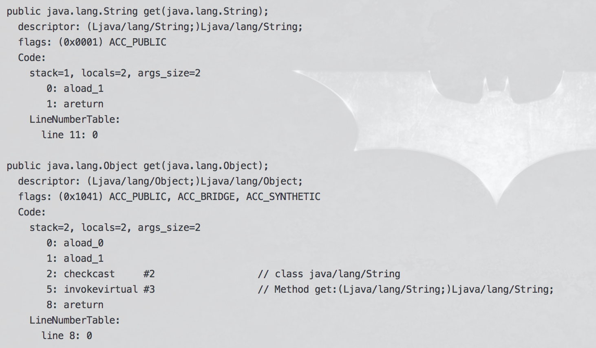
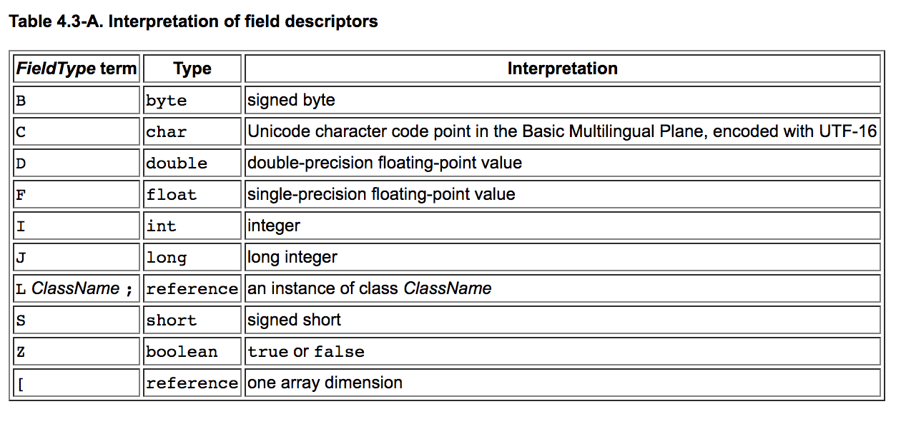
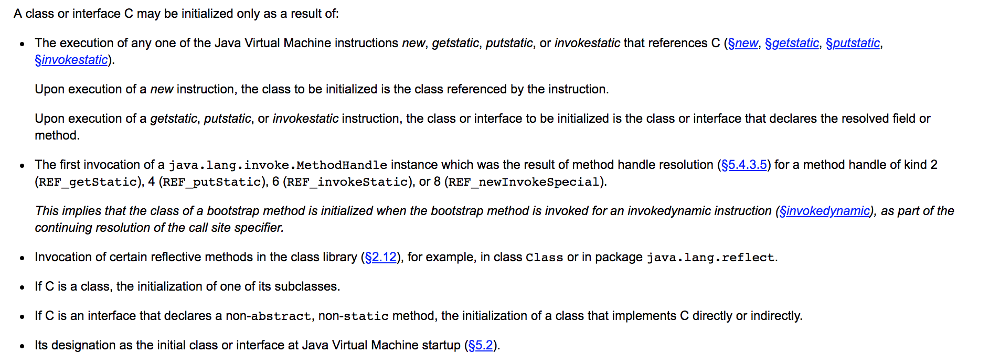
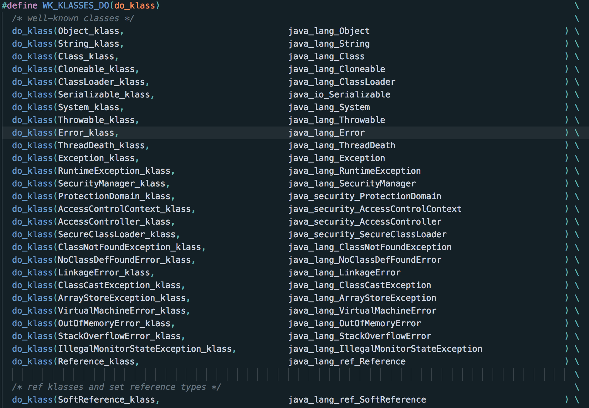
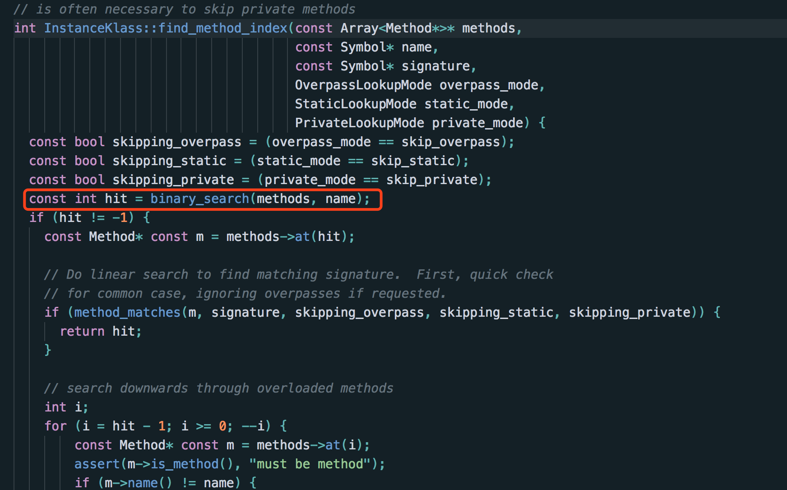

# Java代码的编译与类的加载

## 虚拟机规范

[jdk12虚拟机规范](https://docs.oracle.com/javase/specs/jvms/se12/html/index.html)

##Demo

```java
/**
 * @author Youdisn Wu
 * @date 2019-05-10
 * Demo
 */
public class Demo {

    static {
        num = 2;
    }

    {
        key = "value";
    }

    private boolean shouldDo() {
        boolean result;
        if ("oh my god".equals(key)) {
            result = false;
        } else {
            result = true;
        }
        return result;
    }

    private static int num;

    private String key;
}
```

```bash
// javac命令编译java类
javac Demo.class

// 通过javap查看编译后的文件
javap -c -l -v -p Demo.class 
```
```java
Classfile /Users/xiwang/Documents/course/src/main/java/Demo.class
  Last modified 2019年5月10日; size 535 bytes
  MD5 checksum d9f3e63126ee672f7fc71e212134c00a
  Compiled from "Demo.java"
public class Demo
  minor version: 0
  major version: 55 											// java 1.1 = 45
  flags: (0x0021) ACC_PUBLIC, ACC_SUPER
  this_class: #7                          // Demo
  super_class: #8                         // java/lang/Object
  interfaces: 0, fields: 2, methods: 3, attributes: 1
Constant pool:														// 常量池
   #1 = Methodref          #8.#23         // java/lang/Object."<init>":()V
   #2 = String             #24            // value
   #3 = Fieldref           #7.#25         // Demo.key:Ljava/lang/String;
   #4 = String             #26            // oh my god
   #5 = Methodref          #27.#28        // java/lang/String.equals:(Ljava/lang/Object;)Z
   #6 = Fieldref           #7.#29         // Demo.num:I
   #7 = Class              #30            // Demo
   #8 = Class              #31            // java/lang/Object
   #9 = Utf8               num
  #10 = Utf8               I
  #11 = Utf8               key
  #12 = Utf8               Ljava/lang/String;
  #13 = Utf8               <init>
  #14 = Utf8               ()V
  #15 = Utf8               Code
  #16 = Utf8               LineNumberTable
  #17 = Utf8               shouldDo
  #18 = Utf8               ()Z
  #19 = Utf8               StackMapTable
  #20 = Utf8               <clinit>
  #21 = Utf8               SourceFile
  #22 = Utf8               Demo.java
  #23 = NameAndType        #13:#14        // "<init>":()V
  #24 = Utf8               value
  #25 = NameAndType        #11:#12        // key:Ljava/lang/String;
  #26 = Utf8               oh my god
  #27 = Class              #32            // java/lang/String
  #28 = NameAndType        #33:#34        // equals:(Ljava/lang/Object;)Z
  #29 = NameAndType        #9:#10         // num:I
  #30 = Utf8               Demo
  #31 = Utf8               java/lang/Object
  #32 = Utf8               java/lang/String
  #33 = Utf8               equals
  #34 = Utf8               (Ljava/lang/Object;)Z
{
  private static int num;
    descriptor: I
    flags: (0x000a) ACC_PRIVATE, ACC_STATIC   // 见下

  private java.lang.String key;
    descriptor: Ljava/lang/String; 				// jni描述符，L就代表一个类
    flags: (0x0002) ACC_PRIVATE

  public Demo();
    descriptor: ()V
    flags: (0x0001) ACC_PUBLIC
    Code:
      stack=2, locals=1, args_size=1
         0: aload_0
         1: invokespecial #1                  // Method java/lang/Object."<init>":()V
         4: aload_0
         5: ldc           #2                  // String value // ldc: load constant，就是把常量从常量池中加载到操作数栈
         7: putfield      #3                  // Field key:Ljava/lang/String;
        10: return
      LineNumberTable:
        line 6: 0
        line 13: 4
        line 14: 10

  private boolean shouldDo();
    descriptor: ()Z
    flags: (0x0002) ACC_PRIVATE
    Code:
      stack=2, locals=2, args_size=1
         0: ldc           #4                  // String oh my god // load constant，就是把常量从常量池中加载到操作数栈
         2: aload_0
         3: getfield      #3                  // Field key:Ljava/lang/String;
         6: invokevirtual #5                  // Method java/lang/String.equals:(Ljava/lang/Object;)Z
         9: ifeq          17
        12: iconst_0
        13: istore_1
        14: goto          19
        17: iconst_1
        18: istore_1
        19: iload_1
        20: ireturn
      LineNumberTable:
        line 18: 0
        line 19: 12
        line 21: 17
        line 23: 19
      StackMapTable: number_of_entries = 2 // 这个东西是一个栈图，用来做类型校验的，源码：stackMapTable.hpp stackMapTable.cpp
        frame_type = 17 /* same */
        frame_type = 252 /* append */
          offset_delta = 1
          locals = [ int ]

  static {};
    descriptor: ()V
    flags: (0x0008) ACC_STATIC
    Code:
      stack=1, locals=0, args_size=0
         0: iconst_2
         1: putstatic     #6                  // Field num:I
         4: return
      LineNumberTable:
        line 9: 0
        line 10: 4
}
SourceFile: "Demo.java"

```

##Access_flag

```c++
enum {
    JVM_ACC_PUBLIC        = 0x0001,
    JVM_ACC_PRIVATE       = 0x0002,
    JVM_ACC_PROTECTED     = 0x0004,
    JVM_ACC_STATIC        = 0x0008,
    JVM_ACC_FINAL         = 0x0010,
    JVM_ACC_SYNCHRONIZED  = 0x0020,
    JVM_ACC_SUPER         = 0x0020,
    JVM_ACC_VOLATILE      = 0x0040,
    JVM_ACC_BRIDGE        = 0x0040, // 虚拟机内部生成的桥接方法
    JVM_ACC_TRANSIENT     = 0x0080,
    JVM_ACC_VARARGS       = 0x0080,
    JVM_ACC_NATIVE        = 0x0100,
    JVM_ACC_INTERFACE     = 0x0200,
    JVM_ACC_ABSTRACT      = 0x0400,
    JVM_ACC_STRICT        = 0x0800, // 精确浮点计算，好像是用来约束double和float的
    JVM_ACC_SYNTHETIC     = 0x1000, // 编译时期生成的方法，比如桥接方法，或者一些内部类的private方法
    JVM_ACC_ANNOTATION    = 0x2000,
    JVM_ACC_ENUM          = 0x4000,
    JVM_ACC_MODULE        = 0x8000
};
```

桥接方法的作用最典型的就是实现范型方法，比如下面的代码

```java
public interface GenericInterface<T> {
  T get(T param);
}

public class GenericImpl<String> {
  public String get(String param) {
    return param;
  }
}
```

由于java的类型擦除，java的泛型是会被擦除的，在代码运行时这个类型就是一个Object，所以这个接口的实际方法是这样的

```java
public interface GenericInterface {
  Object get(Object param);
}
```

那么显然我们的**GenericImpl**没有继承对应的方法，那么为了使得java有了泛型之后整个类型的继承依然和我们预期的一样，在编译期间就需要加入自动生成的桥接方法，加入后，我们GenericImpl方法会变成如下样式

```java
public class GenericImpl<String> {
  // 这个就是一个生成的桥接方法，继承了接口的方法，又实现了泛型类型的转换。
  public Object get(Object param) {
    return get((String) param);
  }
  
  public String get(String param) {
    return param;
  }
}
```



> 大家可以思考一下，如果这个方法没有泛型参数param，是否还会生成桥接方法？

## Descriptor

[Descriptor虚拟机规范](https://docs.oracle.com/javase/specs/jvms/se12/html/jvms-4.html#jvms-4.3)



##常量池

常量池具体的作用会到oop/klass的时候具体讲解。目前只要理解是存储常量的即可。（静态常量池和运行时常量池）

##虚拟机加载一个类

[虚拟机规范：加载、链接、初始化](https://docs.oracle.com/javase/specs/jvms/se12/html/jvms-5.html)

虚拟机加载Java类是按需加载的，一般来说只有第一次用到这个类的时候才会触发针对这个类的加载，

**虚拟机规范中约定了何时加载一个类**



###一个例外

在hotspot的实现中，有一部分类并不是真的按照上述虚拟机规范约定来做的（有可能写在别的地方没有看到）。当hotspot启动的时候，有一部分的类是默认就回去强制加载的。

```
init.cpp（103）【init_globals】
init.cpp（125）【universe2_init】
	universe.cpp（299）【Universe::genesis】
```

```c++
// universe.cpp（329）
SystemDictionary::initialize(CHECK);
```

和类加载相关的几个重要的类：

1. ClassFileParser：读取ClassFileStream，然后解析出类
2. Verifier：字节码校验
3. ClassLoader：类加载器
4. **SystemDictionary：记录已经加载到的类。虚拟机中和类加载等相关问题打交道的核心入口。**
5. SymbolTable：字符表，存储函数签名、各种字符串，在metaspace上。

```c++
// systemDictionary.cpp（1882）
void SystemDictionary::initialize(TRAPS) {
  // Allocate arrays
  _placeholders        = new PlaceholderTable(_placeholder_table_size); // HashTable 这个table表示哪些类正在被加载
  _number_of_modifications = 0;
  _loader_constraints  = new LoaderConstraintTable(_loader_constraint_size); // HashTable 虚拟机加载约束，比如两个类相互之间有依赖，但是又由不同的类加载器加载，就会产生加载依赖。
  _resolution_errors   = new ResolutionErrorTable(_resolution_error_size); // 又是一个HashTable，记录常量池解析是报错，invokeDynamic指令问题
  _invoke_method_table = new SymbolPropertyTable(_invoke_method_size); // Symbol和Symbol指针的一个map，虚拟机内部使用
  _pd_cache_table = new ProtectionDomainCacheTable(defaultProtectionDomainCacheSize); // ProtectionDomain，java代码授权保护什么的，和我们日常使用没多大关系

  // Allocate private object used as system class loader lock
  _system_loader_lock_obj = oopFactory::new_intArray(0, CHECK); // 一个锁
  // Initialize basic classes
  resolve_well_known_classes(CHECK); // 初始化well_known_classes，一部分类会在这里去加载
}
```

```c++
// systemDictionary.cpp（1951）
void SystemDictionary::resolve_well_known_classes(TRAPS) {
  // 这个方法就只干了一件事情，就是提前加载所有well_known_classes
}
```

systemDictionary.hpp（102）

大约有百来个类，**但是要注意的是这里是加载，并没有对加载到的类进行初始化。**



### 真正加载一个java类的流程

由于上面说过systemDictionary.cpp是虚拟机中类加载的核心入口，所以类加载的真正流程发起也是在这个类中，具体涉及加载的方法有好多，但是底层都会调用到resolve_or_null。

```c++
// systemDictionary.cpp（250）
Klass* SystemDictionary::resolve_or_null(Symbol* class_name, Handle class_loader, Handle protection_domain, TRAPS) {
  if (FieldType::is_array(class_name)) {
    return resolve_array_class_or_null(class_name, class_loader, protection_domain, THREAD);
  } else {
    return resolve_instance_class_or_null_helper(class_name, class_loader, protection_domain, THREAD);
  }
}

InstanceKlass* SystemDictionary::resolve_instance_class_or_null_helper(Symbol* class_name, // 这个Symbol是分配在metaspace上的
                                                                       Handle class_loader,
                                                                       Handle protection_domain,
                                                                       TRAPS) {
  assert(class_name != NULL && !FieldType::is_array(class_name), "must be");
  // 这个判断就是判断一下是不是L开头的（Field Descriptors）
  if (FieldType::is_obj(class_name)) {
    ResourceMark rm(THREAD);
    // Ignore wrapping L and ;.
    // SymbolTable的内存分配都是在metaspace上的。
    TempNewSymbol name = SymbolTable::new_symbol(class_name->as_C_string() + 1,
                                   class_name->utf8_length() - 2, CHECK_NULL);
    return resolve_instance_class_or_null(name, class_loader, protection_domain, THREAD);
  } else {
    return resolve_instance_class_or_null(class_name, class_loader, protection_domain, THREAD);
  }
}

```

```c++
// systemDictionary.cpp（663）
InstanceKlass* SystemDictionary::resolve_instance_class_or_null(Symbol* name,
                                                                Handle class_loader,
                                                                Handle protection_domain,
                                                                TRAPS) {
  // 方法较长
  // 先看是不是被加载过
  // 在看是不是classLoader为null
  // 加载类，如果class_loader是null就说明是BootstrapClassLoader，否则调用ClassLoader的loadClass方法加载类。
  if (!class_has_been_loaded) {
    k = load_instance_class(name, class_loader, THREAD);
    // 省略
  }
}
```

```c++
// systemDictionary.cpp（1461）
if (k == NULL) { // 先尝试用Bootstrap类加载器加载一下
  // Use VM class loader
  PerfTraceTime vmtimer(ClassLoader::perf_sys_classload_time());
  k = ClassLoader::load_class(class_name, search_only_bootloader_append, CHECK_NULL);
}

// find_or_define_instance_class may return a different InstanceKlass
if (k != NULL) { // 这里就是用Bootstrap加载器已经加载到了
  InstanceKlass* defined_k =
    find_or_define_instance_class(class_name, class_loader, k, THREAD);
  // 这里的find_or_define_instance_class就是
  if (!HAS_PENDING_EXCEPTION && defined_k != k) {
    // If a parallel capable class loader already defined this class, register 'k' for cleanup.
    assert(defined_k != NULL, "Should have a klass if there's no exception");
    loader_data->add_to_deallocate_list(k);
    k = defined_k;
  } else if (HAS_PENDING_EXCEPTION) {
    loader_data->add_to_deallocate_list(k);
    return NULL;
  }
}
return k;
} else {
  // 省略。。
  // java方法的调用原理之后会详细说明
  JavaCalls::call_virtual(&result,
                          class_loader,
                          spec_klass,
                          vmSymbols::loadClass_name(),
                          vmSymbols::string_class_signature(),
                          string,
                          CHECK_NULL);
  // java的ClassLoader里面的loadClass方法

  assert(result.get_type() == T_OBJECT, "just checking");
  oop obj = (oop) result.get_jobject();

	// 省略。。。
}
```

```c++
// 不论是通过BoostrapClassLoader（ClassLoader::load_class），或者通过自定义的类加载器，最后真正需要解析字节码的逻辑都会汇总到这个方法
// klassFactory.cpp（182）
InstanceKlass* KlassFactory::create_from_stream(ClassFileStream* stream,
                                                Symbol* name,
                                                ClassLoaderData* loader_data,
                                                Handle protection_domain,
                                                const InstanceKlass* unsafe_anonymous_host,
                                                GrowableArray<Handle>* cp_patches,
                                                TRAPS) {
	// 省略校验代码
  ResourceMark rm;
  HandleMark hm;

  JvmtiCachedClassFileData* cached_class_file = NULL;

  ClassFileStream* old_stream = stream;

  // increment counter
  THREAD->statistical_info().incr_define_class_count();

  // Skip this processing for VM anonymous classes
  if (unsafe_anonymous_host == NULL) {
    stream = check_class_file_load_hook(stream,
                                        name,
                                        loader_data,
                                        protection_domain,
                                        &cached_class_file,
                                        CHECK_NULL);
  }

  // 解析类文件二进制的流
  ClassFileParser parser(stream,
                         name,
                         loader_data,
                         protection_domain,
                         unsafe_anonymous_host,
                         cp_patches,
                         ClassFileParser::BROADCAST, // publicity level
                         CHECK_NULL);

  InstanceKlass* result = parser.create_instance_klass(old_stream != stream, CHECK_NULL);
  assert(result == parser.create_instance_klass(old_stream != stream, THREAD), "invariant");

  if (result == NULL) {
    return NULL;
  }

  if (cached_class_file != NULL) {
    // JVMTI: we have an InstanceKlass now, tell it about the cached bytes
    result->set_cached_class_file(cached_class_file);
  }

  JFR_ONLY(ON_KLASS_CREATION(result, parser, THREAD);)
	// 省略CDS代码
  return result;
}

```

```c++
// classFileParser.cpp（5803）
// classFileParser.cpp（5919）parse_stream方法最核心
// post_process_parsed_stream（6310）方法重排序
```


> ###补充知识
>
> #### 1. Bootstrap ClassLoader何时初始化
>
> ```
> init.cpp（103）【init_globals】
> init.cpp（113）【universe_init】
> 	universe.cpp（685）【universe_init】
> ```
>
> ```c++
> ClassLoaderData::init_null_class_loader_data();
> ```
>
> #### 2. 为什么方法要重排序
>
> 因为java中调用一个方法是在整个Methods列表中找方法，那么最快的寻找方式就是排序后的二分法查找，所以java方法会重排序。又因为我们调用一个方法就是通过方法的名称来调用的，所以根据方法来排序就是最好的选择（注意这个方法名是存储在metadata里面的Symbol，并非一个字符串排序）
>
> **重点分享一个Java方法是如何被调用时会分析这块**
>
> 

<u>下周会分享的内容是oop/klass体系</u>

3. oop/klass，静态常量池和运行时常量池，字符串常量池等
4. GC基本原理
5. 内存分配
6. 垃圾回收
7. 解释器和即时编译器，Java方法的调用（JavaCalls，Java函数的分发，invoke系列指令原理）
8. Java的并发与锁（sycronized，Thread等）