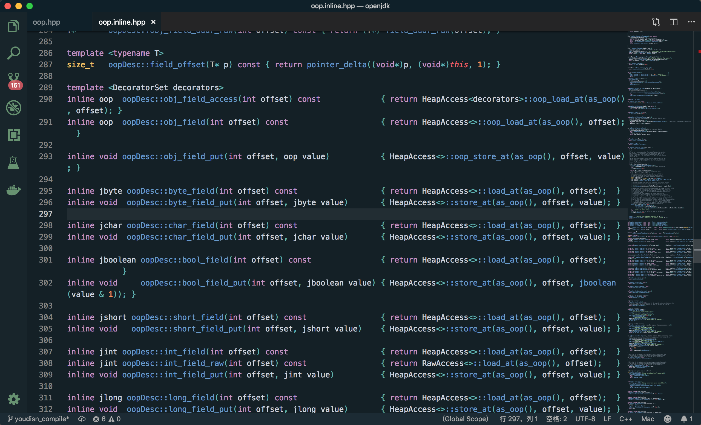
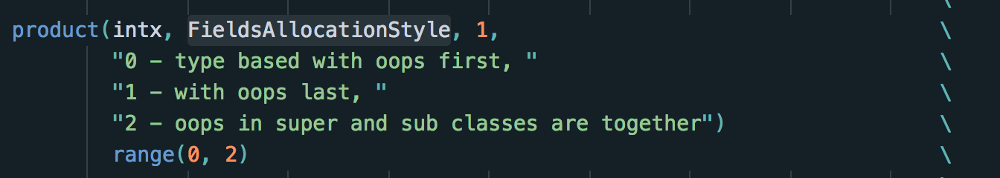
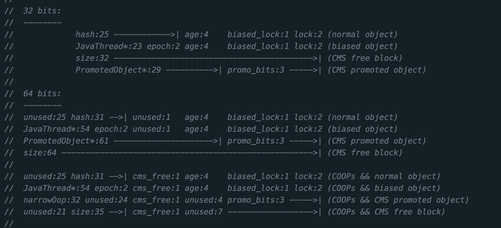
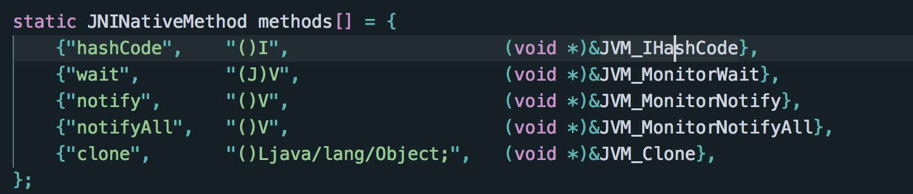
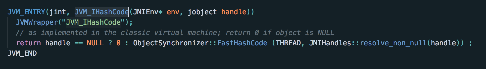
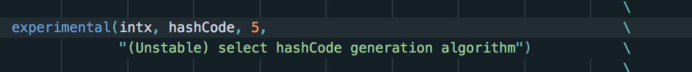
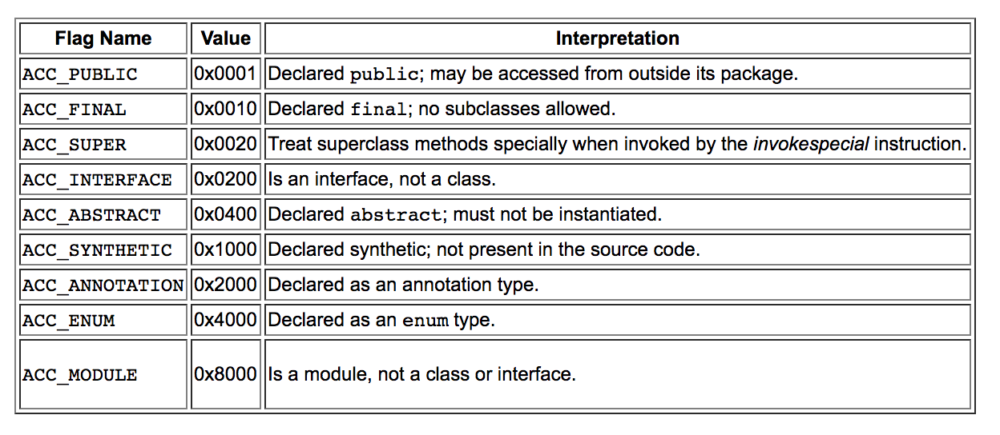

#Java类体系OOP/Klass

oop/klass是虚拟机中非常重要的内容，oop/klass的整套体系就是整个Java面向对象的基础，比如Java面向对象的特性、方法的调用、GC等都是基于oop/klass来实现的，所以对于虚拟机而言，oop/klass可能比GC更重要。只不过对于我们Java程序员而言，oop/klass更底层，而且通常不会出现需要我们自己来解决的问题（GC可能会频繁Full GC等），所以接触的会更少。

Java有三个主要的特性，封装、继承、多态。我们平时使用这些特性非常熟练，那么我们要看一下虚拟机是如何通过c++来实现Java的这些特性。

虚拟机使用的针对Java面向对象的实现就是OOP/Klass模型。


其中OOP就是一个对象的实例数据，而Klass就是描述一个Java类。

##OOP

```c++
// oop.hpp
// oop就是一个对象的实例
class oopDesc {
 private:
  volatile markOop _mark; // 这个东西比如放了gc age、锁标志位等
  union _metadata {
    Klass*      _klass; // 这个对象指向的Java类（虚拟机中的实现，并不是我们写的Java类）存在metaspace上
    narrowKlass _compressed_klass; // 指针压缩，因为64位的操作系统可能会占用更多的内存，使用压缩可以节省内存
  } _metadata;
```

```c++
// oop的继承关系
typedef class oopDesc*                            oop;
typedef class   instanceOopDesc*            instanceOop;
typedef class   arrayOopDesc*                    arrayOop;
typedef class     objArrayOopDesc*            objArrayOop;
typedef class     typeArrayOopDesc*            typeArrayOop;
```

oopDesc大家可以理解成就是一个对象头 + 实例数据，上面看到的markOop就是对象头，那么实例数据如下所示。



这一对的xxx_field就是获取实例数据，inline就是内联方法，内联就是本来是两个方法，现在合并，就节省一次方法调用的开销。因为对对象实例的调用在jvm中是一个非常频繁的操作，所以用内联，可以节省很多方法调用的开销，起到提高性能和优化的作用。所以这也是为什么oop中的方法，尤其是内联方法都是比较短小精干的，因为这样内联后也不会显得代码很臃肿。

还有一个就是实例字段的分配顺序，实例字段的分配顺序是可以配置的

```c++
// classFileParser.cpp（3982）
// Rearrange fields for a given allocation style
  if( allocation_style == 0 ) {
    // Fields order: oops, longs/doubles, ints, shorts/chars, bytes, padded fields
    next_nonstatic_oop_offset    = next_nonstatic_field_offset;
    next_nonstatic_double_offset = next_nonstatic_oop_offset +
                                    (nonstatic_oop_count * heapOopSize);
  } else if( allocation_style == 1 ) { // 策略1是我们虚拟机默认的策略
    // Fields order: longs/doubles, ints, shorts/chars, bytes, oops, padded fields
    next_nonstatic_double_offset = next_nonstatic_field_offset;
  } else if( allocation_style == 2 ) {
    // Fields allocation: oops fields in super and sub classes are together.
    if( nonstatic_field_size > 0 && _super_klass != NULL &&
        _super_klass->nonstatic_oop_map_size() > 0 ) {
      const unsigned int map_count = _super_klass->nonstatic_oop_map_count();
      const OopMapBlock* const first_map = _super_klass->start_of_nonstatic_oop_maps();
      const OopMapBlock* const last_map = first_map + map_count - 1;
      const int next_offset = last_map->offset() + (last_map->count() * heapOopSize);
      if (next_offset == next_nonstatic_field_offset) {
        allocation_style = 0;   // allocate oops first
        next_nonstatic_oop_offset    = next_nonstatic_field_offset;
        next_nonstatic_double_offset = next_nonstatic_oop_offset +
                                       (nonstatic_oop_count * heapOopSize);
      }
    }
    if( allocation_style == 2 ) {
      allocation_style = 1;     // allocate oops last
      next_nonstatic_double_offset = next_nonstatic_field_offset;
    }
  } else {
    ShouldNotReachHere();
  }
```

globals.hpp（915）



也就是说，我们实例字段默认的分配顺序是

longs/doubles, ints, shorts/chars, bytes, oops（其他对象实例）, padded fields（填充字段，主要是用作对象对齐）。对象对齐的原因是虚拟机规范中规定一个java对象的大小必须是8个字节的倍数。

**所以OOP中的Field也是不按照我们书写顺序的，而是按照它实际类型的顺序**

#####markOop



如上图可以看到32位对象头和64对象头的分布原理是不同的，而且同一个对象处于不同的状态他的_markword的对象头分布也是不同的。

##### age

大家这里可以看到age:4，这个的意思就是一个对象的年龄用了4 bit来存储，也就是说一个对象的年龄就是16，这也是为什么大家在看GC的时候可能会注意到一个参数：-*XX*:MaxTenuringThreshold，这个是存储新生代的对象经过的存活次数，所以实际上我理解这个配置只能是0-16，如果你大于16，对象头里面也塞不下。

##### hash

这个hash就是java对象的hashcode，java对象的hashcode方法其实是一个java类可以自己实现的，Java Object对象默认的hashcode方法实现又是如何的呢？





```c++
// synchronizer.cpp（681）
intptr_t ObjectSynchronizer::FastHashCode(Thread * Self, oop obj) {
  // 省略偏向锁

  // 省略校验

  ObjectMonitor* monitor = NULL;
  markOop temp, test;
  intptr_t hash;
  markOop mark = ReadStableMark(obj);

  // object should remain ineligible for biased locking
  assert(!mark->has_bias_pattern(), "invariant");

  if (mark->is_neutral()) {
    hash = mark->hash();              // this is a normal header
    if (hash != 0) {                  // if it has hash, just return it
      return hash;
    }
    hash = get_next_hash(Self, obj);  // allocate a new hash code
    temp = mark->copy_set_hash(hash); // merge the hash code into header
    // use (machine word version) atomic operation to install the hash
    test = obj->cas_set_mark(temp, mark);
    if (test == mark) {
      return hash;
    }
  }
  // 省略其他场景
  return hash;
}
```

```c++
// synchronizer.cpp（681）
static inline intptr_t get_next_hash(Thread * Self, oop obj) {
  intptr_t value = 0;
  // 这个hashcode是一个全局变量，是一个可以配置的值，也就是说希望Object使用哪个hash算法，我们就可以通过虚拟机启动参数来配置。
  if (hashCode == 0) {
    // This form uses global Park-Miller RNG.
    // On MP system we'll have lots of RW access to a global, so the
    // mechanism induces lots of coherency traffic.
    value = os::random();
  } else if (hashCode == 1) {
    // This variation has the property of being stable (idempotent)
    // between STW operations.  This can be useful in some of the 1-0
    // synchronization schemes.
    intptr_t addrBits = cast_from_oop<intptr_t>(obj) >> 3;
    value = addrBits ^ (addrBits >> 5) ^ GVars.stwRandom;
  } else if (hashCode == 2) {
    value = 1;            // for sensitivity testing
  } else if (hashCode == 3) {
    value = ++GVars.hcSequence;
  } else if (hashCode == 4) {
    value = cast_from_oop<intptr_t>(obj);
  } else {
    // 这个是默认的hash算法。
    // Marsaglia's xor-shift scheme with thread-specific state
    // This is probably the best overall implementation -- we'll
    // likely make this the default in future releases.
    unsigned t = Self->_hashStateX;
    t ^= (t << 11);
    Self->_hashStateX = Self->_hashStateY;
    Self->_hashStateY = Self->_hashStateZ;
    Self->_hashStateZ = Self->_hashStateW;
    unsigned v = Self->_hashStateW;
    v = (v ^ (v >> 19)) ^ (t ^ (t >> 8));
    Self->_hashStateW = v;
    value = v;
  }

  value &= markOopDesc::hash_mask;
  if (value == 0) value = 0xBAD;
  assert(value != markOopDesc::no_hash, "invariant");
  return value;
}
```



## Klass

```c++
class Klass; // 通用类
class   InstanceKlass; // 一个Java实例的类
class     InstanceMirrorKlass; // 专门针对java.lang.Class的Klass实现
class     InstanceClassLoaderKlass; // 专门针对ClassLoader
class     InstanceRefKlass; // 专门针对java/lang/ref/Reference的Klass实现。主要为了实现强软弱虚四种引用
class   ArrayKlass;
class     ObjArrayKlass;
class     TypeArrayKlass;
```

```c++
class Klass : public Metadata {
  friend class VMStructs;
  friend class JVMCIVMStructs;
 protected:
  enum { _primary_super_limit = 8 };
  // 如果值是正数，表示这是一个对象，此时这个值就是这个对象的大小
  // 如果值是负数，表示这是一个数组，此时这个值的结构是
  //    [tag, hsz, ebt, log2(esz)]
  // 其中:
  //    tag，如果数组中的元素是对象，tag = 0x80，否则就是0xC0（比如 String[] 和 int[]）
  //    hsz是数组头有多少个字节的大小，可以通过这个值快速跳过头定位到数组的第一个元素
  //    ebt 是这个数组的基本类型
  //    esz 是每一个element的大小
  jint        _layout_helper;

  // 类名，如java/lang/String, etc.如果是数组则为：[I,[Ljava/lang/String
  Symbol*     _name;

  // Cache of last observed secondary supertype
  Klass*      _secondary_super_cache;
  // 这个数组里面放的都是实现的接口
  Array<Klass*>* _secondary_supers;
  // 这个Java类的所有父类（父类的父类等等都算）
  Klass*      _primary_supers[_primary_super_limit];
  //Java 的镜像类
  OopHandle _java_mirror;
  // 父类
  Klass*      _super;
  // 第一个子类（没有就是NULL）
  Klass* volatile _subklass;
  // 所有的子类链表（没有就是NULL）
  Klass* volatile _next_sibling;

  // 加载当前类的ClassLoader加载的所有类的链表。
  Klass*      _next_link;

  // ClassLoader
  ClassLoaderData* _class_loader_data;

  jint        _modifier_flags;  // Modifiers（见下）
  AccessFlags _access_flags;    // Access flags.
```

#####Modifiers



```c++
// instanceKlass.hpp
	// 注解
  Annotations*    _annotations;
  // 当前的包
  PackageEntry*   _package_entry;
  // 那些以这个类为类型的ArrayKlass
  Klass* volatile _array_klasses;
  // 常量池
  ConstantPool* _constants;
  // 内部类
  Array<jushort>* _inner_classes;

  // jdk11新增Nest字段，为了表达嵌套（下面详细解释）
  Array<jushort>* _nest_members;

  // NestHost同上
  InstanceKlass* _nest_host;

  //非静态字段的大小
  int             _nonstatic_field_size;
	// 静态字段的大小
  int             _static_field_size;
  // 静态实例字段的数量
  u2              _static_oop_field_count;
  // Java fields的数量
  u2              _java_fields_count;
	// 当前正在初始化的线程（主要是为了解决循环初始化）
  Thread*         _init_thread;
  // 方法的cache
  OopMapCache*    volatile _oop_map_cache;

	// 当前类的初始化状态
  u1              _init_state;
	// 强软弱虚
  u1              _reference_type;                // reference type
  
  // 方法数组
  Array<Method*>* _methods;
  // 接口继承过来的默认方法
  Array<Method*>* _default_methods;
  // 实现的接口
  Array<InstanceKlass*>* _local_interfaces;
  // 透传的接口，比如说父类继承的接口，但是子类没有实现这个接口
  Array<InstanceKlass*>* _transitive_interfaces;
  // 记录着方法原始顺序的顺序数组
  Array<int>*     _method_ordering;
	// 静态字段和实例字段
  Array<u2>*      _fields;
```

#####Nest

[Nest作用域](https://docs.oracle.com/javase/specs/jvms/se12/html/jvms-5.html#jvms-5.4.4)

具体见Java11特性。

------

到目前为止，整个OOP/Klass的结构我们已经了解清楚了，那么我们接下来我们通过看一下Java面向对象的一些特性通过OOP/Klass是如何实现的来看一下实际jvm运行过程中整套体系是如何运转的。

## ConstantPool

静态常量池就是记录在编译后的class文件中的，常量池的作用就是记录常量；同时在运行时，一些常量需要动态的将符号引用（String）变成对一个类的实际引用。每一个class文件之间能相互产生关联的核心就是常量池。

那么常量池需要动态去处理的内容有四类

1. 类
2. 接口
3. 方法
4. Field字段

我们重点关注对方法的解析，核心的实现是：ConstantPoolCacheEntry，**注意这个类虽然有Cache，但是不可以把它理解成一个缓存，这只是只是动态去获取值的一个方式，并不是一种缓存**。运行时有两种数据需要去动态解析，实例字段或者类的静态字段、方法。

```c++
// bit number |31                0|
// bit length |-8--|-8--|---16----|
// --------------------------------
// _indices   [ b2 | b1 |  index  ]  index = constant_pool_index
// _f1        [  entry specific   ]  metadata ptr (method or klass)
// _f2        [  entry specific   ]  vtable or res_ref index, or vfinal method ptr
// _flags     [tos|0|F=1|0|0|0|f|v|0 |0000|field_index] (for field entries)
// bit length [ 4 |1| 1 |1|1|1|1|1|1 |1     |-3-|----16-----]
// _flags     [tos|0|F=0|M|A|I|f|0|vf|indy_rf|000|00000|psize] (for method entries)
// bit length [ 4 |1| 1 |1|1|1|1|1|1 |-4--|--8--|--8--]
// --------------------------------
//
// with:
// index  = original constant pool index
// b1     = bytecode 1
// b2     = bytecode 2
// psize  = parameters size (method entries only)
// field_index = index into field information in holder InstanceKlass
//          The index max is 0xffff (max number of fields in constant pool)
//          and is multiplied by (InstanceKlass::next_offset) when accessing.
// tos    = TosState
// F      = the entry is for a field (or F=0 for a method)
// A      = call site has an appendix argument (loaded from resolved references)
// I      = interface call is forced virtual (must use a vtable index or vfinal)
// f      = field or method is final
// v      = field is volatile
// vf     = virtual but final (method entries only: is_vfinal())
// indy_rf = call site specifier method resolution failed
//
// The flags after TosState have the following interpretation:
// bit 27: 0 for fields, 1 for methods
// f  flag true if field is marked final
// v  flag true if field is volatile (only for fields)
// f2 flag true if f2 contains an oop (e.g., virtual final method)
// fv flag true if invokeinterface used for method in class Object
class ConstantPoolCacheEntry {
 private:
  volatile intx     _indices;  // constant pool index & rewrite bytecodes
  Metadata* volatile   _f1;       // entry specific metadata field
  volatile intx        _f2;       // entry specific int/metadata field
  volatile intx     _flags;    // flags
```

那么我们静态常量池是什么时候是什么被替换成运行时常量池的呢？

jvm加载一个类分为3步：加载、链接、初始化，我们之前讲解了类的加载，那么由常量池我们要讲解另一个非常重要的过程，就是链接。

java类的链接主要是在初始化之前（？）做的，也会在从stream文件解析完就理解链接

```c++
// instanceKlass.cpp（697）
void InstanceKlass::initialize(TRAPS) {
  if (this->should_be_initialized()) {
    initialize_impl(CHECK);
  } else {
    assert(is_initialized(), "sanity check");
  }
}

// instanceKlass.cpp（910）
void InstanceKlass::initialize_impl(TRAPS) {
  // 略
  link_class(CHECK);
  // 省略其他步骤
}

// instanceKlass.cpp（714）
void InstanceKlass::link_class(TRAPS) {
  assert(is_loaded(), "must be loaded");
  if (!is_linked()) {
    link_class_impl(CHECK);
  }
}

// instanceKlass.cpp（731）
bool InstanceKlass::link_class_impl(TRAPS) {
  // 校验，如果有错抛出java_lang_NoClassDefFoundError异常
  // 如果已经链接就返回
  // 判断是否有父类，如果父类是接口再抛出异常java_lang_IncompatibleClassChangeError，父类不可能接口
  // 如果有父类，就确保父类已经链接（这步会递归往上，如果父类还有父类还会继续）
  // 如果有local_interfaces，也要确保已经链接
  // 锁住当前Java类（就是一个oop）
  // verify_code，这个就是校验代码
  // rewrite_class，这个会遍历所有java字节码，把所有的静态常量池引用都重写成对ConstantPoolCacheEntry的引用
  // link_methods，这个就是将所有的方法都被进行一个封装进一个adapter，添加后续的编译优化什么的。
  // 初始化vtable和itable（jvm中的虚函数表和接口表，讲到java方法调用时说；通过ConstantPoolCacheEntry可以快速定位到vtable的索引，这样就可以通过vtable快速定位到一个方法）
}
```

> 继续类初始化的源码阅读，instanceKlass.cpp（910）
>
> static代码的线程安全是如何确保的？

## 调试工具jdb、jhsdb

打开对应的虚拟机命令中的jdb或者jhsdb，然后运行之后就可以看到虚拟机运行时的数据

#### jdb

```bash
# 打开jdb调试工具，设置classpath
jdb -classpath "/Users/xiwang/Documents/course/out/production/course"

# 通过help可以查看到所有支持的命令
help

# 通过stop命令设置断点
stop at inherited.JavaMain:12

# 通过run命令运行java程序
run inherited.JavaMain

# 查看类结构
class inherited.Son

# 查看类中的方法
methods inherited.Son

# 查看类中的字段
fields inherited.Son
```

#### jhsdb

```bash
# 命令行模式
jhsdb clhsdb

# ui模式
jhsdb hsdb
```
