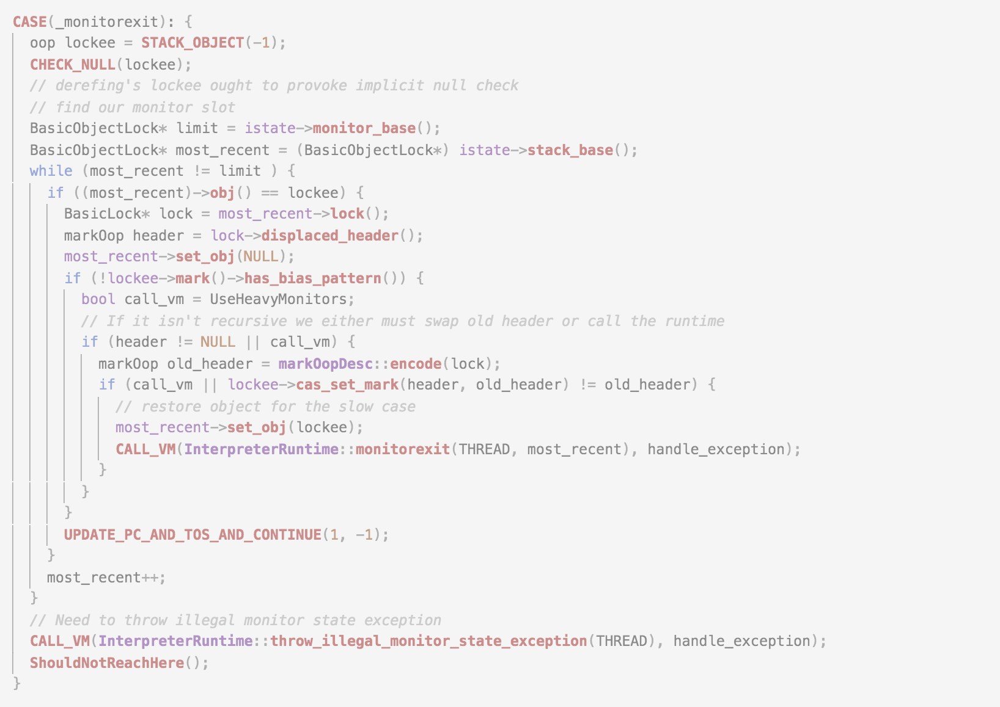
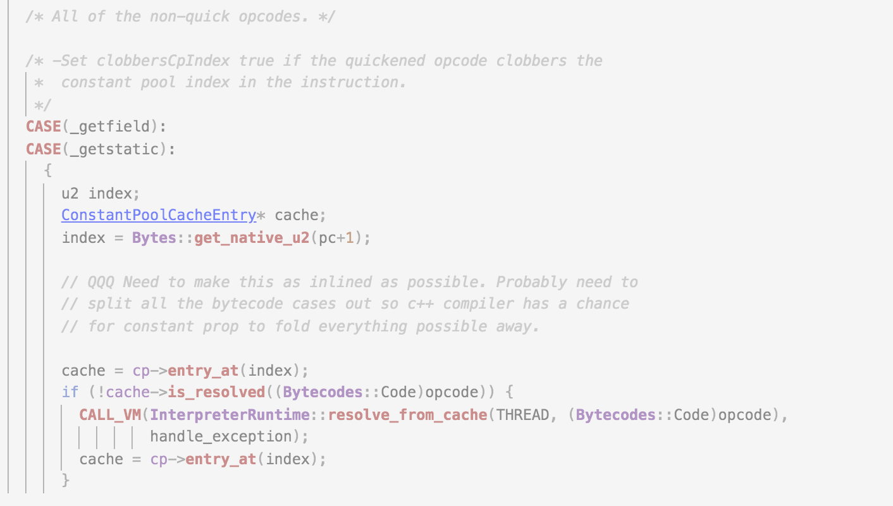
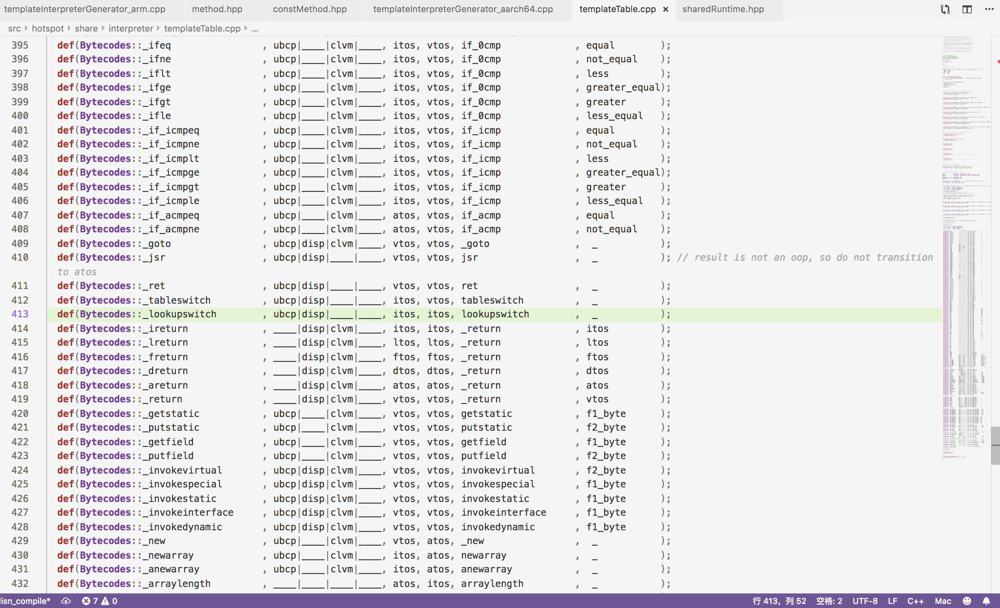
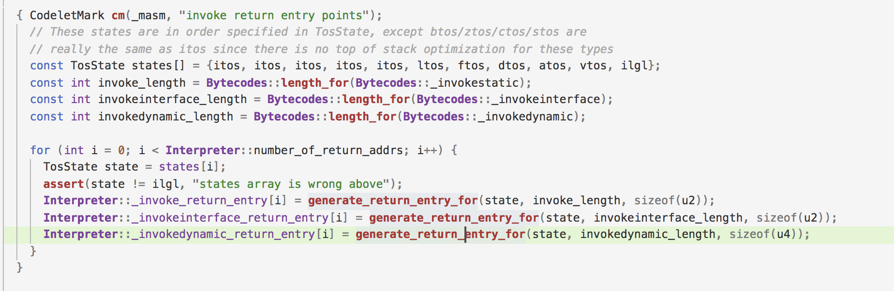
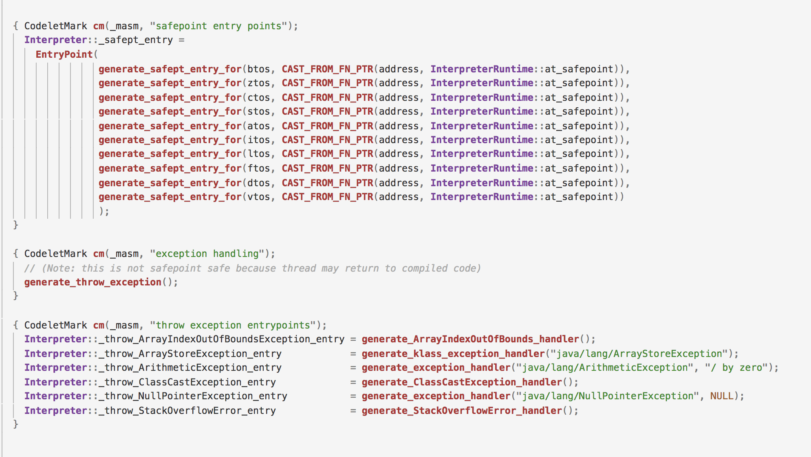
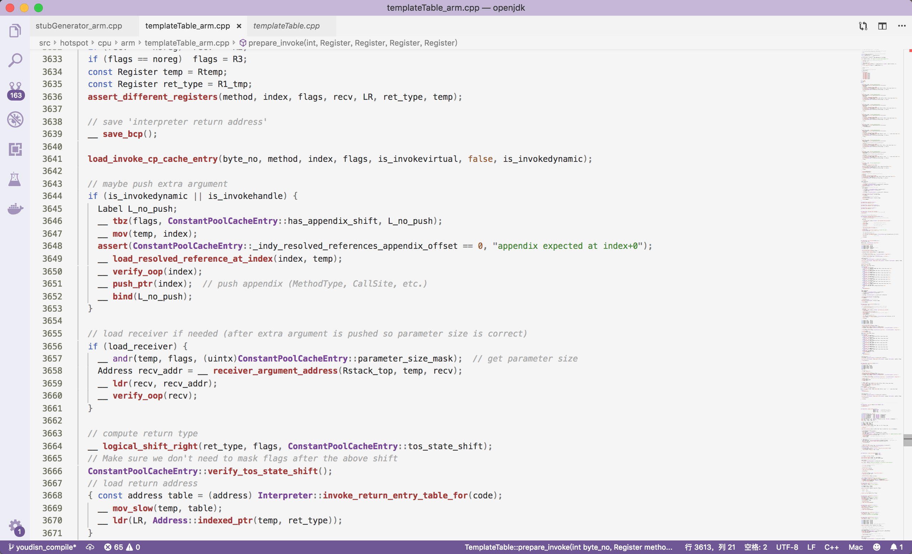
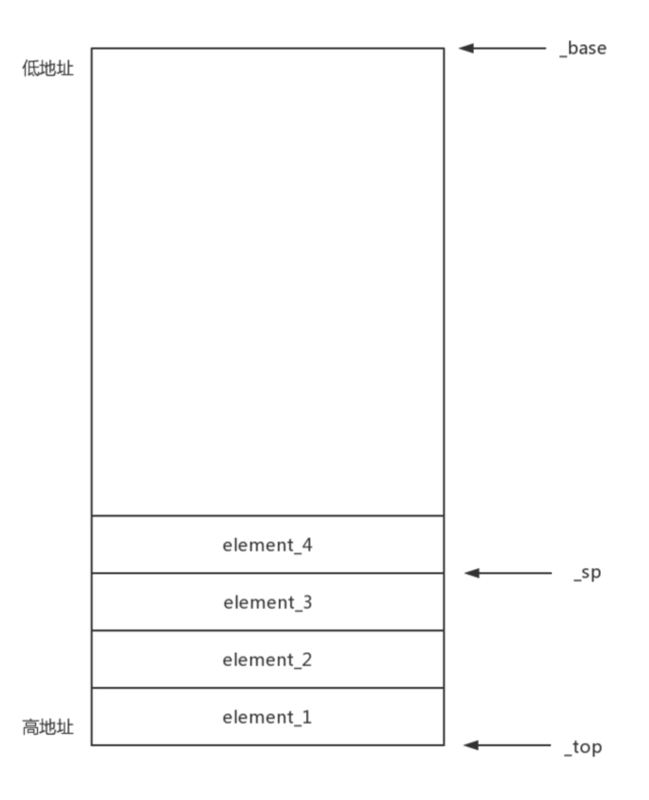

#Java方法调用

对于机器而言，要让机器执行你的指令，就必须使用机器能认识的机器码，但是机器码可能和不同的操作系统以及物理硬件相关，在不同的平台就要编写不同的代码（可以类比安卓和iOS），那么jvm的作用就是屏蔽底层特性，使得我们能面向一个统一的模型来编程而不用关注过于底层的特性。

所以jvm中的执行引擎部分（编译执行和解释执行）其实就充当了一个将字节码翻译成机器码的翻译者的功能。

Java的方法调用时基于栈的方法调用，大家肯定了解过除了基于栈的指令，还有一种很常见的就是基于寄存器的指令。

## CPU和寄存器

CPU的基本原理就是通过地址总线读取指令并放到指令寄存器中译码，对于需要用到的数据就从数据总线把数据放到内部寄存器，然后再通过运算单元对数据进行加工。

一般64位处理器有16个寄存器，每个寄存器都有自己的名称和作用。

寄存器的通用作用主要是用来暂存指令、数据和地址。

- 可将寄存器内的数据执行算术及逻辑运算；

- 存于寄存器内的地址可用来指向内存的某个位置，即寻址；

- 可以用来读写数据到电脑的周边设备。

## 基于栈的指令

由于对于机器来说最终指令都是需要被CPU执行，那么Java基于栈的命令最终仍然是要被处理成相关的机器码，但是jvm为了基于不同平台的通用性，就使用了基于栈的平台无关的一个指令，就是我们基于栈的指令（也就是我们编译之后出来的字节码指令）。

基于寄存器指令的优点：

- 性能优秀、执行高效
- 花费更少的指令完成一项操作

基于栈的指令的优点：

- 设计和实现更简单，适用于资源受限的系统
- 避开了寄存器分配的难题
- 指令更加紧凑

> 深入理解Jvm

## 方法的执行

比如C/C++的语言写完在编译之后就会生成平台相关的机器指令，对于不同平台生成的指令也是不同的。那么我们的Java生成的字节码，我们就需要读取字节码然后对字节码的含义进行程序上的解释。

###解释执行

那么这种字节码解释器的执行的方式就是jvm执行Java的方式，其实就看到一行字节码，翻译起含义，然后执行代码。那么上面其实也提到了，不论你用什么样的方式，对于机器而已始终都是运行机器指令，java字节码就是一个中间格式。那么jvm中字节码解释器的具体实现在这里，比较长，我们就截个图感受一下（bytecodeInterpreter.cpp）。





以上这段就是当我们看到一个字节码，我们就根据字节码所对应的含义进行翻译。这样的实现简单明了，早期的虚拟机也是这样来实行的。但是这样的做法就会导致虚拟机的性能非常的低。

java字节码通过c++代码进行翻译之后，c++代码之后会被编译成机器指令，由于基于栈的指令本身就偏多，在编译成机器码之后，编译器也会生成一些冗余的指令，那么就会导致这样执行java代码的性能整体很慢。

> 基于栈的指令偏多，比如加法 1 + 1，
>
> **基于栈的指令**
> iload 1
> iload 1
> iadd
>
> **基于寄存器的指令**
> add r1 r2

那么这样的方式随着Java应用越来越广泛，已经不再使用了，但是这样的代码依然保留在jvm中（只不过这块内容可以作为学习一个字节码执行逻辑的方式，但是jvm真正运行时并不会这样去执行字节码）

既然这样的字节码解释执行性能不好，其主要原因就是：生成的机器码数量过多导致性能太低。那么如果我们能自己控制生成的机器码这样就可以节省很多开销了。

现在的jvm也是这样做的，虚拟机启动时，会把相关的字节码对应的汇编都准备好并保存在内存中，当我们要执行一个字节码时，我们直接找到对应位置的汇编之行即可。这样的执行方式在虚拟机中被称之为**模版解释器**。

### 模版解释器

模版解释器，就是每一个java字节码都对应有一个汇编代码模版，同一个字节码对应的就是一个模版，不同的只是执行时的上下文和参数不同，但是执行的模版并没有不同。具体的模版解释器的代码如下，我们截图感受一下。



其中有一些值得深入研究一下，

def函数接受几个参数

- 第一列**Bytecodes**：这个就是我们的字节码，是一个枚举。

- 第二列**ubcp、disp、clvm、iswd和____**：这个东西虽然长得很难看，但是他们也是一个枚举，

  ```c++
    enum Flags {
      uses_bcp_bit, // 字节码中是否还有偏移的参数
      does_dispatch_bit, // 是否需要转发
      calls_vm_bit, // 标志是否需要调用JVM函数
      wide_bit // 标志是否是wide指令(使用附加字节扩展全局变量索引)
    };
  ```

- 第三和第四列：栈顶缓存。栈顶缓存的目的是因为cpu读取寄存器的速度远远高于内存，所以通过将栈顶元素缓存在CPU的寄存器中，这样来提高性能，所以不同的字节码指令对于栈顶缓存的操作是不一样的。

  ```c++
  // TosState describes the top-of-stack state before and after the execution of
  // a bytecode or method. The top-of-stack value may be cached in one or more CPU
  // registers. The TosState corresponds to the 'machine representation' of this cached
  // value. There's 4 states corresponding to the JAVA types int, long, float & double
  // as well as a 5th state in case the top-of-stack value is actually on the top
  // of stack (in memory) and thus not cached. The atos state corresponds to the itos
  // state when it comes to machine representation but is used separately for (oop)
  // type specific operations (e.g. verification code).
  
  enum TosState {         // describes the tos cache contents
    btos = 0,             // byte, tos cached
    ztos = 1,             // bool tos cached
    ctos = 2,             // char tos cached
    stos = 3,             // short tos cached
    itos = 4,             // int tos cached
    ltos = 5,             // long tos cached
    ftos = 6,             // float tos cached
    dtos = 7,             // double tos cached
    atos = 8,             // object cached
    vtos = 9,             // tos not cached
    number_of_states,
    ilgl                  // illegal state: should not occur
  };
  ```

  这段的作用就是每一个java字节码，在执行前的栈顶元素是什么和执行后的栈顶元素是什么应该是很明确的。所以这里两个参数的作用就是定义字节码执行前和执行后的类型，后续可以据此进行校验。

  **栈顶缓存节省的开销在哪里？**

  主要就是如果不用栈顶缓存，每个字节码执行之后的结果都会放到内存中，下一个计算再从内存中读出来进行操作。有了栈顶缓存一些中间结果就可以放在寄存器中，下次直接从寄存器中操作即可。

- 再后面一列就是函数指针，就是处理该字节码应当使用哪一个函数（不同cpu架构不同的实现）

- 最后一列就是参数

下面列举一个invokevisual的模版：

```c++
void TemplateTable::invokevirtual(int byte_no) {
  transition(vtos, vtos);
  assert(byte_no == f2_byte, "use this argument");

  // 寄存器
  Register Rscratch = G3_scratch;
  Register Rtemp    = G4_scratch;
  Register Rret     = Lscratch;
  Register O0_recv  = O0;
  Label notFinal;

  // 加载ConstantPoolCacheEntry
  load_invoke_cp_cache_entry(byte_no, G5_method, noreg, Rret, true, false, false);
  __ mov(SP, O5_savedSP); // record SP that we wanted the callee to restore

  // 以下都是汇编方法，使用汇编来完成invokevisual的语义
  // Check for vfinal
  // final方法
  __ set((1 << ConstantPoolCacheEntry::is_vfinal_shift), G4_scratch);
  __ btst(Rret, G4_scratch);
  __ br(Assembler::zero, false, Assembler::pt, notFinal);
  __ delayed()->and3(Rret, 0xFF, G4_scratch);      // gets number of parameters

  if (RewriteBytecodes && !UseSharedSpaces && !DumpSharedSpaces) {
    patch_bytecode(Bytecodes::_fast_invokevfinal, Rscratch, Rtemp);
  }

  invokevfinal_helper(Rscratch, Rret);

  __ bind(notFinal);

  __ mov(G5_method, Rscratch);  // better scratch register
  __ load_receiver(G4_scratch, O0_recv);  // gets receiverOop
  // receiver is in O0_recv
  __ verify_oop(O0_recv);

  // get return address
  AddressLiteral table(Interpreter::invoke_return_entry_table());
  __ set(table, Rtemp);
  __ srl(Rret, ConstantPoolCacheEntry::tos_state_shift, Rret);          // get return type
  // Make sure we don't need to mask Rret after the above shift
  ConstantPoolCacheEntry::verify_tos_state_shift();
  __ sll(Rret,  LogBytesPerWord, Rret);
  __ ld_ptr(Rtemp, Rret, Rret);         // get return address

  // get receiver klass
  __ null_check(O0_recv, oopDesc::klass_offset_in_bytes());
  __ load_klass(O0_recv, O0_recv);
  __ verify_klass_ptr(O0_recv);

  __ profile_virtual_call(O0_recv, O4);

  generate_vtable_call(O0_recv, Rscratch, Rret);
}

void TemplateTable::generate_vtable_call(Register Rrecv, Register Rindex, Register Rret) {
  Register Rtemp = G4_scratch;
  Register Rcall = Rindex;
  assert_different_registers(Rcall, G5_method, Gargs, Rret);

  // get target Method* & entry point
  __ lookup_virtual_method(Rrecv, Rindex, G5_method);
  __ profile_arguments_type(G5_method, Rcall, Gargs, true);
  __ profile_called_method(G5_method, Rtemp);
  __ call_from_interpreter(Rcall, Gargs, Rret);
}
```

### 核心类

- **TemplateTable**

  这个类的作用就是存放所有的字节码指令的汇编代码模版

- **TemplateInterpreterGenerator**

  模版解释器生成器，就是一些常见代码的模版生成器，比如一些方法调用的模版、gc safepoint的模版、抛出常见异常的模版和去优化的模版等。

  下面用几个图感受一下。

  

  

初始化过程：

```c++
// init.cpp（119）
// jvm初始化的老朋友方法
jint init_globals() {
  // 省略。。
  interpreter_init(); 
  // 省略。。
}

// interpreter.cpp（115）
void interpreter_init() {
  Interpreter::initialize();
  // 省略无关内容
}
```

生成的模版代码都是放在CodeCache中的，具体的空间分配如下：

```c++
// Initialize arrays of CodeHeap subsets
GrowableArray<CodeHeap*>* CodeCache::_heaps = new(ResourceObj::C_HEAP, mtCode) GrowableArray<CodeHeap*> (CodeBlobType::All, true);
GrowableArray<CodeHeap*>* CodeCache::_compiled_heaps = new(ResourceObj::C_HEAP, mtCode) GrowableArray<CodeHeap*> (CodeBlobType::All, true);
GrowableArray<CodeHeap*>* CodeCache::_nmethod_heaps = new(ResourceObj::C_HEAP, mtCode) GrowableArray<CodeHeap*> (CodeBlobType::All, true);
GrowableArray<CodeHeap*>* CodeCache::_allocable_heaps = new(ResourceObj::C_HEAP, mtCode) GrowableArray<CodeHeap*> (CodeBlobType::All, true);
```

## Java方法的调用

除了jvm主动调用java方法之外，还有可能是java方法之间的互相调用。

目前Java有一下5个字节码指令代表方法之间的调用

- **invokespecial：比如调用private方法、构造函数和父类方法等，这个指令就是编译时就能确定的方法（普通public有可能会被子类继承重写）**
- **invokeinterface：调用接口方法**
- **invokevirtual：普通的调用实例方法**
- **invokestatic：调用静态方法**
- invokedynamic：jdk7新增的，比如jdk8中的lamda函数。

```c++
// 虚拟机调用Java方法代码示例
JavaCalls::call(result, method, &java_args, CHECK);
```

所有jvm中调用Java方法都是通过**JavaCalls**。

下面主要分析一下invokespecial，invokeinterface，invokevirtual，invokestatic

```c++
void JavaCalls::call_helper(JavaValue* result, const methodHandle& method, JavaCallArguments* args, TRAPS) {

  JavaThread* thread = (JavaThread*)THREAD;
  CHECK_UNHANDLED_OOPS_ONLY(thread->clear_unhandled_oops();)

	// Verify the arguments
  if (CheckJNICalls)  {
    args->verify(method, result->get_type());
  }
  else debug_only(args->verify(method, result->get_type()));

  // Ignore call if method is empty
  if (method->is_empty_method()) {
    assert(result->get_type() == T_VOID, "an empty method must return a void value");
    return;
  }

  // 查看是否需要出发编译优化，基本做法就是调用 Method -> is_not_compile方法，每个方法自己有MethodData记录当前方法一些信息，然后根据当前方法的优化等级，来看是否能触发下一个层级的编译优化。Method上面有一个字段_code就是储存编译之后的代码
  CompilationPolicy::compile_if_required(method, CHECK);

  // 默认都是通过解释执行（注意是模版解释）
  address entry_point = method->from_interpreted_entry();
  if (JvmtiExport::can_post_interpreter_events() && thread->is_interp_only_mode()) {
    entry_point = method->interpreter_entry();
  }

  // 获取方法返回的类型
  BasicType result_type = runtime_type_from(result);
  // 返回的对象是否是一个对象或者是数组
  bool oop_result_flag = (result->get_type() == T_OBJECT || result->get_type() == T_ARRAY);

  // 获取返回的result的内存地址
  intptr_t* result_val_address = (intptr_t*)(result->get_value_addr());

  // Java代码中的this
  Handle receiver = (!method->is_static()) ? args->receiver() : Handle();

  // When we reenter Java, we need to reenable the reserved/yellow zone which
  // might already be disabled when we are in VM.
  if (!thread->stack_guards_enabled()) {
    thread->reguard_stack();
  }

  // Check that there are shadow pages available before changing thread state
  // to Java. Calculate current_stack_pointer here to make sure
  // stack_shadow_pages_available() and bang_stack_shadow_pages() use the same sp.
  address sp = os::current_stack_pointer();
  if (!os::stack_shadow_pages_available(THREAD, method, sp)) {
    // Throw stack overflow exception with preinitialized exception.
    Exceptions::throw_stack_overflow_exception(THREAD, __FILE__, __LINE__, method);
    return;
  } else {
    // Touch pages checked if the OS needs them to be touched to be mapped.
    os::map_stack_shadow_pages(sp);
  }

  // do call
  { JavaCallWrapper link(method, receiver, result, CHECK);
    { HandleMark hm(thread);  // HandleMark used by HandleMarkCleaner

      // 这里call_stub返回的是一个_call_stub_entry函数指针，
      StubRoutines::call_stub()(
        (address)&link,
        // (intptr_t*)&(result->_value), // see NOTE above (compiler problem)
        result_val_address,          // see NOTE above (compiler problem)
        result_type,
        method(),
        entry_point,
        args->parameters(),
        args->size_of_parameters(),
        CHECK
      );

      result = link.result();  // 返回结果
      // 这个就是上面看的是不是java对象
      if (oop_result_flag) {
        thread->set_vm_result((oop) result->get_jobject());
      }
    }
  } // Exit JavaCallWrapper (can block - potential return oop must be preserved)

  // 这个就是上面看的是不是java对象
  if (oop_result_flag) {
    result->set_jobject((jobject)thread->vm_result());
    thread->set_vm_result(NULL);
  }
}
```

这里的call_stub方法就是调用汇编代码的例程。

> 字节码执行的思想其实可以通过解释执行来学习，汇编模版其实做的事情和被已经抛弃的解释执行差不多，只是写汇编从编译器转到了自己生成的模版，但是做法基本是类似的，所以如果只是想要学习虚拟机实现的大致思路，未必要去钻研汇编。

汇编代码比较难以理解，下面截图感受一下



鉴于汇编不好理解，我们就看一下Zero解释器的执行逻辑

### ZeroStack



所谓入栈和出栈就是_sp指针从高地址到低地址的一个变化过程。

```c++
// cppInterpreter_zero.cpp（71）
// 这个就是每个被调用的方法的入口（比如main方法也是一次方法的调用，如果是解释执行就回到这里）
int CppInterpreter::normal_entry(Method* method, intptr_t UNUSED, TRAPS) {
	// 看源码
}

// cppInterpreter_zero.cpp（710）
// 创建栈帧的逻辑
InterpreterFrame *InterpreterFrame::build(Method* const method, TRAPS) {
  // 看源码
}

void CppInterpreter::main_loop(int recurse, TRAPS) {
	// 看源码
}
```

源码：

```c++
			CASE(_invokevirtual):
      CASE(_invokespecial):
      CASE(_invokestatic): {
        // 拿到常量池下标
        u2 index = Bytes::get_native_u2(pc+1);
				// 找到常量池对应的entry
        ConstantPoolCacheEntry* cache = cp->entry_at(index);
				// 看看符号引用是否被解析过，如果没有就解析一下（符号引用变为运行时的引用）
        if (!cache->is_resolved((Bytecodes::Code)opcode)) {
          // interpreterRuntime.cpp（1000）
          // resolve的基本逻辑就是首先确保方法所在的类以及完成了加载，然后到这个类上找到对应的这个方法
          // 找到之后再更新对应的的constantPool_cache_entry
          CALL_VM(InterpreterRuntime::resolve_from_cache(THREAD, (Bytecodes::Code)opcode),
                  handle_exception);
          cache = cp->entry_at(index);
        }

        istate->set_msg(call_method);
        {
          Method* callee;
          // 如果是_invokevirtual字节码
          if ((Bytecodes::Code)opcode == Bytecodes::_invokevirtual) {
            CHECK_NULL(STACK_OBJECT(-(cache->parameter_size())));
            // 如果是final
            if (cache->is_vfinal()) {
              // 是final就直接拿方法
              callee = cache->f2_as_vfinal_method();
              BI_PROFILE_UPDATE_FINALCALL();
            } else {
            // 不是final
              // get receiver
              int parms = cache->parameter_size();
              oop rcvr = STACK_OBJECT(-parms);
              VERIFY_OOP(rcvr);
              Klass* rcvrKlass = rcvr->klass();
              // 不是final方法，就要从vtable去拿
              callee = (Method*) rcvrKlass->method_at_vtable(cache->f2_as_index());
              // Profile virtual call.
              BI_PROFILE_UPDATE_VIRTUALCALL(rcvrKlass);
            }
          } else {
            // _invokespecial
            if ((Bytecodes::Code)opcode == Bytecodes::_invokespecial) {
              CHECK_NULL(STACK_OBJECT(-(cache->parameter_size())));
            }
            callee = cache->f1_as_method();

            // Profile call.
            BI_PROFILE_UPDATE_CALL();
          }

          // 设置被调用的方法
          istate->set_callee(callee);
          // 解释执行的方式来调用
          istate->set_callee_entry_point(callee->from_interpreted_entry());
          istate->set_bcp_advance(3);
          // return
          UPDATE_PC_AND_RETURN(0);
        }
      }
```

一个栗子

```java
public class TestSpecial {

    public TestSpecial() {
        int a = 1;
        int b = 2;
        int c = test(a, b);
        int d = c + a;
    }

    public int test(int a, int b) {
        int t = a + 1;
        return t;
    }

    public static void main(String[] args) {
        new TestSpecial();
    }
}

```

字节码：

```
  public invokedynamic.TestSpecial();
    descriptor: ()V
    flags: (0x0001) ACC_PUBLIC
    Code:
      stack=3, locals=5, args_size=1
         0: aload_0
         1: invokespecial #1                  // Method java/lang/Object."<init>":()V
         4: iconst_1
         5: istore_1
         6: iconst_2
         7: istore_2
         8: aload_0
         9: iload_1
        10: iload_2
        11: invokevirtual #2                  // Method test:(II)I
        14: istore_3
        15: iload_3
        16: iload_1
        17: iadd
        18: istore        4
        20: return
      LineNumberTable:
        line 10: 0
        line 11: 4
        line 12: 6
        line 13: 8
        line 14: 15
        line 15: 20
      LocalVariableTable:
        Start  Length  Slot  Name   Signature
            0      21     0  this   Linvokedynamic/TestSpecial;
            6      15     1     a   I
            8      13     2     b   I
           15       6     3     c   I
           20       1     4     d   I

  public int test(int, int);
    descriptor: (II)I
    flags: (0x0001) ACC_PUBLIC
    Code:
      stack=2, locals=4, args_size=3
         0: iload_1
         1: iconst_1
         2: iadd
         3: istore_3
         4: iload_3
         5: ireturn
         
   public static void main(java.lang.String[]);
     descriptor: ([Ljava/lang/String;)V
     flags: (0x0009) ACC_PUBLIC, ACC_STATIC
     Code:
       stack=2, locals=1, args_size=1
          0: new           #3                  // class invokedynamic/TestSpecial
          3: dup
          4: invokespecial #4                  // Method "<init>":()V
          7: pop
          8: return
```

> 具体栈帧调用方式画图演示。