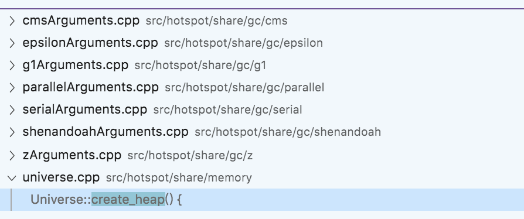
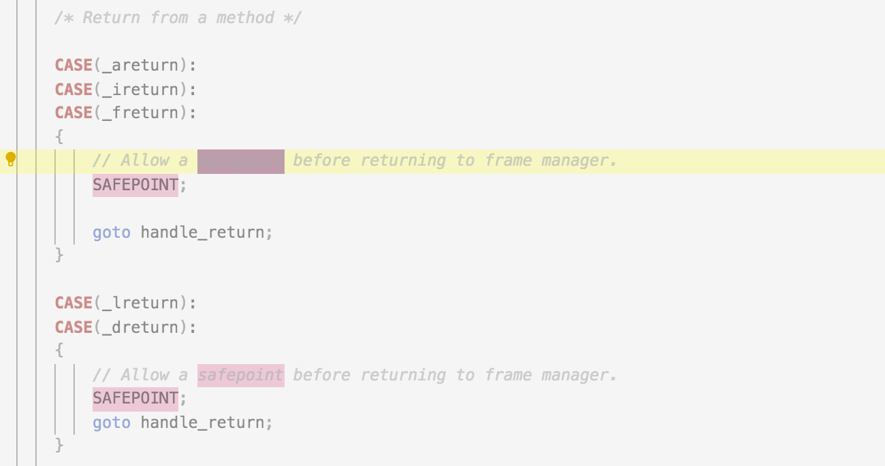
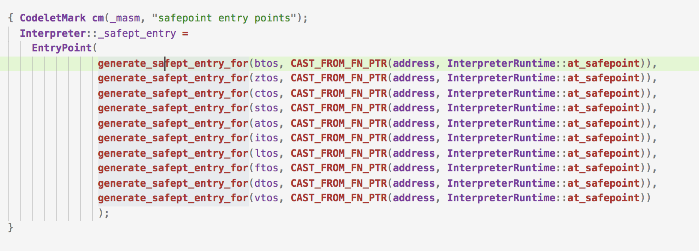

#jvm9 — GC通用实现

## GC通用模块

### CollectedHeap

这个类就是我们一直说的Java程序的堆的实现（抽象类），该类实现了一些最基本的功能，比如创建TLAB、普通分配等，通常一个GC算法自己会实现一个自己的Heap，这个Heap会是CollectedHeap的子类。

### GCCause

这个就是引起本次GC的原因。

```c++
enum Cause {
    /* public */
    _java_lang_system_gc,
    _full_gc_alot,
    _scavenge_alot,
    _allocation_profiler,
    _jvmti_force_gc,
    _gc_locker,
    _heap_inspection,
    _heap_dump,
    _wb_young_gc,
    _wb_conc_mark,
    _wb_full_gc,
    _archive_time_gc,

    /* implementation independent, but reserved for GC use */
    _no_gc,
    _no_cause_specified,
    _allocation_failure,

    /* implementation specific */

    _tenured_generation_full,
    _metadata_GC_threshold,
    _metadata_GC_clear_soft_refs,

    _cms_generation_full,
    _cms_initial_mark,
    _cms_final_remark,
    _cms_concurrent_mark,

    _old_generation_expanded_on_last_scavenge,
    _old_generation_too_full_to_scavenge,
    _adaptive_size_policy,

    _g1_inc_collection_pause,
    _g1_humongous_allocation,
    _g1_periodic_collection,

    _dcmd_gc_run,

    _shenandoah_stop_vm,
    _shenandoah_allocation_failure_evac,
    _shenandoah_concurrent_gc,
    _shenandoah_traversal_gc,
    _shenandoah_upgrade_to_full_gc,

    _z_timer,
    _z_warmup,
    _z_allocation_rate,
    _z_allocation_stall,
    _z_proactive,

    _last_gc_cause
  };
```

### VM_Operation、VM_GC_Operation体系

```c++
// The following class hierarchy represents
// a set of operations (VM_Operation) related to GC.
//
//  VM_Operation
//      VM_GC_Operation
//          VM_GC_HeapInspection
//          VM_GenCollectFull
//          VM_GenCollectFullConcurrent
//          VM_ParallelGCSystemGC
//          VM_CollectForAllocation
//              VM_GenCollectForAllocation
//              VM_ParallelGCFailedAllocation
//  VM_GC_Operation
//   - implements methods common to all classes in the hierarchy:
//     prevents multiple gc requests and manages lock on heap;
//
//  VM_GC_HeapInspection
//   - prints class histogram on SIGBREAK if PrintClassHistogram
//     is specified; and also the attach "inspectheap" operation
//
//  VM_CollectForAllocation
//  VM_GenCollectForAllocation
//  VM_ParallelGCFailedAllocation
//   - this operation is invoked when allocation is failed;
//     operation performs garbage collection and tries to
//     allocate afterwards;
//
//  VM_GenCollectFull
//  VM_GenCollectFullConcurrent
//  VM_ParallelGCSystemGC
//   - these operations preform full collection of heaps of
//     different kind
```

上面列举的就是在GC过程中相关的各种操作，GC相当于是一个命令模式，通过Operation这样的“命令”来指定堆Heap做什么样的操作，每一个operation都要实现一个doit的方法，这个方法就是具体实现的逻辑。

###ConcurrentGCThread

GC线程

### Hotspot支持的GC收集器类型

- **cms**：jdk1.4引入，近十多年java web应用无可争议的gc回收器实现
- epsilon：这个就是只分配但是不回收。一个实验性质的gc回收器，可以用来学习
- **g1**：下一个十年的gc回收器。g1的出现主要是为了解决cms内存碎片化后长时间停顿的问题。提供了期望的gc停顿时间等功能。提高在大堆下的gc表现
- Shenandoah：进一步提高GC过程中的并发，目的是降低gc过程中的停顿时间。同时这个停顿时间和堆的大小无关（不会随着堆的大小线性增长）
- **zgc**：停顿时间不超过10ms；停顿时间和堆的大小、存活对象大小无关；可以处理几TB的堆

## GC堆的初始化

初始化的入口还是之前一直提到的全局初始化方法init_globals中，

```c++
// init.cpp(103)
jint init_globals() {
  // 省略
  jint status = universe_init();
  if (status != JNI_OK)
    return status;
  // 省略
}

// init.cpp(649)
jint universe_init() {
  // 省略
  jint status = Universe::initialize_heap();
  if (status != JNI_OK) {
    return status;
  }
}
```



```c++
// universe.cpp（724）
CollectedHeap* Universe::create_heap() {
  assert(_collectedHeap == NULL, "Heap already created");
  return GCConfig::arguments()->create_heap();
}

jint Universe::initialize_heap() {
  // 创建堆
  // 这里的创建逻辑就是通过全局配置的GCConfig的参数来创建
  // 这里的GCArguments有很多的实现，不同的GC算法有不同的参数，比如cmsArguments、g1Arguments等，具体的创建堆的实现在具体自己对应的arguments实现中
  // 每个arguments定义自己的Heap类型（因为堆的实现就是一个类），以及一个Policy（每种GC算法自己对应一个Policy的实现），比如cms就是CMSHeap和ConcurrentMarkSweepPolicy，具体实现就是new一个Policy，然后调用一下Policy的initilize方法，然后new Heap(policy);
  // 所以综上堆的创建就是根据配置的gc类型，初始化自己的GCPolicy，然后new一个自己的Heap类
  _collectedHeap = create_heap();
  // 初始化创建出来的堆
  // 这个初始化方法就是各个Heap堆各自实现的
  jint status = _collectedHeap->initialize();
  if (status != JNI_OK) {
    return status;
  }
  log_info(gc)("Using %s", _collectedHeap->name());

  // TLAB线程本地分配
  ThreadLocalAllocBuffer::set_max_size(Universe::heap()->max_tlab_size());

  // 是否使用指针压缩
  if (UseCompressedOops) {
    // 使用指针压缩落
  }

  if (UseTLAB) {
    ThreadLocalAllocBuffer::startup_initialization();
  }
  return JNI_OK;
}
```

以上就是Java堆的初步创建，创建完之后还有后续的初始化过程，

```c++
// init.cpp(961)
bool universe_post_init() {
  // 省略
  // 这个post_initialize是各个堆自己实现的，针对自己的GC算法做一些初始化的事情
  Universe::heap()->post_initialize();
  // 省略
}
```

### GC Policy的初始化

```c++
// 这个函数大家注意到就是一个template，具体会根据Heap和Policy的类型来实现，大家这里可以当作是类似范性
template <class Heap, class Policy>
CollectedHeap* GCArguments::create_heap_with_policy() {
	// 所谓的Policy其实就是new出来，然后初始化一下，然后把这个policy传给具体的堆的实现
  Policy* policy = new Policy();
  policy->initialize_all();
  return new Heap(policy);
}

CollectedHeap* CMSArguments::create_heap() {
	// 这里<>里面的两个类型就是会替代上面的template中的类型
  return create_heap_with_policy<CMSHeap, ConcurrentMarkSweepPolicy>();
}
```

## 内存的分配

Java中最典型的内存分配就是new一个对象，那么我们看一下new一个对象的内存分配逻辑是如何做的。

```c++
// bytecodeInterpreter.cpp(2139)
CASE(_new): {
  u2 index = Bytes::get_Java_u2(pc+1);
  ConstantPool* constants = istate->method()->constants();
  // 如果常量池引用已经被解析过，就先尝试快速分配
  if (!constants->tag_at(index).is_unresolved_klass()) {
    Klass* entry = constants->resolved_klass_at(index);
    InstanceKlass* ik = InstanceKlass::cast(entry);
    // 如果类以及被初始化过了
    if (ik->is_initialized() && ik->can_be_fastpath_allocated() ) {
      // 找到这个对象需要多大的内存空间
      size_t obj_size = ik->size_helper();
      oop result = NULL;
      // If the TLAB isn't pre-zeroed then we'll have to do it
      bool need_zero = !ZeroTLAB;
      if (UseTLAB) {
        // 尝试从TLAB分配
        result = (oop) THREAD->tlab().allocate(obj_size);
      }
      if (result == NULL) {
        // 如果TLAB分配失败
        need_zero = true;
        // 通过指针碰撞分配
        retry:
        HeapWord* compare_to = *Universe::heap()->top_addr();
        HeapWord* new_top = compare_to + obj_size;
        if (new_top <= *Universe::heap()->end_addr()) {
          if (Atomic::cmpxchg(new_top, Universe::heap()->top_addr(), compare_to) != compare_to) {
            goto retry;
          }
          result = (oop) compare_to;
        }
      }
      if (result != NULL) {
        if (need_zero ) {
          HeapWord* to_zero = (HeapWord*) result + sizeof(oopDesc) / oopSize;
          obj_size -= sizeof(oopDesc) / oopSize;
          if (obj_size > 0 ) {
            memset(to_zero, 0, obj_size * HeapWordSize);
          }
        }
        if (UseBiasedLocking) {
          result->set_mark(ik->prototype_header());
        } else {
          result->set_mark(markOopDesc::prototype());
        }
        result->set_klass_gap(0);
        result->set_klass(ik);
        OrderAccess::storestore();
        SET_STACK_OBJECT(result, 0);
        UPDATE_PC_AND_TOS_AND_CONTINUE(3, 1);
      }
    }
  }
  // 如果快速分配没有成功，就进入普通慢速处理
  CALL_VM(InterpreterRuntime::_new(THREAD, METHOD->constants(), index),
          handle_exception);
  OrderAccess::storestore();
  SET_STACK_OBJECT(THREAD->vm_result(), 0);
  THREAD->set_vm_result(NULL);
  UPDATE_PC_AND_TOS_AND_CONTINUE(3, 1);
}
```

下面是慢速分配的流程

```c++
// interpreterRuntime.cpp(228)
IRT_ENTRY(void, InterpreterRuntime::_new(JavaThread* thread, ConstantPool* pool, int index))
  // 获取常量池类
  Klass* k = pool->klass_at(index, CHECK);
  InstanceKlass* klass = InstanceKlass::cast(k);

  // 确保没有new一个抽象类等
  klass->check_valid_for_instantiation(true, CHECK);

  // 确保类已经初始化了
  klass->initialize(CHECK);

	// 分配内存
  oop obj = klass->allocate_instance(CHECK);
  thread->set_vm_result(obj);
IRT_END
```

```c++
// instanceKlass.cpp(1250)
instanceOop InstanceKlass::allocate_instance(TRAPS) {
  // 是否实现了finalize方法
  bool has_finalizer_flag = has_finalizer(); // Query before possible GC
  // 获取需要分配对象的大小（类加载的时候就可以确定）
  int size = size_helper();  // Query before forming handle.

  instanceOop i;

  // 堆上分配内存
  i = (instanceOop)Universe::heap()->obj_allocate(this, size, CHECK_NULL);
  // 如果有实现finalize方法，就注册一下
  if (has_finalizer_flag && !RegisterFinalizersAtInit) {
    i = register_finalizer(i, CHECK_NULL);
  }
  return i;
}
```

```c++
// collectedHeap.inline.cpp(70)
inline oop CollectedHeap::obj_allocate(Klass* klass, int size, TRAPS) {
  ObjAllocator allocator(klass, size, THREAD);
  return allocator.allocate();
}
```

```c++
// memAllocator.cpp(346)
HeapWord* MemAllocator::mem_allocate(Allocation& allocation) const {
  if (UseTLAB) {
    HeapWord* result = allocate_inside_tlab(allocation);
    if (result != NULL) {
      return result;
    }
  }

  return allocate_outside_tlab(allocation);
}

oop MemAllocator::allocate() const {
  oop obj = NULL;
  {
    Allocation allocation(*this, &obj);
    HeapWord* mem = mem_allocate(allocation);
    if (mem != NULL) {
      obj = initialize(mem);
    }
  }
  return obj;
}

HeapWord* MemAllocator::allocate_inside_tlab(Allocation& allocation) const {
  assert(UseTLAB, "should use UseTLAB");

  // 这个就是计算一下top指针，然后设置新的top = top + obj_size即可
  HeapWord* mem = _thread->tlab().allocate(_word_size);
  if (mem != NULL) {
    return mem;
  }

  // 再申请一块额外的tlab空间分配
  return allocate_inside_tlab_slow(allocation);
}

HeapWord* MemAllocator::allocate_outside_tlab(Allocation& allocation) const {
  allocation._allocated_outside_tlab = true;
  // 这个mem_allocate非常重要，下面会详细分析，目前我们只要知道这里就是尝试去分配一块内存
  HeapWord* mem = _heap->mem_allocate(_word_size, &allocation._overhead_limit_exceeded);
  if (mem == NULL) {
    return mem;
  }

  NOT_PRODUCT(_heap->check_for_non_bad_heap_word_value(mem, _word_size));
  size_t size_in_bytes = _word_size * HeapWordSize;
  _thread->incr_allocated_bytes(size_in_bytes);

  return mem;
}
```

## 如何触发一次GC

注意下面的这些实现都是以典型的分代堆为例，G1、Shenandoah、Z等算法并不是这样实现的。因为典型的分代回收我们最熟悉，就以典型的分代回收为例来看。

```c++
// genCollectedHeap.cpp(912)
// 这里的GCCause就是触发本次GC的原因
void GenCollectedHeap::collect(GCCause::Cause cause) {
  if (cause == GCCause::_wb_young_gc) {
    // 仅收集年轻代
    collect(cause, YoungGen);
  } else {
    // 收集老年代
    collect(cause, OldGen);
  }
}
```

上面的collect方法，最后会进入如下代码，

```c++
void GenCollectedHeap::collect_locked(GCCause::Cause cause, GenerationType max_generation) {
  // Read the GC count while holding the Heap_lock
  unsigned int gc_count_before      = total_collections();
  unsigned int full_gc_count_before = total_full_collections();
  // 下面这段方法是比较通用的执行GC的代码写法
  // 显示new一个相关的operation，然后把这个operation放到VMThread的队列当中去执行
  {
    MutexUnlocker mu(Heap_lock);  // give up heap lock, execute gets it back
    // 生成一个VM_Operation
    VM_GenCollectFull op(gc_count_before, full_gc_count_before,
                         cause, max_generation);
    // 把生成的operation交给VMThread来执行
    VMThread::execute(&op);
  }
}
```

这里的VMThread非常重要，VMThread就像是一个母体，这个线程是虚拟机的单例线程，虚拟机中只有一个该线程。这个线程的主要作用就是维护了一个优先级队列（该队列就是一个VM_Operation队列），然后通过一个死循环的loop函数，不停的取出队列中的Operation，然后执行Operation（这个执行的含义是有些事情是他来做，有些事情是他来通知其他线程来做）。

==这里要注意一点，其实GC更多的情况下还是通过new一个VM_Operation（可以是具体的operation子类），然后把这个operation放到VMThread队列中来实现的。==

### 触发一次YoungGC

上面有一个

```c++
_heap->mem_allocate(_word_size, &allocation._overhead_limit_exceeded);
```

这个方法对于分配一个对象而言非常重要，下面是这个方法的具体实现

```c++
HeapWord* GenCollectedHeap::mem_allocate(size_t size,
                                         bool* gc_overhead_limit_was_exceeded) {
  // 直接调用mem_allocate_work
  return mem_allocate_work(size,
                           false /* is_tlab */,
                           gc_overhead_limit_was_exceeded);
}

HeapWord* GenCollectedHeap::mem_allocate_work(size_t size,
                                              bool is_tlab,
                                              bool* gc_overhead_limit_was_exceeded) {
  // gc分配是否超时，一般情况下都是false
  *gc_overhead_limit_was_exceeded = false;

  HeapWord* result = NULL;

  // 一个循环，会一直循环到分配成功或GC后分配失败
  for (uint try_count = 1, gclocker_stalled_count = 0; /* return or throw */; try_count += 1) {
    HandleMark hm; // Discard any handles allocated in each iteration.

    // First allocation attempt is lock-free.
    Generation *young = _young_gen;
    assert(young->supports_inline_contig_alloc(),
      "Otherwise, must do alloc within heap lock");
    // 这里就是校验一下，比如这个对象的大小是不是超过了整个Young区的大小
    if (young->should_allocate(size, is_tlab)) {
      // 在Young区分配内存
      result = young->par_allocate(size, is_tlab);
      if (result != NULL) {
        // 分配成功就直接返回
        assert(is_in_reserved(result), "result not in heap");
        return result;
      }
    }
    uint gc_count_before;  // Read inside the Heap_lock locked region.
    {
      // 锁！
      MutexLocker ml(Heap_lock);
      log_trace(gc, alloc)("GenCollectedHeap::mem_allocate_work: attempting locked slow path allocation");
      // 这个bool就是是否要尝试在老年代中分配
      // 通常情况下都是false，
      // 以下情况下会会是true
      //     1. 超大对象大于Young区剩下的空间
      //     2. GC锁已经被持有
      //     3. 内存非常紧张的情况下（比如上一次GC是因为年轻代回收后空余内存不够又出发了full gc，然后虚拟机判断下一次gc也大概率会失败）
      bool first_only = !should_try_older_generation_allocation(size);

      // 尝试分配内存
      result = attempt_allocation(size, is_tlab, first_only);
      if (result != NULL) {
        assert(is_in_reserved(result), "result not in heap");
        return result;
      }

      // 如果需要GC同时GC也已经触发，但是还没有被执行（一般不会发生）
      if (GCLocker::is_active_and_needs_gc()) {
        // tlab直接return NULL
        // 调用方自己会充实
        if (is_tlab) {
          return NULL;
        }
        // 看看堆能不能扩展一下
        if (!is_maximal_no_gc()) {
          // Try and expand heap to satisfy request.
          result = expand_heap_and_allocate(size, is_tlab);
          // Result could be null if we are out of space.
          if (result != NULL) {
            return result;
          }
        }

        if (gclocker_stalled_count > GCLockerRetryAllocationCount) {
          return NULL; // We didn't get to do a GC and we didn't get any memory.
        }

        JavaThread* jthr = JavaThread::current();
        if (!jthr->in_critical()) {
          MutexUnlocker mul(Heap_lock);
          // Wait for JNI critical section to be exited
          GCLocker::stall_until_clear();
          gclocker_stalled_count += 1;
          continue;
        } else {
          if (CheckJNICalls) {
            fatal("Possible deadlock due to allocating while"
                  " in jni critical section");
          }
          return NULL;
        }
      }

      // Read the gc count while the heap lock is held.
      gc_count_before = total_collections();
    }

    // 生成一个VM_Operation进行一次Young GC
    VM_GenCollectForAllocation op(size, is_tlab, gc_count_before);
    // 给VMThread来执行
    VMThread::execute(&op);
    if (op.prologue_succeeded()) {
      result = op.result();
      // 如果VM_Operation还没结束，就继续死循环重试
      if (op.gc_locked()) {
         assert(result == NULL, "must be NULL if gc_locked() is true");
         continue;
      }

			// 有没有超过时间
      const bool limit_exceeded = size_policy()->gc_overhead_limit_exceeded();
      // 有没有清理软引用
      const bool softrefs_clear = soft_ref_policy()->all_soft_refs_clear();

      // 如果所有软引用也清理过了还导致了超市，那么就是内存不够了
      if (limit_exceeded && softrefs_clear) {
        *gc_overhead_limit_was_exceeded = true;
        size_policy()->set_gc_overhead_limit_exceeded(false);
        if (op.result() != NULL) {
          CollectedHeap::fill_with_object(op.result(), size);
        }
        return NULL;
      }
      assert(result == NULL || is_in_reserved(result),
             "result not in heap");
      // 回收过后的内存分配出来了就正常返回
      return result;
    }

    // Give a warning if we seem to be looping forever.
    if ((QueuedAllocationWarningCount > 0) &&
        (try_count % QueuedAllocationWarningCount == 0)) {
          log_warning(gc, ergo)("GenCollectedHeap::mem_allocate_work retries %d times,"
                                " size=" SIZE_FORMAT " %s", try_count, size, is_tlab ? "(TLAB)" : "");
    }
  }
}
```

以上这部分代码就是如果TLAB分配失败，就会在Young区分配，Young区分配会先看对象的大小，如果对象大小过大就跳过Young区分配直接进入Old区分配，就在Young区分配，分配方式就是一个无锁的CAS分配；如果分配不成功就递交VM_Operation；如果GC已经Active了但是还没执行，就尝试扩容整个堆；

###触发一次Old GC

触发Old GC的情况有很多，需要结合具体的算法具体分析，通常来讲，触发一次YoungGC如果回收到的空间不够可能会触发一次full GC；或者old区的内存占用比例到达一的阀值也会触发一次old gc等，这块留到后续分析具体算法的实现时再详细深入讲解。

## Heap的结构和典型的实现

前面的学习我们了解到了一个Heap的典型实现是CollectedHeap，那么这个Heap类里面有一些字段、结构是子类实现是所依赖的，这里就主要关注一些比较重要的实现。

下面是CollectedHeap和子类的继承关系。

```
CollectedHeap
   GenCollectedHeap
     SerialHeap
     CMSHeap
   G1CollectedHeap
   ParallelScavengeHeap
   ShenandoahHeap
   ZCollectedHeap
```

GenCollectedHeap，这个东西的意思是分代堆，GenCollectedHeap里面有两个字段分别是年轻代和老年代。

```c++
// GenCollectedHeap.hpp（67） 
protected:
  Generation* _young_gen;
  Generation* _old_gen;
```

这里的Generation就是常说中的分代，

```txt
 Generation                      - abstract base class
 - DefNewGeneration              - allocation area (copy collected)
   - ParNewGeneration            - a DefNewGeneration that is collected by
                                   several threads
 - CardGeneration                 - abstract class adding offset array behavior
   - TenuredGeneration             - tenured (old object) space (markSweepCompact)
   - ConcurrentMarkSweepGeneration - Mostly Concurrent Mark Sweep Generation
                                       (Detlefs-Printezis refinement of
                                       Boehm-Demers-Schenker)

 The system configurations currently allowed are:

   DefNewGeneration + TenuredGeneration

   ParNewGeneration + ConcurrentMarkSweepGeneration
```

可以看到所谓的分成年轻代和老年代的传统分代其实就只剩下两根独苗了（这也是为什么不说算法和收集器就说分为老年代和年轻代是错误的）。

### DefNewGeneration + TenuredGeneration

这两个是老版本虚拟机如果没有指定GC算法时的默认回收算法，也是eden、from and to的传统内存区，这两个就是串行GC

### ParNewGeneration + ConcurrentMarkSweepGeneration

这两个就是并行GC。

通常来说，如果是学习的目的的话，可以学习DefNewGeneration + TenuredGeneration，因为单线程模式下比较容易学习。

## CardTable

CardTable就是所谓的卡表，之前讲解GC基本原理的时候也提到过CardTable，卡表就是记录分代间的跨代指针，因为在Young GC中老年代中的对象也是GC Roots的一部分，如果每次都把整个老年代中的对象都扫描一边就很浪费时间，所以就用写屏障在修改指针的时候更新卡表为dirty，后续只要扫描dirty的卡就可以了。

卡表我们只要简单理解为一个数组就可以了，每个数组代表一个内存快，每个内存块。

##SafePoint

安全点，安全点是jvm中一个非常重要的机制，因为我们知道进行GC的时候是需要进入STW的，那么虚拟机是如何知道我何时应当进入STW呢？虚拟机就用了一个safepoint，这个东西就是代表当进入某些状态时，虚拟机会认为这是一个安全的状态，我可以在这个状态下安全的进入STW。

> safepoint并不是只有在GC中才使用，比如一些去优化等，只是GC更贴近我们的日常工作，编译优化的内容和我们日常工作关系不大，所以这块很少提。

那么在hotspot的实现中，什么地方被认为是安全点呢？

```java
  // safepoint.cpp（162）
	// Begin the process of bringing the system to a safepoint.
  // Java threads can be in several different states and are
  // stopped by different mechanisms:
  //
  //  1. Running interpreted
  //     The interpreter dispatch table is changed to force it to
  //     check for a safepoint condition between bytecodes.
  //  2. Running in native code
  //     When returning from the native code, a Java thread must check
  //     the safepoint _state to see if we must block.  If the
  //     VM thread sees a Java thread in native, it does
  //     not wait for this thread to block.  The order of the memory
  //     writes and reads of both the safepoint state and the Java
  //     threads state is critical.  In order to guarantee that the
  //     memory writes are serialized with respect to each other,
  //     the VM thread issues a memory barrier instruction.
  //  3. Running compiled Code
  //     Compiled code reads a global (Safepoint Polling) page that
  //     is set to fault if we are trying to get to a safepoint.
  //  4. Blocked
  //     A thread which is blocked will not be allowed to return from the
  //     block condition until the safepoint operation is complete.
  //  5. In VM or Transitioning between states
  //     If a Java thread is currently running in the VM or transitioning
  //     between states, the safepointing code will wait for the thread to
  //     block itself when it attempts transitions to a new state.
```

上面的这段注释就是相关的一些安全点的描述，虚拟机中的基本做法就是，当需要进入安全点时，虚拟机会设置全局变量，然后每一条线程都会轮询相关的全局变量，当轮训到的时候就主动把自己挂起。

比如在zero解释器中的主动轮询：



就会在一些字节码执行后主动去看是否需要进入安全点。

那么在更加通用的模版解释器中生成安全点的代码如下：



其中的generate_safept_entry_for函数是一个操作系统、cpu架构有关的函数（因为这是生成汇编，肯定不同）。

生成出来的这个汇编代码，也会在合适的位置插入。