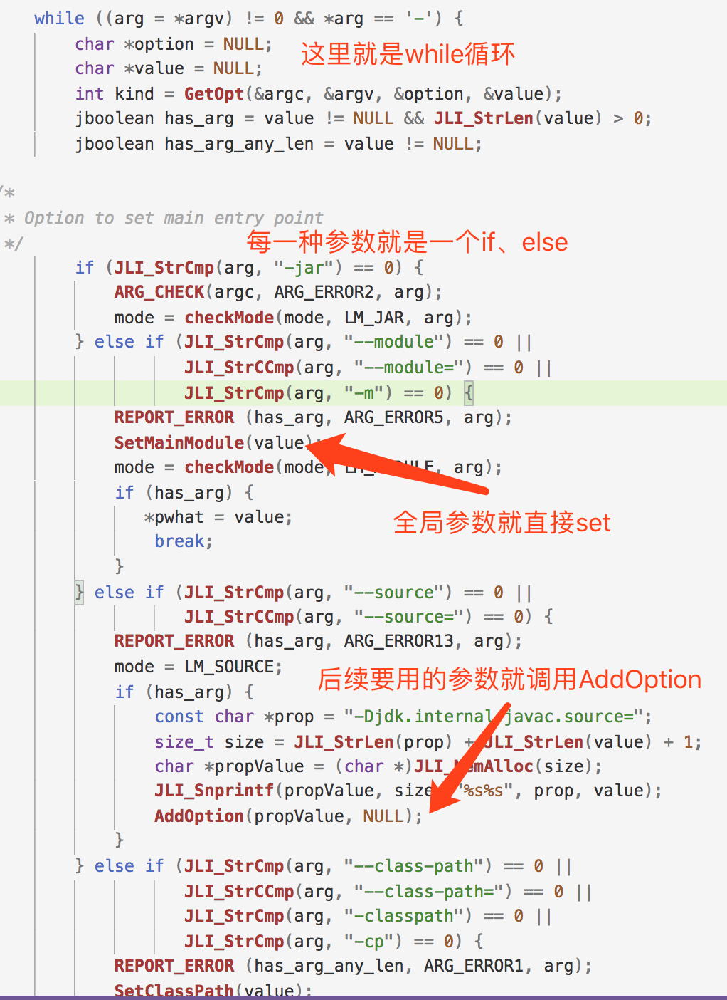
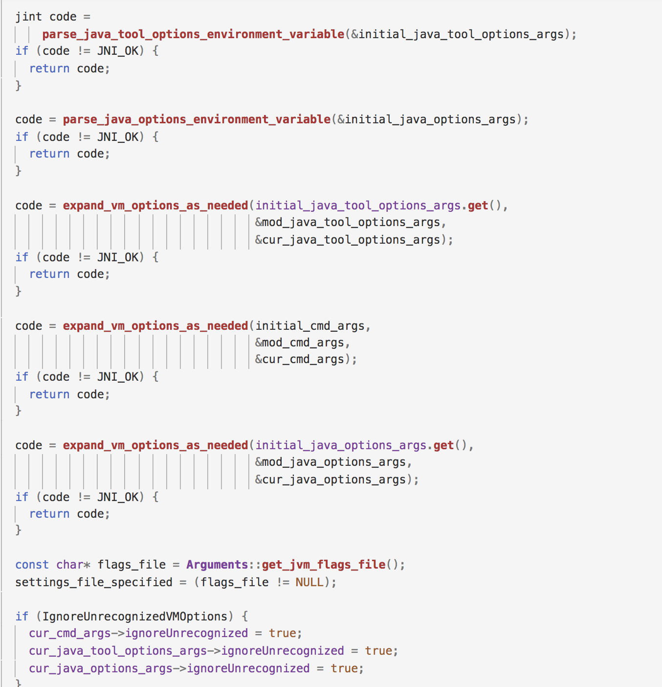
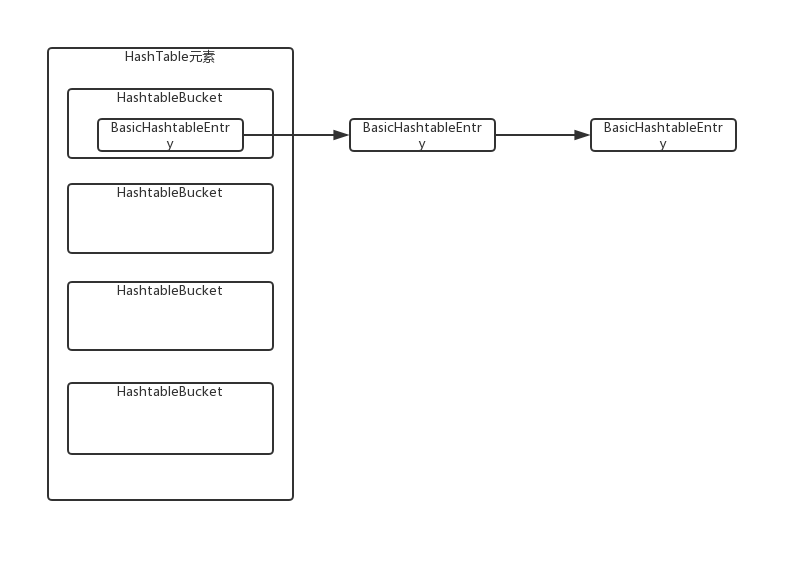
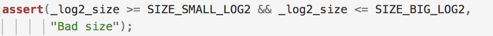
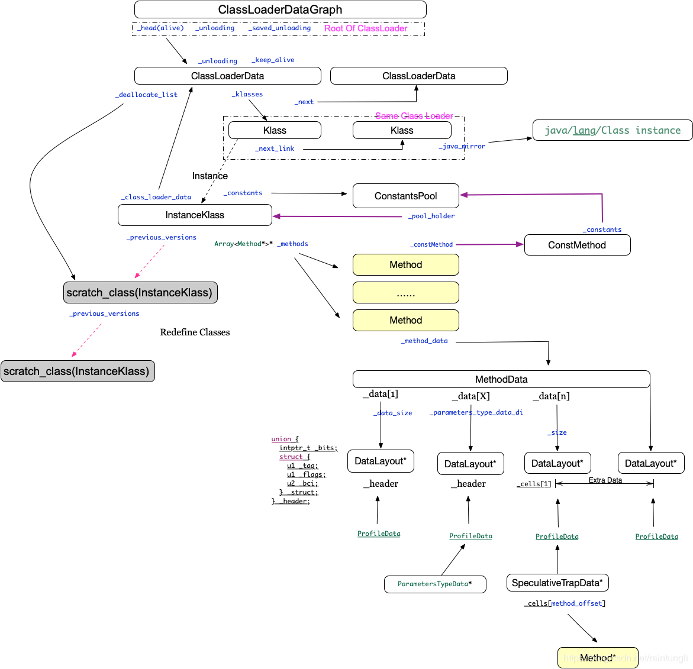

#jvm启动、类加载、OOP/Klass（补充内容）

------

之前由于主要分享的是主要流程，一些有意思的细节没有进一步分析，这次做一个整理，把一些有意思的但是之前没有提到的内容或者说的不详细的内容单独说明一下。

##虚拟机启动

### 虚拟机解析启动参数

虚拟机启动参数解析相关的逻辑都在arguments.cpp文件中，主要做法就是在main.c中准备好所有的参数，然后在java.c的JLI_Launch方法中去解析参数，具体源码如下：

```c
// main.c（）
JNIEXPORT int
main(int argc, char **argv)
{
    int margc;
    char** margv;
    int jargc;
    char** jargv;
    const jboolean const_javaw = JNI_FALSE;
    {
    // 省略

	  // 这个方法里面做一些预处理，比如是不是可以用argfile（参数配置文件，是不是传了参数等）
    JLI_InitArgProcessing(jargc > 0, const_disable_argfile);

    {
        // accommodate the NULL at the end
        JLI_List args = JLI_List_new(argc + 1);
        int i = 0;

        // Add first arg, which is the app name
        JLI_List_add(args, JLI_StringDup(argv[0]));
        // Append JDK_JAVA_OPTIONS
        if (JLI_AddArgsFromEnvVar(args, JDK_JAVA_OPTIONS)) {
            // JLI_SetTraceLauncher is not called yet
            // Show _JAVA_OPTIONS content along with JDK_JAVA_OPTIONS to aid diagnosis
            if (getenv(JLDEBUG_ENV_ENTRY)) {
                char *tmp = getenv("_JAVA_OPTIONS");
                if (NULL != tmp) {
                    JLI_ReportMessage(ARG_INFO_ENVVAR, "_JAVA_OPTIONS", tmp);
                }
            }
        }
        // Iterate the rest of command line
        for (i = 1; i < argc; i++) {
	          // 处理参数，看是不是把参数文件
            JLI_List argsInFile = JLI_PreprocessArg(argv[i], JNI_TRUE);
	          // 如果没有就把这个参数拷贝args中
            if (NULL == argsInFile) {
                JLI_List_add(args, JLI_StringDup(argv[i]));
            } else {
	              // 如果有就从文件中读取参数（一般来说应该不会进来）
                int cnt, idx;
                cnt = argsInFile->size;
                for (idx = 0; idx < cnt; idx++) {
                    JLI_List_add(args, argsInFile->elements[idx]);
                }
                // Shallow free, we reuse the string to avoid copy
                JLI_MemFree(argsInFile->elements);
                JLI_MemFree(argsInFile);
            }
        }
        margc = args->size;
        // add the NULL pointer at argv[argc]
        JLI_List_add(args, NULL);
        margv = args->elements;
    }
      // margv就是args的元素，里面的元素传到启动方法中
    return JLI_Launch(margc, margv,
                   jargc, (const char**) jargv,
                   0, NULL,
                   VERSION_STRING,
                   DOT_VERSION,
                   (const_progname != NULL) ? const_progname : *margv,
                   (const_launcher != NULL) ? const_launcher : *margv,
                   jargc > 0,
                   const_cpwildcard, const_javaw, 0);
}

```

```c
// java.c（219）
JNIEXPORT int JNICALL
JLI_Launch(int argc, char ** argv,              /* main argc, argv */
        int jargc, const char** jargv,          /* java args */
        int appclassc, const char** appclassv,  /* app classpath */
        const char* fullversion,                /* full version defined */
        const char* dotversion,                 /* UNUSED dot version defined */
        const char* pname,                      /* program name */
        const char* lname,                      /* launcher name */
        jboolean javaargs,                      /* JAVA_ARGS */
        jboolean cpwildcard,                    /* classpath wildcard*/
        jboolean javaw,                         /* windows-only javaw */
        jint ergo                               /* unused */
)
{
    int mode = LM_UNKNOWN;
    char *what = NULL;
    char *main_class = NULL;
    int ret;
    InvocationFunctions ifn;
    jlong start, end;
    char jvmpath[MAXPATHLEN];
    char jrepath[MAXPATHLEN];
    char jvmcfg[MAXPATHLEN];

    _fVersion = fullversion;
    _launcher_name = lname;
    _program_name = pname;
    _is_java_args = javaargs;
    _wc_enabled = cpwildcard;

		// 就是下面的JLI_IsTraceLauncher，是不是需要追踪多打一些日志
    InitLauncher(javaw);
    DumpState();
    if (JLI_IsTraceLauncher()) {
        int i;
        printf("Java args:\n");
        for (i = 0; i < jargc ; i++) {
            printf("jargv[%d] = %s\n", i, jargv[i]);
        }
        printf("Command line args:\n");
        for (i = 0; i < argc ; i++) {
            printf("argv[%d] = %s\n", i, argv[i]);
        }
        AddOption("-Dsun.java.launcher.diag=true", NULL);
    }

    /*
     * SelectVersion() has several responsibilities:
     *
     *  1) Disallow specification of another JRE.  With 1.9, another
     *     version of the JRE cannot be invoked.
     *  2) Allow for a JRE version to invoke JDK 1.9 or later.  Since
     *     all mJRE directives have been stripped from the request but
     *     the pre 1.9 JRE [ 1.6 thru 1.8 ], it is as if 1.9+ has been
     *     invoked from the command line.
     */
    SelectVersion(argc, argv, &main_class);

		// 创建执行环境，主要找一些jre、jvm的路径和配置
    CreateExecutionEnvironment(&argc, &argv,
                               jrepath, sizeof(jrepath),
                               jvmpath, sizeof(jvmpath),
                               jvmcfg,  sizeof(jvmcfg));

    if (!IsJavaArgs()) {
        SetJvmEnvironment(argc,argv);
    }

    ifn.CreateJavaVM = 0;
    ifn.GetDefaultJavaVMInitArgs = 0;

    if (JLI_IsTraceLauncher()) {
        start = CounterGet();
    }

    if (!LoadJavaVM(jvmpath, &ifn)) {
        return(6);
    }

    if (JLI_IsTraceLauncher()) {
        end   = CounterGet();
    }

    JLI_TraceLauncher("%ld micro seconds to LoadJavaVM\n",
             (long)(jint)Counter2Micros(end-start));

    ++argv;
    --argc;

		// 这个默认是false，就是能不能使用形如：-J-ms32m这样的参数
    if (IsJavaArgs()) {
        /* Preprocess wrapper arguments */
        TranslateApplicationArgs(jargc, jargv, &argc, &argv);
        if (!AddApplicationOptions(appclassc, appclassv)) {
            return(1);
        }
    } else {
        /* Set default CLASSPATH */
        char* cpath = getenv("CLASSPATH");
        if (cpath != NULL) {
            SetClassPath(cpath);
        }
    }

		// 这里就是真正的执行参数解析的逻辑
    if (!ParseArguments(&argc, &argv, &mode, &what, &ret, jrepath)) {
        return(ret);
    }

    /* Override class path if -jar flag was specified */
    if (mode == LM_JAR) {
        SetClassPath(what);     /* Override class path */
    }

    /* set the -Dsun.java.command pseudo property */
    SetJavaCommandLineProp(what, argc, argv);

    /* Set the -Dsun.java.launcher pseudo property */
    SetJavaLauncherProp();

    /* set the -Dsun.java.launcher.* platform properties */
    SetJavaLauncherPlatformProps();

    return JVMInit(&ifn, threadStackSize, argc, argv, mode, what, ret);
}
```

ParseArguments在java.c（1278），方法太长，截一个图感受一下。主要做的事情就是如果是全局需要用到的参数（比如classPath），就设置一下，如果全局需要用到的，就拷贝到一个全局options的数组中。



调用链路如下

```
java.c -> JLI_Launch
	java_md_solinux.c(和操作系统有关，不同操作系统执行不同的文件) -> JVMInit
		java_md_solinux.c(和操作系统有关，不同操作系统执行不同的文件) -> ContinueInNewThread
			java.c -> JavaMain			
				java.c -> InitializeJVM
					jni.cpp -> JNI_CreateJavaVM
						jni.cpp -> JNI_CreateJavaVM_inner
							thread.cpp -> create_vm（3707）【jint parse_result = Arguments::parse(args);】
```

在Arguments::parse方法中会解析所有需要的参数，该方法较长，处理了各种参数解析，下面简单截图感受一下




### 如何执行main方法

我们知道Java程序都会通过main方法来调用，那么这个又是如何做到的呢？

执行java的main方法分为两步，第一步找到MainClass，第二步在MainClass中找到对应的main方法。

找MainClass的逻辑在**java.c -> LoadMainClass**中，主要就是通过调用**sun/launcher/LauncherHelper -> checkAndLoadMain**方法来实现的，这个方法是一个java方法，这个方法如下

```java
public static Class<?> checkAndLoadMain(boolean var0, int var1, String var2) {
}
```

具体调用方实现如下

```c++
static jclass
LoadMainClass(JNIEnv *env, int mode, char *name)
{
    jmethodID mid;
    jstring str;
    jobject result;
    jlong start, end;
    jclass cls = GetLauncherHelperClass(env);
    NULL_CHECK0(cls);
    if (JLI_IsTraceLauncher()) {
        start = CounterGet();
    }
    NULL_CHECK0(mid = (*env)->GetStaticMethodID(env, cls,
                "checkAndLoadMain",
                "(ZILjava/lang/String;)Ljava/lang/Class;"));

    NULL_CHECK0(str = NewPlatformString(env, name));
	  // USE_STDERR默认是true，mode就是上ParseArguments处解析的
  	// mode的取值范围如下：
	  // private static final int LM_UNKNOWN = 0;
		// private static final int LM_CLASS   = 1;
    // private static final int LM_JAR     = 2;
    // private static final int LM_MODULE  = 3;
    // private static final int LM_SOURCE  = 4;
    NULL_CHECK0(result = (*env)->CallStaticObjectMethod(env, cls, mid,
                                                        USE_STDERR, mode, str));

    if (JLI_IsTraceLauncher()) {
        end   = CounterGet();
        printf("%ld micro seconds to load main class\n",
               (long)(jint)Counter2Micros(end-start));
        printf("----%s----\n", JLDEBUG_ENV_ENTRY);
    }

    return (jclass)result;
}
```

找到MainClass之后就是准备main方法需要的args[]的参数，这块具体的实现如下，

```c++
// java.c（JavaMain，508）
/* Build platform specific argument array */
mainArgs = CreateApplicationArgs(env, argv, argc);

// java_md_common.c（362）
// CreateApplicationArgs方法不同的操作系统又不同的实现，下面的是java_md_common.c中（非windows系统的实现）
jobjectArray
CreateApplicationArgs(JNIEnv *env, char **strv, int argc)
{
    return NewPlatformStringArray(env, strv, argc);
}

// java.c（1584）
jobjectArray
NewPlatformStringArray(JNIEnv *env, char **strv, int strc)
{
    jarray cls;
    jarray ary;
    int i;

	  // 找到java/lang/String这个类
    NULL_CHECK0(cls = FindBootStrapClass(env, "java/lang/String"));
  	// 弄一个数组出来
    NULL_CHECK0(ary = (*env)->NewObjectArray(env, strc, cls, 0));
    CHECK_EXCEPTION_RETURN_VALUE(0);
    for (i = 0; i < strc; i++) {
      	// 把参数用转成java/lang/String类型，这里的实现就是调用sun/launcher/LauncherHelper -> makePlatformString，把一个byte数组转成一个String。
        jstring str = NewPlatformString(env, *strv++);
        NULL_CHECK0(str);
        (*env)->SetObjectArrayElement(env, ary, i, str);
        (*env)->DeleteLocalRef(env, str);
    }
	  // 这里执行main方法的参数也都准备好了
    return ary;
}
```

```java
// sun/launcher/LauncherHelper -> makePlatformString
// var0就是是不是能输出stderr，默认为true
static String makePlatformString(boolean var0, byte[] var1) {
  initOutput(var0);
  if (encoding == null) {
    encoding = System.getProperty("sun.jnu.encoding");
    isCharsetSupported = Charset.isSupported(encoding);
  }

  try {
    // byte数组转成String
    String var2 = isCharsetSupported ? new String(var1, encoding) : new String(var1);
    return var2;
  } catch (UnsupportedEncodingException var3) {
    abort(var3, (String)null);
    return null;
  }
}
```

那么到这里参数也已经准备好了，有了MainClass和传入的参数，就差最后一步的调用main方法了。

```c++
// java.c（544）
// 其实就是通过jni接口调用java static方法。
mainID = (*env)->GetStaticMethodID(env, mainClass, "main",
                                       "([Ljava/lang/String;)V");
```

------

## HashTable

源码中有很多基于HashTable的数据结构，比如**PlaceholderTable**等，那么jvm的HashTable和Java的HashMap实现上有什么区别？

### 基本原理

两个实现的逻辑总体上还是比较接近的，桶+链表，设计思想是一致的。

- 但是JDK8中的HashMap容量是2的n次方，HashTable没有这样的优化

- 两个实现处理hash冲突的方式都是使用链表

- HashMap的hash是原hashcode高16位和低16位异或；HashTable的key都是Symbol，

  ```c++
  // symbol.hpp（161）
  unsigned identity_hash() const {
      // 先右移两位
      unsigned addr_bits = (unsigned)((uintptr_t)this >> (LogMinObjAlignmentInBytes + 3));
    	// 这个_identity_hash是创建这个对象的时候通过os::random分配到的。
      return ((unsigned)_identity_hash & 0xffff) |
        		 // 内存地址、_body的数据进行计算
             ((addr_bits ^ (length() << 8) ^ (( _body[0] << 8) | _body[1])) << 16);
    }
  ```

- HashTable的内存分配方式相比HashMap要复杂一些，因为Java会帮助我们管理好内存，但是c++需要自己管理。HashMap的Node对象是分配在堆上的，我们无需关心，但是HashTable就有一个对象池性质的东西。HashTable的对象池有两个，一个是_entry_blocks，是一个GrowableArray，所有分配到的对象都需要放到这个list当中。还有一个就是\_free_list，就是HashTable被释放的内存就会放到这个list中，\_free_list是一个链表，分配内存是优先从这个list分配中的。

- resize方法。对于HashMap来说resize一般都是扩容，JDK8的扩容就是两倍，然后rehash。HashTable的扩容其实并没有体现在桶的扩容，而是体现在\_entry_block的扩容，也就是桶的数量不变，但是链表的长度会不断变长。这个resize方法其实就是HashTable主动扩容、缩容（不像HashMap那样会自动触发），而是提供一个resize方法给你手动触发。

- 结构不同

  

------

##GrowableArray

这个就是相当于Java中的ArrayList，但是具体的实现上也有一定程度的不同。

### 基本原理

总体来说两个类的实现还是比较接近的，只不过ArrayList每次扩容是1.5倍，GrowableArray每次是2倍，扩容的时候其实也是分配一个新的数组，然后把原来的元素都复制到新的数组中。

- 内存分配。ArrayList作为Java中的类，内存自然是由虚拟机托管，内存的分配只需要知道在堆上就可以。但是GrowableArray需要自己来考虑内存要分配在哪里。

  ```c++
   protected:
    int    _len;          // current length
    int    _max;          // maximum length
    Arena* _arena;        // Indicates where allocation occurs:
                          //   0 means default ResourceArea
                          //   1 means on C heap
                          //   otherwise, allocate in _arena
  ```

  这里的内存分配有三种模式，分配在栈上，分配在堆上和分配在一个内部的内存池Arena上。

------

##ConcurrentHashTable

对比Java的ConcurrentHashMap，两者实现的基本思想和HashMap的基本思想是一致的，基本做法还是桶+链表的结构。而且ConcurrentHashTable的size也是2的n次方，5 ～ 32之间。



但是在并发的处理上两个实现还是有比较大的区别的。

###添加元素

JDK8的ConcurrenthHashMap的并发添加元素的基本做法是如果桶的位置没有元素就CAS放元素，如果有元素就syncronized锁住该元素，然后在获得锁的情况下对这个元素进行操作。

```java
// ConcurrentHashMap添加元素基本原理
final V putVal(K key, V value, boolean onlyIfAbsent) {
        if (key == null || value == null) throw new NullPointerException();
        int hash = spread(key.hashCode());
        int binCount = 0;
        for (Node<K,V>[] tab = table;;) {
            Node<K,V> f; int n, i, fh;
            if (tab == null || (n = tab.length) == 0)
	              // 如果没有则初始化table。cas sizeCtl = -1才能初始化table，
                tab = initTable();
            else if ((f = tabAt(tab, i = (n - 1) & hash)) == null) {
	              // 如果桶上没有元素就cas放置
                if (casTabAt(tab, i, null,
                             new Node<K,V>(hash, key, value, null)))
                    break;                   // no lock when adding to empty bin
            }
            else if ((fh = f.hash) == MOVED)
	              // 如果在扩容就帮助扩容
                tab = helpTransfer(tab, f);
            else {
                V oldVal = null;
	              // 如果原来已经有元素了，就锁住这个元素
                synchronized (f) {
                    if (tabAt(tab, i) == f) {
                        if (fh >= 0) {
                            binCount = 1;
                            for (Node<K,V> e = f;; ++binCount) {
                                K ek;
	                              // 如果原来有这个key了，那就看是不是需要更新value
                                if (e.hash == hash &&
                                    ((ek = e.key) == key ||
                                     (ek != null && key.equals(ek)))) {
                                    oldVal = e.val;
                                    if (!onlyIfAbsent)
                                        e.val = value;
                                    break;
                                }
                                Node<K,V> pred = e;
                                if ((e = e.next) == null) {
	                                  // 如果原来没有key，就在链表的最后面添加一个元素
                                    pred.next = new Node<K,V>(hash, key,
                                                              value, null);
                                    break;
                                }
                            }
                        }
                        else if (f instanceof TreeBin) {
                            Node<K,V> p;
                            binCount = 2;
	                          // 红黑树单独处理
                            if ((p = ((TreeBin<K,V>)f).putTreeVal(hash, key,
                                                           value)) != null) {
                                oldVal = p.val;
                                if (!onlyIfAbsent)
                                    p.val = value;
                            }
                        }
                    }
                }
                if (binCount != 0) {
	                  // 链表长度到8就变成红黑树（退化是6，为了防止频繁升级成红黑树以及频繁退化成链表）
                    if (binCount >= TREEIFY_THRESHOLD)
                        treeifyBin(tab, i);
                    if (oldVal != null)
                        return oldVal;
                    break;
                }
            }
        }
			  // 长度+1（基本长度是放在baseCount上，先cas改一下，如果没有改成功，就放到CounterCell中，为了防止大量县城都在抢着更改baseCount）
  			// addCount也是一个很复杂的实现，基本思想是先乐观的修改，然后是比较乐观的修改，然后才是非常悲观的死循环方式CAS修改
        addCount(1L, binCount);
        return null;
    }
```

```c++
template <typename VALUE, typename CONFIG, MEMFLAGS F>
template <typename LOOKUP_FUNC>
inline bool ConcurrentHashTable<VALUE, CONFIG, F>::
  internal_insert(Thread* thread, LOOKUP_FUNC& lookup_f, const VALUE& value,
                  bool* grow_hint, bool* clean_hint)
{
    bool ret = false;
    bool clean = false;
    bool locked;
    size_t loops = 0;
    size_t i = 0;
    // 这个就是拿到key的hash
    uintx hash = lookup_f.get_hash();
    // 创建一个新的node
    Node* new_node = Node::create_node(value, NULL);

    while (true) {
      {
        // 这行不用管
        ScopedCS cs(thread, this); /* protected the table/bucket */
        // 获取对应的桶
        Bucket* bucket = get_bucket(hash);
        // 找到桶中的第一个元素
        Node* first_at_start = bucket->first();
        // 看看在这个桶的链表上是不是有old元素
        Node* old = get_node(bucket, lookup_f, &clean, &loops);
        // 这个说明原来没有
        if (old == NULL) {
          // 把新建的node放在原来的first前面
          new_node->set_next(first_at_start);
          // cas修改桶的first为新建的node
          if (bucket->cas_first(new_node, first_at_start)) {
            // 这里就代表成功
            new_node = NULL;
            ret = true;
            break; /* leave critical section */
          }
          // CAS failed we must leave critical section and retry.
          // CAS失败了就记录一下
          locked = bucket->is_locked();
        } else {
          // There is a duplicate.
          break; /* leave critical section */
        }
      } /* leave critical section */
      i++;
      if (locked) {
        // 如果这个桶已经被锁上了
        // 这个在Linux中的实现是sched_yield()方法，就是试着让出CPU资源，把自己放到队列的末端，如果没有人用CPU资源就会继续立即执行
        os::naked_yield();
      } else {
        // 自旋一下，其实就是降低锁的竞争
        SpinPause();
      }
      // 死循环继续重试
    }

    if (new_node != NULL) {
      // CAS failed and a duplicate was inserted, we must free this node.
      Node::destroy_node(new_node);
    } else if (i == 0 && clean) {
      // We only do cleaning on fast inserts.
      // 清理当前桶中已经dead的元素（需要加锁）
      Bucket* bucket = get_bucket_locked(thread, lookup_f.get_hash());
      delete_in_bucket(thread, bucket, lookup_f);
      bucket->unlock();
      clean = false;
    }

    if (grow_hint != NULL) {
      *grow_hint = loops > _grow_hint;
    }

    if (clean_hint != NULL) {
      *clean_hint = clean;
    }

    return ret;
}
```

###移除元素

ConcurrentHashMap移除和添加差不多，都是如果是桶上的元素就CAS，不然就锁起来挨个找。

ConcurrentHashTable则更粗暴一点，直接把整个桶全部锁起来，然后链表挨个遍历。就是比Java多一步destory，因为Java删除的元素虚拟机会帮助我们回收，但是c++需要自己来管理。

### 扩容

ConcurentHashMap的扩容基本步骤如下，

1. 先确定每次扩容的步长
2. 找到自己可以扩容的那个桶
3. 锁住桶节点，然后遍历链表，分为两个链表，然后在新的tab上对应位置放置两个链表，原来的老tab对应位置放置ForwardingNode。

ConcurrentHashTable扩容基本原理如下，

1. 每次扩容也是扩容一倍（2的n次方）
2. 把整个桶取出来并加锁，重新hash之后最高位也会出现1和0的情况，然后放在对应的newTable上
3. 原来的first设置redirect标识位（相当于ForwardingNode）

虚拟机中典型的ConcurrentHashTable实现就是**SymbleTable**（就是放一大堆各种Symbol的地方）和**StringTable**（就是方Java字符串的Table）。

------

## 类加载、链接、初始化

###类加载的时候ClassFileParser中间解析到的method、annotation、interface、fields等在生成instanceClass之前都是存在哪里的？

每一个ClassLoader都对应jvm中的一个结构ClassLoaderData，这个东西里面有一个ClassLoaderMetaspace，所有类加载过程中用到的中间变量都是放在这里的（ClassFileparser在析构函数中会释放这些所有的内存）。如果这里内存空间不够，有一个循环一边分配一边进行Full GC尝试对metaspace进行回收，知道有足够的空间出来为止。

源码如下：

```c++
// metaspace.cpp（1266）
MetaWord* Metaspace::allocate(ClassLoaderData* loader_data, size_t word_size,
                              MetaspaceObj::Type type, TRAPS) {
  assert(!_frozen, "sanity");
  assert(!(DumpSharedSpaces && THREAD->is_VM_thread()), "sanity");

  if (HAS_PENDING_EXCEPTION) {
    assert(false, "Should not allocate with exception pending");
    return NULL;  // caller does a CHECK_NULL too
  }

  assert(loader_data != NULL, "Should never pass around a NULL loader_data. "
        "ClassLoaderData::the_null_class_loader_data() should have been used.");

  MetadataType mdtype = (type == MetaspaceObj::ClassType) ? ClassType : NonClassType;

  // Try to allocate metadata.
  MetaWord* result = loader_data->metaspace_non_null()->allocate(word_size, mdtype);

  if (result == NULL) {
    tracer()->report_metaspace_allocation_failure(loader_data, word_size, type, mdtype);

    // Allocation failed.
    if (is_init_completed()) {
      // Only start a GC if the bootstrapping has completed.
      // Try to clean out some heap memory and retry. This can prevent premature
      // expansion of the metaspace.
      result = Universe::heap()->satisfy_failed_metadata_allocation(loader_data, word_size, mdtype);
    }
  }

  if (result == NULL) {
    if (DumpSharedSpaces) {
      // CDS dumping keeps loading classes, so if we hit an OOM we probably will keep hitting OOM.
      // We should abort to avoid generating a potentially bad archive.
      vm_exit_during_cds_dumping(err_msg("Failed allocating metaspace object type %s of size " SIZE_FORMAT ". CDS dump aborted.",
          MetaspaceObj::type_name(type), word_size * BytesPerWord),
        err_msg("Please increase MaxMetaspaceSize (currently " SIZE_FORMAT " bytes).", MaxMetaspaceSize));
    }
    report_metadata_oome(loader_data, word_size, type, mdtype, THREAD);
    assert(HAS_PENDING_EXCEPTION, "sanity");
    return NULL;
  }

  // Zero initialize.
  Copy::fill_to_words((HeapWord*)result, word_size, 0);

  return result;
}
```

### OOP是一个实例，那么OOP是如何生成的？OOP里面的字段new出来之后为什么都是零值？

OOP的内存分配是在instanceKlass上的方法，

```c++
// instanceKlass.cpp（1250）
instanceOop InstanceKlass::allocate_instance(TRAPS) {
  bool has_finalizer_flag = has_finalizer(); // Query before possible GC
  int size = size_helper();  // Query before forming handle.

  instanceOop i;

  // 从堆上分配一个instanceOop，具体实现如下
  i = (instanceOop)Universe::heap()->obj_allocate(this, size, CHECK_NULL);
  if (has_finalizer_flag && !RegisterFinalizersAtInit) {
    i = register_finalizer(i, CHECK_NULL);
  }
  return i;
}
```

```c++
// collectedHeap.inline.cpp（70）
inline oop CollectedHeap::obj_allocate(Klass* klass, int size, TRAPS) {
  ObjAllocator allocator(klass, size, THREAD);
  return allocator.allocate();
}
```

```c++
// memAllocator.cpp（357）
oop MemAllocator::allocate() const {
  oop obj = NULL;
  {
    Allocation allocation(*this, &obj);
    // 这边的分配就是先在tlab上分配，如果分配不成功就在堆上分配
    HeapWord* mem = mem_allocate(allocation);
    if (mem != NULL) {
      obj = initialize(mem);
    }
  }
  return obj;
}

// memAllocator.cpp（392）
oop ObjAllocator::initialize(HeapWord* mem) const {
  mem_clear(mem);
  return finish(mem);
}

// memAllocator.cpp（369）
void MemAllocator::mem_clear(HeapWord* mem) const {
  assert(mem != NULL, "cannot initialize NULL object");
  const size_t hs = oopDesc::header_size();
  assert(_word_size >= hs, "unexpected object size");
  oopDesc::set_klass_gap(mem, 0);
  // 用0填充分配到的那块内存，这个就是为什么我们new出来的对象在执行构造函数之前，实例对象的值都是0值的原因，因为
  Copy::fill_to_aligned_words(mem + hs, _word_size - hs);
}

// memAllocator.cpp（377）
oop MemAllocator::finish(HeapWord* mem) const {
  assert(mem != NULL, "NULL object pointer");
  // 是否使用偏向锁
  if (UseBiasedLocking) {
    // 设置对象头，偏向锁下用klass的prototype_header
    oopDesc::set_mark_raw(mem, _klass->prototype_header());
  } else {
    // 设置对象头，非偏向锁用markOopDesc的prototype
    oopDesc::set_mark_raw(mem, markOopDesc::prototype());
  }
  // Need a release store to ensure array/class length, mark word, and
  // object zeroing are visible before setting the klass non-NULL, for
  // concurrent collectors.
  // 这个就是调用OrderAccess通过内存屏障确保设置的值能被各线程读取到
  oopDesc::release_set_klass(mem, _klass);
  return oop(mem);
}
```

### 讲了Vtable的大小，那么ITable的大小是如何计算的？

```c++
// classFileParser.cpp（6315）
// 两个方法是在一起的
  klassVtable::compute_vtable_size_and_num_mirandas(&_vtable_size,
                                                    &_num_miranda_methods,
                                                    _all_mirandas,
                                                    _super_klass,
                                                    _methods,
                                                    _access_flags,
                                                    _major_version,
                                                    loader,
                                                    _class_name,
                                                    _local_interfaces,
                                                    CHECK);

  // Size of Java itable (in words)
  _itable_size = _access_flags.is_interface() ? 0 :
    klassItable::compute_itable_size(_transitive_interfaces);
```

```c++
// klassVtable.cpp（1345）
void visit_all_interfaces(Array<InstanceKlass*>* transitive_intf, InterfaceVisiterClosure *blk) {
	// 挨个遍历所有接口
  for(int i = 0; i < transitive_intf->length(); i++) {
    // 拿到接口对应的instanceKlass
    InstanceKlass* intf = transitive_intf->at(i);
    assert(intf->is_interface(), "sanity check");

    // Find no. of itable methods
    int method_count = 0;
    // method_count = klassItable::method_count_for_interface(intf);
    // 拿到所有的方法
    Array<Method*>* methods = intf->methods();
    if (methods->length() > 0) {
      // 逐个遍历方法
      for (int i = methods->length(); --i >= 0; ) {
        // 只要不是private、static、构造方法就进入if条件
        if (interface_method_needs_itable_index(methods->at(i))) {
          method_count++;
        }
      }
    }

    if (method_count > 0 || intf->transitive_interfaces()->length() > 0) {
      blk->doit(intf, method_count);
    }
  }
}
```

------

##ClassLoaderDataGraph、ClassLoader、ClassLoaderData



### BootstrapClassLoader

####初始化

```c++
// classLoader.cpp（76）
ClassLoaderData * ClassLoaderData::_the_null_class_loader_data = NULL;

void ClassLoaderData::init_null_class_loader_data() {
  assert(_the_null_class_loader_data == NULL, "cannot initialize twice");
  assert(ClassLoaderDataGraph::_head == NULL, "cannot initialize twice");

  // 这个_the_null_class_loader_data就是所谓的bootstrapClassLoader
  // 就是new一个ClassLoaderData
  _the_null_class_loader_data = new ClassLoaderData(Handle(), false);
  // 然后ClassLoaderDataGraph的_head指向我们的BootstrapClassLoader
  ClassLoaderDataGraph::_head = _the_null_class_loader_data;
  assert(_the_null_class_loader_data->is_the_null_class_loader_data(), "Must be");

  LogTarget(Trace, class, loader, data) lt;
  if (lt.is_enabled()) {
    ResourceMark rm;
    LogStream ls(lt);
    ls.print("create ");
    _the_null_class_loader_data->print_value_on(&ls);
    ls.cr();
  }
}
```

jvm获取bootstrapClassLoader

```c++
// classLoaderData.hpp（226）
// 就是一个静态变量
static ClassLoaderData* the_null_class_loader_data() {
  return _the_null_class_loader_data;
}
```

