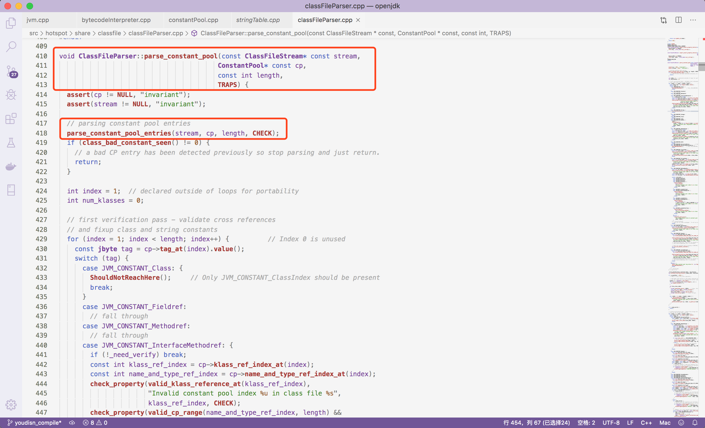

#jvm补充 --- String

String，我们平时开发的过程中非常常用。但是String并不是一个普通的Java对象，在jvm中是有特殊处理的。有点类似Thread，虽然它只是一个Java对象，但是在jvm针对这个特殊的对象有着自己的处理逻辑。所以我们要分析一下String在jvm中的处理。

##使用String

```java
String a = "aaa";
```

这是一行典型的Java中使用String的代码，那么编译成字节码之后，这段代码编译后变成了什么样子呢？

```
   // 省略其他内容
Constant pool:
	 // 省略其他内容
	 // 重点关注！重点关注！重点关注！重点关注！重点关注！重点关注！重点关注！
   #2 = String             #24            // aaa
   // 省略其他内容
public static void main(java.lang.String[]);
   descriptor: ([Ljava/lang/String;)V
   flags: (0x0009) ACC_PUBLIC, ACC_STATIC
   Code:
   	 stack=1, locals=2, args_size=1
 	 	 // 重点关注！重点关注！重点关注！重点关注！重点关注！重点关注！重点关注！
     0: ldc           #2                  // String aaa
     2: astore_1
     3: return
   LineNumberTable:
     line 11: 0
     line 12: 3
   LocalVariableTable:
     Start  Length  Slot  Name   Signature
     0       4     0  args   [Ljava/lang/String;
     3       1     1     a   Ljava/lang/String;
   MethodParameters:
     Name                           Flags
     args
   // 省略其他内容
```

从上面的字节码中可以看到，String在编译的时候在静态常量池中添加，然后通过String类型代表这是一个String

> 这里要区别ConstantPool中的String类型和UTF8类型，String代表字符串对象，UTF8代表类名、方法名等

然后有了字节码之后，分为两个阶段，第一个是类加载阶段，第二个是执行字节码阶段。我们后面分开叙述。

## 类加载阶段

类加载阶段会读取文件Stream然后根据字符解析，那么在处理常量池时针对String类型的常量分为两步，

1. 将String转换为Symbol储存在ConstantPool中的一个array中
2. 根据下标读取到对应的值，设置为Symbol

下面是源码解析，入口代码如下



在parse_constant_pool_entries方法里面，其实就是一个for循环，然后通过switch case来做处理，下面仅选取部分代码

```c++
case JVM_CONSTANT_String : {
  cfs->guarantee_more(3, CHECK);  // string_index, tag/access_flags
  const u2 string_index = cfs->get_u2_fast();
  cp->string_index_at_put(index, string_index);
  break;
}

// constantPool中的JVM_CONSTANT_String替换为JVM_CONSTANT_StringIndex
void string_index_at_put(int which, int string_index) {
  tag_at_put(which, JVM_CONSTANT_StringIndex);
  *int_at_addr(which) = string_index;
}
```

上面就是设置类型为JVM_CONSTANT_StringIndex。

后面根据这个类型会做处理，

```c++
case JVM_CONSTANT_StringIndex: {
  // 读取刚刚存的string_index
  const int string_index = cp->string_index_at(index);
  check_property(valid_symbol_at(string_index),
                 "Invalid constant pool index %u in class file %s",
                 string_index, CHECK);
  // 获取Symbol，Symbol理解为一个独一无二的String，哪怕值一样，Symbol也永远不会和别人相等
  Symbol* const sym = cp->symbol_at(string_index);
  // 然后把symbol和index放到unresolved cache中
  // 注意是unresolved，这里还是静态常量池
  cp->unresolved_string_at_put(index, sym);
  break;
}
```

到这里，类加载时做的处理已经完成了，后面就是具体执行字节码的时候做的处理。

## 字节码执行阶段

然后在执行java代码的时候，指令为：ldc #2，ldc是一个字节码指令，代表load constant（个人根据前缀的理解，非官方解释），然后constantPool中为#2的元素，前面可以看到#2的元素就是一个String。

刚才已经看到了ConstantPool中下标为2的地方，已经设置了一个Symbol。

还是从解释执行来分析具体的行为。

找到ldc字节码对应的操作，再找到JVM_CONSTANT_String对应的处理，就是下面截取的这段

```c++
case JVM_CONSTANT_String:
{
  // 这里就是回去尝试resolve，把静态常量池的内容解析成动态常量池的内容
  oop result = constants->resolved_references()->obj_at(index);
  // 如果为空就尝试解析
  if (result == NULL) {
    // 这里就是resolve_ldc
    CALL_VM(InterpreterRuntime::resolve_ldc(THREAD, (Bytecodes::Code) opcode), handle_exception);
    SET_STACK_OBJECT(THREAD->vm_result(), 0);
    THREAD->set_vm_result(NULL);
  } else {
    // 否则就直接返回
    VERIFY_OOP(result);
    // 设置到栈上其实就是return，因为java是基于栈的
    SET_STACK_OBJECT(result, 0);
  }
  break;
}
```

下面还是截取对应string部分的源码

```c++
case JVM_CONSTANT_String:
    assert(cache_index != _no_index_sentinel, "should have been set");
		// 这个if是已经预处理过的内容，不是很清楚什么情况会做预处理，这里的判断是通过指针计算的，所以不是很好理解，可以暂时先忽略
    if (this_cp->is_pseudo_string_at(index)) {
      result_oop = this_cp->pseudo_string_at(index, cache_index);
      break;
    }
		// 直接看这里的实现
    result_oop = string_at_impl(this_cp, index, cache_index, CHECK_NULL);
    break;
```

```c++
oop ConstantPool::string_at_impl(const constantPoolHandle& this_cp, int which, int obj_index, TRAPS) {
  // 再尝试一次是不是已经解析过了
  oop str = this_cp->resolved_references()->obj_at(obj_index);
  assert(!oopDesc::equals(str, Universe::the_null_sentinel()), "");
  if (str != NULL) return str;
  // 找到之前存下的symbol
  Symbol* sym = this_cp->unresolved_string_at(which);
  // 放到StringTable中，StringTable是一个ConcurrentHashTable，之前分析过c++的ConcurrentHashTable的实现原理
  str = StringTable::intern(sym, CHECK_(NULL));
  // 然后放到ConsantPool中，下次就直接使用这个解析完毕之后的值
  this_cp->string_at_put(which, obj_index, str);
  assert(java_lang_String::is_instance(str), "must be string");
  return str;
}
```

到了这里就是String的基本处理。但是这里只是分析了String的存储，还有一些比较常见的问题。

## String的拼接

###情况一

```java
String a = "1" + "2";
```

这行Java代码也是我们平时经常会写的代码，但是这样的代码在编译过程中并不会变成一个加法的计算，而是直接让a = "12"，这个可以通过编译验证，我这里就省略了。

###情况二

```java
String a = "1";
String b = "2";
String c = a + b;
```

这样的情况是更为常见的字符串拼接，通过变量进行拼接。但是jdk8（好像是8）之后，针对这样的字符串凭借统一编译成了StringBuilder来拼接。

编译代码为证：

```
public static void main(java.lang.String[]);
    Code:
      stack=2, locals=4, args_size=1
         0: ldc           #2                  // String 1
         2: astore_1
         3: ldc           #3                  // String 2
         5: astore_2
         6: new           #4                  // class java/lang/StringBuilder
         9: dup
        10: invokespecial #5                  // Method java/lang/StringBuilder."<init>":()V
        13: aload_1
        14: invokevirtual #6                  // Method java/lang/StringBuilder.append:(Ljava/lang/String;)Ljava/lang/StringBuilder;
        17: aload_2
        18: invokevirtual #6                  // Method java/lang/StringBuilder.append:(Ljava/lang/String;)Ljava/lang/StringBuilder;
        21: invokevirtual #7                  // Method java/lang/StringBuilder.toString:()Ljava/lang/String;
        24: astore_3
        25: return

```

### 情况三

```java
String a = new String("a");
```

这样的代码在日常开发过程中很少见，一般我们不会主动去写这样的代码，但是我们也要知道这样的做法背后的原理。

这里就不贴编译后的字节码了，其实就是先从ConstantPool中找到字符串a，然后调用String的构造函数返回一个新的String，这个新的String赋值给变量a。

> 这里有一个要注意的，String的这个构造函数实现java9+之后有不同，java9之后有@HotSpotIntrinsicCandidate这个注解，代表jvm可能会用高性能实现代替java代码的实现。

###情况四

```java
String a = new String("1" + "2");
```

这个经常会在一些面试题中出现，问你这行代码创造了多少个对象，但是很可惜我网上看到的所谓的答案多半都是错的。

其实我们之前分析完之后已经可以知道结果了，"1" + "2"在编译的时候会合并，并不会创建ConstantPool的值，所以就是一个ConstantPool的Symbol="12"，然后会创建一个StringTable中的oop对象，同时再调用new String构造函数创建一个新对象，并把这个新对象的引用赋值给a。

## String存在哪里

String是存在堆上的（jdk8之后），创建String有源码如下：

```c++
Handle java_lang_String::basic_create(int length, bool is_latin1, TRAPS) {
  assert(initialized, "Must be initialized");
  assert(CompactStrings || !is_latin1, "Must be UTF16 without CompactStrings");

  oop obj;
  // 这行是重点，allocate_instance方法在下面
  obj = SystemDictionary::String_klass()->allocate_instance(CHECK_NH);

  Handle h_obj(THREAD, obj);
  int arr_length = is_latin1 ? length : length << 1; // 2 bytes per UTF16.
  typeArrayOop buffer = oopFactory::new_byteArray(arr_length, CHECK_NH);;

  obj = h_obj();
  set_value(obj, buffer);
  // No need to zero the offset, allocation zero'ed the entire String object
  set_coder(obj, is_latin1 ? CODER_LATIN1 : CODER_UTF16);
  return h_obj;
}

instanceOop InstanceKlass::allocate_instance(TRAPS) {
  bool has_finalizer_flag = has_finalizer(); // Query before possible GC
  int size = size_helper();  // Query before forming handle.

  instanceOop i;

  // 这里可以看到是从堆上分配的空间
  i = (instanceOop)Universe::heap()->obj_allocate(this, size, CHECK_NULL);
  if (has_finalizer_flag && !RegisterFinalizersAtInit) {
    i = register_finalizer(i, CHECK_NULL);
  }
  return i;
}
```

那么String在堆上，StringTable里面是什么？

StringTable里面是一个Handle的引用，这个引用指向堆上具体的对象。