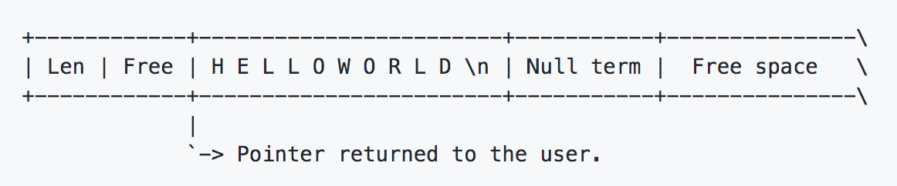

# REDIS源码2-SDS

Redis的本质是一个超大型的Dict，那么作为一个字典型或Map类型的KV存储，字符串就是一个非常非常重要的数据类型。但是在C中，常规的字符串在内存中就是一个char的字节数组，通常以NULL结尾（0x\0），这时如果要获取这个字符串的长度，使用strlen标准库函数，这个算法的复杂度是O(n)，但是Redis是一个单线程的模型，所以如果每一次获取字符串长度都用O(n)的方式，对于Redis的影响是非常巨大的，因此作者使用了SDS（Simple Dynamic String）。

> [SDS库GitHub官方说明](https://github.com/antirez/sds)
>
> SDS因为在Redis中大量运用，已经被单独抽出来做一个单独的C的String库，上面的链接就是这个单独库的作者说明。

## SDS设计原理



SDS在内存中是一个形如上图的设计，前面有一个对象头，而从Pointer到Null term部分则是C的标准字符串，后面还有一个多余的Free space。

前面的头部分则有一个len，顾名思义就是字符串的长度，Free就是Free space还剩下多少。

> 根据作者自述，这样的设计有好处也有不足
>
> **好处：**
>
> 1. 可以当作一个普通的C字符串使用，不像其他类库需要调用一个额外的方法
> 2. 可以当作char数组使用
> 3. 有更好的代码局部性，因为整个字符串结构和头结构是完全连在一起的。其他类库往往对象和实际分配的char数组是分开的，这样对代码的局部性有不足。
>
> **不足：**
>
> 1. 字符串拼接需要额外调用strcat方法，形如s = strcat(s, "more data")，同时结果也要assign给s，否则可能会引起问题
> 2. 如果sds对象在多处被引用，你需要自己维护引用计数，否则容易引起内存泄漏。

```c
struct sdshdr {
    int len;    // 当前sds的已经使用的长度
    int free;   // 空余的长度 
    char buf[]; // 数组内容，往往是一个指向第一个元素的指针
};
```

SDS在C中的基本定义就是这样。由于有free这个概念，那么就有扩容的问题，在SDS中，如果buf的长度小于1mb，那么长度就会翻倍，如果大于1mb，那么每次就增加1mb。

## Redis中的字符串实现

### SDS

上面已经基本分析了SDS的基本结构，那么接下来看一下Redis中SDS的实际实现。

因为Redis对内存做了非常多细节的优化，每一个字节的数据都做了最为充分的利用，因此在实际的Redis实现中，SDS的结构较原理略微复杂一点。

```c
// 通常情况下sdshdr5会因为字符串长度不够使用SDS而用了embedded string，所以通常情况下客户端的代码很难用到这个结构，
// 但是有一些例外情况，详见下面的例外说明
struct __attribute__ ((__packed__)) sdshdr5 {
    unsigned char flags; /* 3 lsb of type, and 5 msb of string length */
    char buf[];
};
struct __attribute__ ((__packed__)) sdshdr8 {
    uint8_t len; // 已使用的长度
    uint8_t alloc; // 除header和\0之外分配的空间
    unsigned char flags; // 编码，就是用的是这里的几个header中的哪一个
    char buf[];
};
struct __attribute__ ((__packed__)) sdshdr16 {
    uint16_t len; // 同上
    uint16_t alloc; // 同上
    unsigned char flags; // 同上
    char buf[];
};
struct __attribute__ ((__packed__)) sdshdr32 {
    uint32_t len; // 同上
    uint32_t alloc; // 同上
    unsigned char flags; // 同上
    char buf[];
};
struct __attribute__ ((__packed__)) sdshdr64 {
    uint64_t len; // 同上
    uint64_t alloc; // 同上
    unsigned char flags; // 同上
    char buf[];
};
```

这段代码就是定义sds这个结构体的定义关系，可以看到虽然只是一个sds，但是实际实现中，用了不同的类型来实现，基本的原因是len 和 alloc这两个长度用了不同长度的数据类型来表示，这样每一个sds可以节省几个字节，对于Redis这样kv存储来说节省的数据量就十分可观了。

那么最大的就是sdshdr64这个结构了，可以看到最大的长度就是2^64^个bit。

> 如果查阅Redis的文档，可以看到Redis要求字符串不大于512mb，但是如果仅仅从SDS的定义上来看，其实没有做这样的规定，看了SDS的源码也没有发现对长度有做限制。后来发现这个512mb的约束是在接受客户端请求的时候做的校验，也就是客户端在调用Redis Server执行命令的时候会对入参进行校验，这个时候做了512mb的校验。

#### sdshdr5使用情况说明

Redis源码中又一些形如这样的代码：

```c
server.masterhost = sdsnew(argv[1]);
sds user = sdsnew("user ");
```

根据Redis对sdsnew函数的实现，

```c
sds sdsnew(const char *init) {
  size_t initlen = (init == NULL) ? 0 : strlen(init);
  return sdsnewlen(init, initlen);
}

sds sdsnewlen(const void *init, size_t initlen) {
  void *sh;
  sds s;
  char type = sdsReqType(initlen);
  /* Empty strings are usually created in order to append. Use type 8
    * since type 5 is not good at this. */
  if (type == SDS_TYPE_5 && initlen == 0) type = SDS_TYPE_8;
  // 省略其他代码
}

static inline char sdsReqType(size_t string_size) {
  if (string_size < 1<<5)
    return SDS_TYPE_5;
	// 省略其他代码
}
```

通过上面这段可以看到，Redis有的时候会直接拷贝一些字符串等操作，这个时候因为是内部代码直接绕开了EMBSTR使用的SDS，所以在这样的情况下会用到这个sdshdr5。

不过通览了所有**sdsnew(const char *init)**调用的地方，往往都是确定的字符串以及生成后几乎不可能改变的字符串才有可能是用到这个的情况，所以sdshdr5还是应当视作是一种特例，当作一种内部使用；而往往用户客户端发送的字符串会经过EMBSTR的优化，通常不会用到这个结构。

### EMBSTR

上面分析了SDS在Redis的基本结构和实现，但是Redis作为一个优化到极致的中间件，对于字符串还有另一种形式的存储，也就是embstr。

首先先看一个基本的RedisObject结构：

```c
typedef struct redisObject {
    unsigned type:4;				// 4个bit，表达对象的不同类型
    unsigned encoding:4;		// 4个bit，表达对象不同的编码信息
    unsigned lru:LRU_BITS;  // 24个bit，前16个bit是时间戳，后8个bit是count
    int refcount; 					// 4个字节，引用计数
    void *ptr;							// 8个字节，指针
} robj;
```

这就是一个RedisObject的基本结构，综合上面的RedisObject的大小分析，一个RedisObject有16个字节的对象头，和JVM中的对象头大小比较类似（8个字节对象头+8个字节Klass指针）。

那么在看SDS的对象头结构，对于最小的SDS而言，

```c
struct __attribute__ ((__packed__)) sdshdr8 {
    uint8_t len; 					// 1个字节
    uint8_t alloc; 				// 1个字节
    unsigned char flags; 	// 1个字节
    char buf[];						// 可有可无，如果字符串为空就没有
};
```

那么分配一个RedisObject+SDS最少需要19个字节（16 + 3），那么embstr就是这样一种存储方式，它把对象头和SDS分配到了一起，做了连续分配。如果是分开的话，就需要分配两次，在内存上是不连续的。

又由于内存分配起jemalloc等分配内存时都是2/4/8/16/32/64这样的方式分配字节的，Redis把大于64个字节的对象当作大字符串，那么也就是64（分配器） - 19（RedisObject + SDS对象头） - 1（字符串最后的一个字节NULL） = 44，所以Redis中，把小于等于44个字节的数据存储为embstr。

###裁剪缩容

补充一下缩容的相关内容，之前只关注了扩容。在字符串计算的层面还有缩容和裁剪两种方式。

下面的trim是裁剪，从源码的角度看，用到的场景不是很多，主要是Redis自己的代码在使用，没有暴露给客户端，下面就是实现。

```c
// s就是待处理sds，cset是一个char的数组，只要在这数组里面的字符都要被干掉。
sds sdstrim(sds s, const char *cset) {
  char *start, *end, *sp, *ep;
  size_t len;

  // sp开始就是s的指针位置
  sp = start = s;
  // 这里-1是因为sds最后一定是一个Null term
  ep = end = s+sdslen(s)-1;
  // strchr是c的字符串提供的方法，作用是查找给定字符的第一个匹配之处
  // 这里就是从前往后找到没有在cset中的第一个
  while(sp <= end && strchr(cset, *sp)) sp++;
  // 这个是从后往前找到没有cset的第一个
  while(ep > sp && strchr(cset, *ep)) ep--;
  // 计算长度
  len = (sp > ep) ? 0 : ((ep-sp)+1);
  // 多余的内存还掉
  if (s != sp) memmove(s, sp, len);
  // C字符串必然要的结尾富豪
  s[len] = '\0';
  // 设置len
  sdssetlen(s,len);
  return s;
}
```

上面部分是对字符串的裁剪，下面是对字符串的缩容。

```c
sds sdsRemoveFreeSpace(sds s) {
  void *sh, *newsh;
  char type, oldtype = s[-1] & SDS_TYPE_MASK;
  // 计算之前header的长度，这个地方也是因为sds的header长度是可变的
  int hdrlen, oldhdrlen = sdsHdrSize(oldtype);
  // sds的长度
  size_t len = sdslen(s);
  // 空余的长度
  size_t avail = sdsavail(s);
  // sh就是sds最最前面的指针位置，因为s的指针是指向header后的，减掉header的长度就是sds真正的内存开始的位置
  sh = (char*)s-oldhdrlen;

  /* Return ASAP if there is no space left. */
  if (avail == 0) return s;

	// 计算这个长度所应该用的类型，就是header的len应该用几个字节来存储
  type = sdsReqType(len);
  // 根据这个类型，来看header应该要多大
  hdrlen = sdsHdrSize(type);
  
  // 这里在i云保的面试中有问到，但是之前看的时候忽略了这一块，只有扩容部分的内容。
  // 面试中其实回答了下面if else的else部分分支代码，所以其实if条件下，会有realloc的工作，但是没有新建一个小字符串拷贝。两者还是有一些区别的。
  
  // 如果类型相同，或者type是大于8位的长度
  // 这里的言外之意就是如果字符串改变的不是很大，那么就不要花很多力气去拷贝了，就在原来的基础上，做一些简单的工作就可以了
  if (oldtype==type || type > SDS_TYPE_8) {
    // 重新分配一块，长度是原header的长度+字符串长度+1，同样的+1是为了c字符串结尾\0
    newsh = s_realloc(sh, oldhdrlen+len+1);
    if (newsh == NULL) return NULL;
    // s的指针要指向字符串开头的位置
    s = (char*)newsh+oldhdrlen;
  } else {
    // 进到这里就说type不同同时新的type是8，也就是字符串极大的缩小了，那么就用重新分配一块的价值了
    newsh = s_malloc(hdrlen+len+1);
    if (newsh == NULL) return NULL;
    // 把之前的东西拷过来
    memcpy((char*)newsh+hdrlen, s, len+1);
    // 释放之前的内存
    s_free(sh);
    s = (char*)newsh+hdrlen;
    // s指针往前一位是一个flag，其中有3个bit是type
    s[-1] = type;
    // 设置长度
    sdssetlen(s, len);
  }
  // 设置alloc
  sdssetalloc(s, len);
  return s;
}
```


## 其他

### sds扩容时header大小可能会变化

SDS扩容时，由于存在sdshdr8、sdshdr16、sdshdr32、sdshdr64等不同的定义方式，所以在扩容时又可能要从sdshdr16变成sdshdr32，因此会导致str的header大小发生变化，这个是一个需要注意的点。因为一般我们认为对象头一旦分配完毕，一般是不会发生变化的，但是sds是一个例外。

### 扩容的基本逻辑

这个其实和Java中的ArrayList这样的扩容原理差不多，先计算出新的大小（<= 1mb翻倍，否则每次+1mb），然后计算新的对象头大小，刚才提过对象头大小可能会发生变化，然后分配新的内存空间，把之前的SDS数据拷贝过来（老的数据free掉）。

再重新设置sds中的len字段。