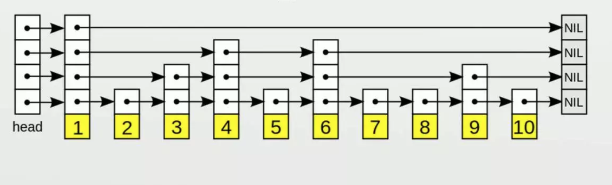

#REDIS源码7-Zset

到了Redis常见数据结构的最后一个，应该也是最难的一个，就是Zset，其实就是SortedSet。在Redis的实现中，一个zset就是由一个dict和一个skiplist共同组成的。dict已经是老朋友了，就不再过多分析了，本章的重点则是skiplist。

##Skiplist

###Why Skiplist

首先先要分析为什么Redis要用跳表。Zset的作用是排序的Set，那么对于这样的一个结构而言，Set的实现还是使用了dict。那么Skiplist在这里其实是一个类似索引的作用。

不过既然说到了索引，通常索引我们能想到的就是b树、b+树、红黑树等。Mysql使用的索引是b+树，Mongodb使用的索引是b树，但是Redis在Zset中选择的数据结构是skiplist。

Mongo和Mysql使用B/B+树的理由是，他们作为一个数据需要落磁盘的db，读取数据肯定是有磁盘的IO操作，作为一个db而言，最耗费性能的操作肯定是磁盘的IO操作。所以通过B/B+树的一个节点设计为一个磁盘页可以极大的提高高速缓存的命中。而Mongo用B树，和Mysql不同的原因是一个是SQL数据库一个是NoSQL数据库，在Mysql中经常会用到的范围查找，通过B+树字节点的链表可以极大的提高效率。但是Mongo的范围查找往往会通过数据结构的内联来避免，因此Mongo更多的是K/V查找，也就用不到B+树范围查找的优点。

上面解释了为什么Mongo和Mysql用了B/B+树，其实最本质的原因是磁盘IO问题，但是Redis是一个内存数据库，并没有磁盘IO（持久化不算），读写数据完全是基于内存的。而skiplist的时间复杂度和两棵树一样，就是需要建立多极索引，虽然多极索引会额外占用一些内存，但是相对B+树找了很多指针，同时Redis中存储往往的都是较大的字符串等这样的数据，当数据占用的空间远大于索引需要的空间，那么额外多出来的一点索引消耗其实并不那么关键。

而作者自己也提到了另外一个点，就是skiplist实现简单更好维护，时间复杂度和空间复杂度也都在理想的范围内，所以就选用了跳表，而没有用两棵树了。

> 为什么不用红黑树？树高太高、数据结构太复杂、范围查询支持不好。

### 实现

#### ziplist

先是我们老朋友ziplist，源码就不贴了，因为和hash里面的ziplist用法类似。只是hash里面的ziplist插入只要插入就可以了，zset里面需要在ziplist里逐个比对score，然后再决定在哪里插入。

不过是（插入元素，score得分）这样的顺序插入ziplist的，所以ziplist的插入要插入两次，一个内容，一个得分。然后按照得分排序。

其他的删除啊、范围查找、范围删除等都是类似的，遍历，然后确定范围，然后删，然后把后面的数据拷贝过来填补这块删除的内存，基本都差不多。当然还有一个级联更新，因为prev节点的长度改变了。

**当ziplist的长度大于zset_max_ziplist_entries，这个可以配置，默认是128的时候，就会转变为真正的skiplist；或者sds的长度大于64的时候（又是64）。**

**同时如果长度小于等于128同时最大的sds长度也不超过64，也会重新变回ziplist。**

#### skiplist

根据作者的描述，zset的skiplist实现有三个特点

1. 允许重复的分数（skiplist中的score）
2. 比对的时候不仅仅是根据score评分，同时也包含*satellite data*（暂时还不知道干什么用的）
3. 有一个back指针（应该是相当于双向链表），可以从后往前遍历



跳表就是一个多级索引的结构，搜索的时候可以使用类似二分法查找的方式。

看一下Redis zset的设计，

```c
typedef struct zskiplistNode {
  // 元素
  sds ele;
  // 评分
  double score;
  // 后继节点
  struct zskiplistNode *backward;
  struct zskiplistLevel {
    // 前驱节点
    struct zskiplistNode *forward;
    unsigned long span;
  } level[];
} zskiplistNode;

typedef struct zskiplist {
  // 头和尾指针
  struct zskiplistNode *header, *tail;
  // 长度
  unsigned long length;
  // 层级
  int level;
} zskiplist;

typedef struct zset {
  // 老朋友了
  dict *dict;
  // 跳表
  zskiplist *zsl;
} zset;
```

###插入

先看在skiplist里插入一个数据是如何实现的，由于源码比较绕，所以先整理一下流程，

1. 首先是从header节点开始通过多级索引定位到距离待插入数据最接近的那个节点，并且在定位的过程中记录下定位的过程中遍历到的节点，以及每个遍历节点的跨度（跨度就是经过每一层跨过了多少个节点，因为多级索引，越上级的索引一个指针可能在下层就跨过了多个节点）。

2. 然后随机生成一个level，这个level是每一级25%的概率，level就是第几级索引。比如第一级（从下往上），就是25%的概率在第一级生成索引节点。第二级就是25% * 25%，第三级就是25% * 25% * 25%，以此类推，最多可以有64级（因为放多级索引的是一个数组，数组的第i个就是第i级索引，这个数组大小为64）。所以这个level因为是随机的，所以插入的元素越多，越有可能生成多级索引，这个代码比较简单，就直接贴一下了。

   ```c
   int zslRandomLevel(void) {
     int level = 1;
     // ZSKIPLIST_P = 0.25
     while ((random()&0xFFFF) < (ZSKIPLIST_P * 0xFFFF))
       level += 1;
     // ZSKIPLIST_MAXLEVEL = 64
     return (level<ZSKIPLIST_MAXLEVEL) ? level : ZSKIPLIST_MAXLEVEL;
   }
   ```

3. 有了层级之后，生成一个node节点，把这个节点放到链表当中，同时更新span这个跨度，因为多了一个元素

下面是源码分析：

```c
zskiplistNode *zslInsert(zskiplist *zsl, double score, sds ele) {
  zskiplistNode *update[ZSKIPLIST_MAXLEVEL], *x;
  unsigned int rank[ZSKIPLIST_MAXLEVEL];
  int i, level;

  // 确保score是一个数字
  serverAssert(!isnan(score));
  // 获取头节点
  x = zsl->header;
  // 从最上层开始逐级索引往下寻找
  for (i = zsl->level-1; i >= 0; i--) {
    // 存储经过的节点跨度，就是每往下一层，这个跨度就要累计
    rank[i] = i == (zsl->level-1) ? 0 : rank[i+1];
    // 当前层节点的下一个节点存在 && 
    // 下一个节点的score小于目标score || (score相等 && 下一个节点的sds二进制小于插入的sds二进制)
    // 这个while循环比较复杂，不过做的事情目的就是根据当前层级的索引一个个往下，找到距离要插入数据的score最接近的那个skiplist node
    while (x->level[i].forward &&
           (x->level[i].forward->score < score ||
            (x->level[i].forward->score == score &&
             sdscmp(x->level[i].forward->ele,ele) < 0)))
    {
      // 这个就是还没有找到想要的那个最接近的节点，会执行这块逻辑
      
      // 这个就是路径累计
      rank[i] += x->level[i].span;
      // 然后链表往后挪动一个
      x = x->level[i].forward;
    }
    // 这个是搜索的路径保留
    update[i] = x;
  }
  // 到了这里就是已经有了最接近的那个节点，然后看是不是需要随机生成新的一层
  level = zslRandomLevel();
  // 如果随机的这个level比当前skiplist的level要大
  if (level > zsl->level) {
    // 遍历多出来的这些level
    for (i = zsl->level; i < level; i++) {
      // 然后更新rank，rank就是跨度
      rank[i] = 0;
      // 在更新搜索路径，把头节点放过去，因为是多出来一层，所以肯定是在最上面的，因此要头节点作为更新路径节点
      update[i] = zsl->header;
      // 因为这个i是新的一层，所以其实是没有东西的，就是直接头到尾，所以就是zsl的length
      update[i]->level[i].span = zsl->length;
    }
    zsl->level = level;
  }
  // 创建一个新的节点
  x = zslCreateNode(level,score,ele);
  // 这个for循环是更新每一层索引里的下一个节点
  for (i = 0; i < level; i++) {
    // 这个就是把新建的这个节点连到链表上
    x->level[i].forward = update[i]->level[i].forward;
    update[i]->level[i].forward = x;

    // 更新跨度
    x->level[i].span = update[i]->level[i].span - (rank[0] - rank[i]);
    update[i]->level[i].span = (rank[0] - rank[i]) + 1;
  }

  // 所有的层级跨度+1，因为多了一个节点
  for (i = level; i < zsl->level; i++) {
    update[i]->level[i].span++;
  }

  x->backward = (update[0] == zsl->header) ? NULL : update[0];
  if (x->level[0].forward)
    x->level[0].forward->backward = x;
  else
    zsl->tail = x;
  zsl->length++;
  return x;
}
```

### 删除

删除一个元素实现如下，

```c
int zslDelete(zskiplist *zsl, double score, sds ele, zskiplistNode **node) {
  zskiplistNode *update[ZSKIPLIST_MAXLEVEL], *x;
  int i;

  // 这个地方和插入是一样的，就是找到距离目标最接近的那个节点，同时保留追踪路径
  // 基本上skiplist不论什么操作，都是需要通过这一段方法，通过多级索引，逐层找到结果
  x = zsl->header;
  for (i = zsl->level-1; i >= 0; i--) {
    while (x->level[i].forward &&
           (x->level[i].forward->score < score ||
            (x->level[i].forward->score == score &&
             sdscmp(x->level[i].forward->ele,ele) < 0)))
    {
      x = x->level[i].forward;
    }
    update[i] = x;
  }
  // 因为score相同的节点可能有多个，所以还要比对ele是不是相同
  x = x->level[0].forward;
  if (x && score == x->score && sdscmp(x->ele,ele) == 0) {
    // 删除节点
    zslDeleteNode(zsl, x, update);
    // 如果被删除的节点不要了就直接free掉，否则就把node指针指向被删除节点
    if (!node)
      zslFreeNode(x);
    else
      *node = x;
    return 1;
  }
  return 0; /* not found */
}
```

###更新score

```c
zskiplistNode *zslUpdateScore(zskiplist *zsl, double curscore, sds ele, double newscore) {
  zskiplistNode *update[ZSKIPLIST_MAXLEVEL], *x;
  int i;

  // 老套路
  x = zsl->header;
  for (i = zsl->level-1; i >= 0; i--) {
    while (x->level[i].forward &&
           (x->level[i].forward->score < curscore ||
            (x->level[i].forward->score == curscore &&
             sdscmp(x->level[i].forward->ele,ele) < 0)))
    {
      x = x->level[i].forward;
    }
    update[i] = x;
  }

  /* Jump to our element: note that this function assumes that the
     * element with the matching score exists. */
  x = x->level[0].forward;
  serverAssert(x && curscore == x->score && sdscmp(x->ele,ele) == 0);

  // 如果是最后一个节点同时新的score比原来的要打，就直接更新score就可以，因为不会变更顺序
  if ((x->backward == NULL || x->backward->score < newscore) &&
      (x->level[0].forward == NULL || x->level[0].forward->score > newscore))
  {
    x->score = newscore;
    return x;
  }

  // 把老的节点删掉，然后重新插入一遍
  zslDeleteNode(zsl, x, update);
  zskiplistNode *newnode = zslInsert(zsl,newscore,x->ele);
  /* We reused the old node x->ele SDS string, free the node now
     * since zslInsert created a new one. */
  x->ele = NULL;
  zslFreeNode(x);
  return newnode;
}
```

###计数

还有一类操作就是计数，比如给定一个范围，看这个范围内的数据有多少，基本做法就是从头节点开始到范围内的第一个元素记为count1，然后从头节点到范围内的最后一个元素，记为count2，然后count2 - count1就是结果。

那么这个count1和count2的计算方式也是通过多级索引，每一个索引上都有一个span就是跨度，如果同一层的下一个节点依然比目标score要小，那么直接把span加上去就可以了，不用像链表一样要知道两节点之间有多少个节点还需要遍历其中所有的节点。

不过这里要插一句的就是如果用的ziplist，就是逐个遍历，没有这种操作。

