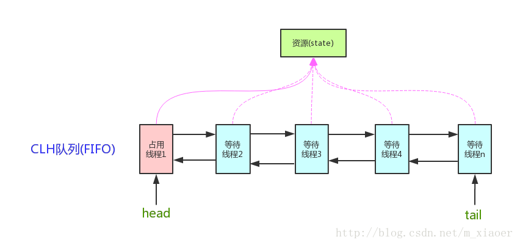
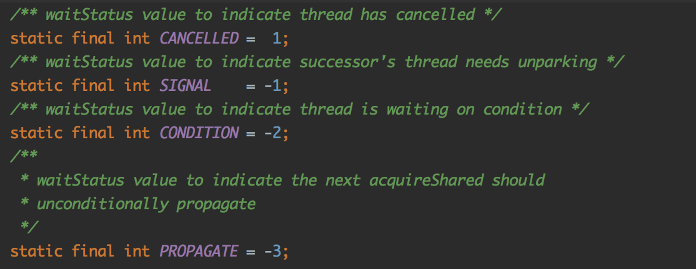
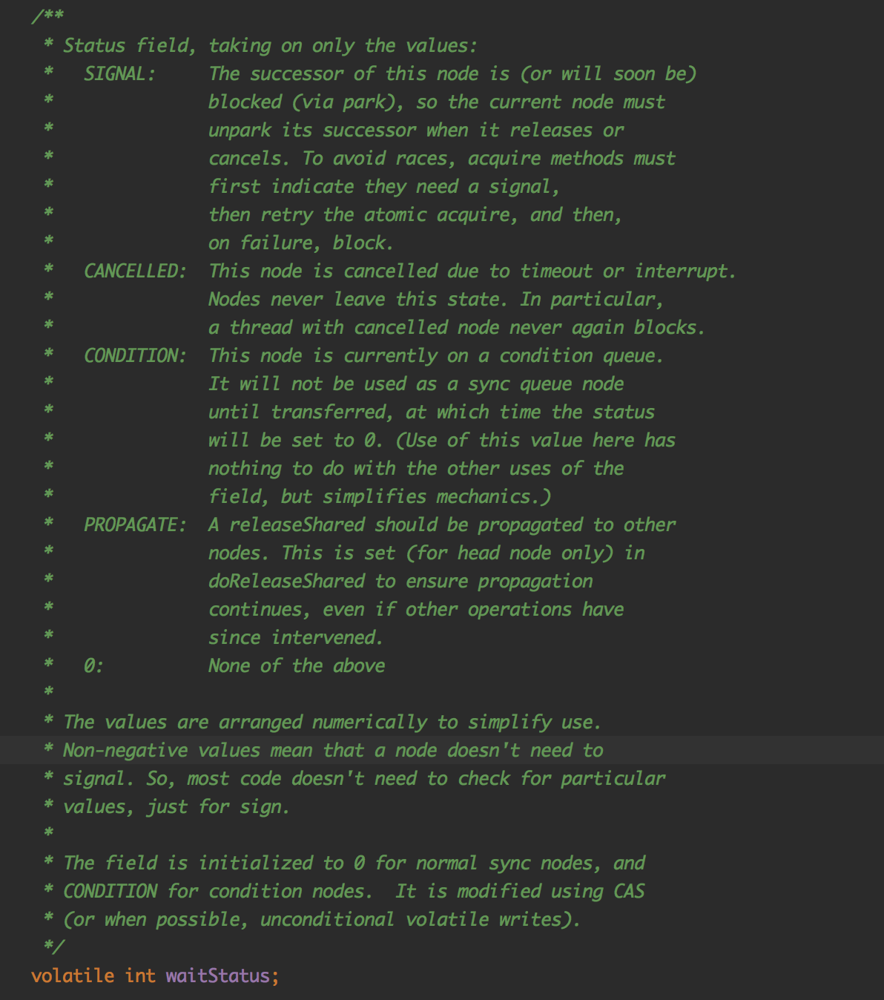
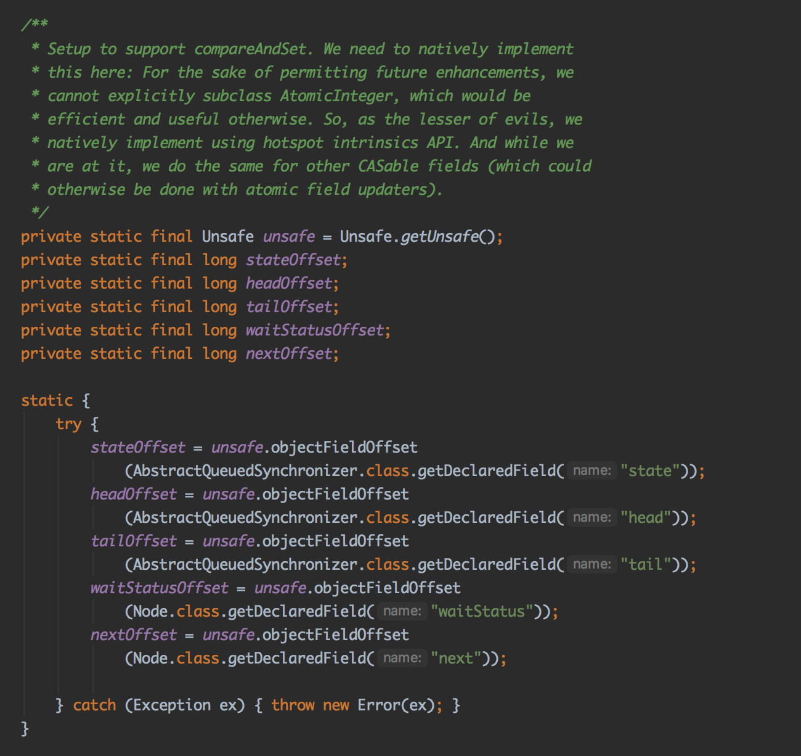
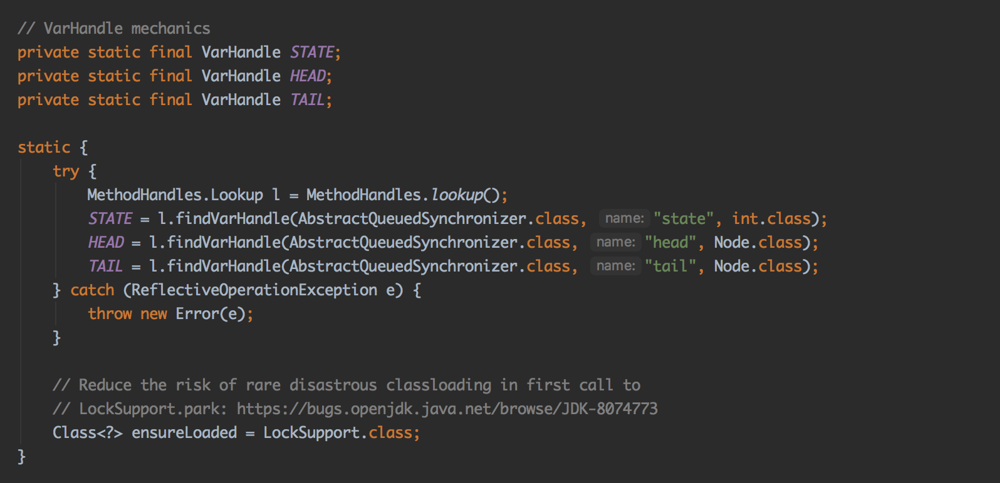

# 读写锁

------

##读写锁代码示例

```java
class RWDictionary {
    private final Map<String, Data> m = new TreeMap<String, Data>();
    private final ReentrantReadWriteLock rwl = new ReentrantReadWriteLock();
    private final Lock r = rwl.readLock();
    private final Lock w = rwl.writeLock();
 
    public Data get(String key) {
      r.lock();
      try { return m.get(key); }
      finally { r.unlock(); }
    }
    public String[] allKeys() {
      r.lock();
      try { return m.keySet().toArray(); }
      finally { r.unlock(); }
    }
    public Data put(String key, Data value) {
      w.lock();
      try { return m.put(key, value); }
      4
    }
    public void clear() {
      w.lock();
      try { m.clear(); }
     
    }
  }
```


## AQS

1. AQS原理

   

   [^上面这个图是有错的]: AQS中的head节点是一个虚拟节点，并不是当前占用线程！！！

   > **为什么AQS需要一个虚拟head？**
   >
   > 因为AQS一个node的状态是记录在它的前驱节点的（比如这个node是否需要被唤醒，是他的前驱节点记录的）。又由于第一个节点没有前驱节点，所以整个队列头就设置了一个虚拟节点（不能说是虚拟，就是这个节点除了waitStatus，没有其他内容）

   - **state:** state记录当前锁持有的状态，如果是0就表示当前没有被锁住，如果是其他数字就代表被锁住了多少次

   - **CLH队列: **所谓CLH队列就是一个head指针指向头，tail指针指向尾。然后每一个后继节点都会阻塞在前驱节点的waitStatus上。

     > 除了CLH之外还有一种叫**MCS**，两者之间的区别就是CLH是阻塞在前驱节点，MCS是阻塞在自己的状态上，前驱节点完成之后回去修改后继节点的状态。
     >
     > 个人觉得CLH好一点，万一前驱节点的线程除了问题，后继节点可以帮助清理，不会造成死锁。

   - **CLH队列中的线程什么时候会被挂起：**CLH队列中的线程会自旋的尝试获取锁，专门有一个方法shouldParkAfterFailedAcquire来判断当前线程是否需要挂起。

     shouldParkAfterFailedAcquire这个方法的逻辑如下。

     1. 如果前驱节点状态是SIGNAL，那么自己就要被挂起。

     2. 如果前驱节点被cancel了，那就找前驱的前驱，直到找到一个没有被取消的节点，并且把那个节点的next设置为当前节点。

     3. 如果前驱节点没有被cancel，就把前驱节点状态设置为SIGNAL。

        

        

   - **JAVA 8 和 10之间的区别：**最主要的区别是CAS原子设置状态的代码

     java8代码：主要还是使用了UNSAFE来获取内存偏移，然后对应字段读取使用volatile，确保每次都是从主内存中刷到最新的值。
     

     

     java10的代码：

     

     从java9开始都统一使用了变量具柄的方式。

     在java8的时候有三种方式可以原子的设置一个变量的值：

     1. AtomicXXXX系列，原理是CAS。JAVA5开始
     2. 使用AtomicXXXXFieldUpdater。JAVA8开始
     3. Unsafe。只有被BootStrapClassLoader加载的类才能使用Unsafe。

     从java7开始就添加了XXXXHandle系列，但是主要集中在方法具柄上，但是从java9开始，加入了很多变量具柄。从java7，jvm开始支持动态调用方法时就加入了XXXXHandle家族，但是主要使用是在java8开始有lamda之后开始使用的。从java9开始更近一步，增加了变量具柄。

     ==除了这个明显的改动之外，java10的代码结构相比java8重构了一下，在总体逻辑保持不变的情况下，代码的可读性有了很大的提升，所以建议之后阅读源码可以阅读java10的源码。下面举一个例子==

     **java8:**

     

     **java10：**

     

------

# 读写锁的原理

##ReentrantReadWriteLock

整体代码结构：

```java
public class ReentrantReadWriteLock implements ReadWriteLock, java.io.Serializable {
    abstract static class Sync extends AbstractQueuedSynchronizer {}
    
    static final class NonfairSync extends Sync {}
    
    static final class FairSync extends Sync {}
    
    public static class ReadLock implements Lock, java.io.Serializable {
        private final Sync sync;
    }
    
    public static class WriteLock implements Lock, java.io.Serializable {
        private final Sync sync;
    }
}
```

##读写锁原理：

读写锁的state高16位表示读锁的重入个数，低16位表示写锁的重入个数。

==读锁是共享锁，写锁是互斥锁。==

**获取写锁的原理：（Sync类的tryAcquire方法，因为写锁是互斥的）**

```java
@ReservedStackAccess // 这个注解java9添加的，主要是给jvm看的，表示这个方法内形成的栈帧应当预先保留。
protected final boolean tryAcquire(int acquires) {
    Thread current = Thread.currentThread();
    int c = getState(); // 获取state
    int w = exclusiveCount(c); // 根据state算出后16位表示的写锁的状态
    if (c != 0) { // 如果已经有人获取了锁，可能是读锁，也可能是写锁
		// 如果写锁是0（说明已经有人在读）或者当前的线程不是当前独占的线程
        if (w == 0 || current != getExclusiveOwnerThread())
            return false;
        // 如果写锁的数量超过了最大数量，就抛出Error
        if (w + exclusiveCount(acquires) > MAX_COUNT)
            throw new Error("Maximum lock count exceeded");
        // 获取锁，可以支持重入
        setState(c + acquires);
        return true;
    }
    // 写是否需要阻塞
    if (writerShouldBlock() ||
        // CAS设置state
        !compareAndSetState(c, c + acquires))
        return false;
    // 设置当前独占线程
    setExclusiveOwnerThread(current);
    return true;
}
```

**@ReservedStackAccess注解的作用：**这个注解是java9新增的注解，这个注解主要是给虚拟机看的。主要是因为AQS家族通常都有一个这样的代码

```java
final void lock() {
    if (compareAndSetState(0, 1)) {
        setExclusiveOwnerThread(Thread.currentThread());
    } else {
        acquire(1);
    }
}
```

这段代码看上去没有问题，但是如果执行到setExclusiveOwnerThread突然发生了StackOverFlow异常，那么这个锁就会处于一种类似死锁的中间状态，就是这个锁的是被锁上的，但是没有一个线程持有这个锁。根据OpenJDK的描述，Java7中的ConcurrentHashMap使用了ReentrantLock，同时ClassLoader又使用了ConcurrentHashMap，所以就会出现类加载器发生了这个类似死锁的bug，导致虚拟机处于一个崩溃的状态。

[OpenJDK链接]: http://openjdk.java.net/jeps/270

**获取读锁的原理：**

```java
@ReservedStackAccess
protected final int tryAcquireShared(int unused) {
    Thread current = Thread.currentThread();
    int c = getState();
    // 判断当前是不是已经获取了写锁，如果获取了写锁就要看，获取写锁的这个线程是不是当前线程。如果不是就无法获取读锁
    if (exclusiveCount(c) != 0 &&
        getExclusiveOwnerThread() != current)
        return -1;
    int r = sharedCount(c);
    // 尝试获取读锁
    if (!readerShouldBlock() &&
        r < MAX_COUNT &&
        compareAndSetState(c, c + SHARED_UNIT)) {
        if (r == 0) {
            // 如果是第一个获取读锁的，就执行这块逻辑
            firstReader = current;
            firstReaderHoldCount = 1;
        } else if (firstReader == current) {
            firstReaderHoldCount++;
        } else {
            // 读锁是可以重入的，AQS中的state只是保存了获取读锁的总数，所以还需要表达每一个获取读锁的线程各自获取锁的次数。因为这是个和线程绑定的参数，所以用了一个ThreadLocal变量来维护，当前线程获取了多少次锁这个信息。下面的cachedHoldCounter只是一个缓存
            HoldCounter rh = cachedHoldCounter;
            if (rh == null ||
                rh.tid != LockSupport.getThreadId(current))
                cachedHoldCounter = rh = readHolds.get();
            else if (rh.count == 0)
                readHolds.set(rh);
            rh.count++;
        }
        return 1;
    }
    // 这个方法做的事情其实就是在一个死循环里面不停的去尝试获取锁直至成功或者失败
    return fullTryAcquireShared(current);
}
```

*释放锁的原理相对比较容易理解，快速过一下，就不深入展开了。*

> AQS：1299行
>
> ReentrantReadWriteLock: 370行

##几个问题

1. 非公平锁为什么是非公平的？

   因为每一次acquire获取锁，都是需要尝试CAS设置state字段的，如果没有成功，就进入CLH队列排队等待唤醒。所以先尝试的线程有可能在排队，后来的人可能恰好setState成功，那么就是非公平的体现。

2. 公平锁如何做到公平？

   就是每一次都是从CLH队列排队唤醒线程。

3. 读写锁中为什么写线程容易饥饿？代码中何处体现？

   因为写线程会看如果有读锁，那么就不能写。而读线程看当前有没有写锁，如果没有写锁就能读。那么如果一直有新的线程来读，写线程就无法获取写锁了。


## Java8中新增的读写锁 StampedLock

------

## 简介

StampedLock返回一个stamp，通过这个stamp来验证当前锁的状态。StampedLock共提供三种模式，乐观读，悲观读和写锁。

StampedLock不是一个可重入的锁，如果你获取了锁，你就不应当再去调用可能会再次获取锁的代码。

读锁模式的相关代码应当是没有副作用的，还没有经过validate的锁是不应当被认为锁住的。StampedLock返回的stamp不是一个安全的stamp（意思是不是一个随机的stamp）这个stamp是有可能被推测出来的。

如果你获取了一个锁，那么这个锁一直持有但是不使用超过一年的时间，是有可能被回收的，这个时候如果你再次去验证，有可能是会失败的。StampedLock只能告诉你是不是持有锁，但是不能告诉你这个锁到底是被哪个线程持有的。

StampedLock不会像ReentrantReadWriteLock那样，写线程可能发生饥饿。StampedLock每一次获取锁都会尽自己所能去争取锁，所以StampedLock也不提供任何公平锁或者定时锁之类的功能。如果你获取的stamp是0，你不能根据这个stamp去对当前StampedLock的状态做任何推测（比如是否持有读锁写锁等）。

```java
class Point {
    private double x, y;
    private final StampedLock sl = new StampedLock();
 
    // an exclusively locked method
    void move(double deltaX, double deltaY) {
      long stamp = sl.writeLock();
      try {
        x += deltaX;
        y += deltaY;
      } finally {
        sl.unlockWrite(stamp);
      }
    }
 
    // a read-only method
    // upgrade from optimistic read to read lock
    double distanceFromOrigin() {
      long stamp = sl.tryOptimisticRead();
      try {
        retryHoldingLock: for (;; stamp = sl.readLock()) {
          if (stamp == 0L)
            continue retryHoldingLock;
          // possibly racy reads
          double currentX = x;
          double currentY = y;
          if (!sl.validate(stamp))
            continue retryHoldingLock;
          return Math.hypot(currentX, currentY);
        }
      } finally {
        if (StampedLock.isReadLockStamp(stamp))
          sl.unlockRead(stamp);
      }
    }
 
    // upgrade from optimistic read to write lock
    void moveIfAtOrigin(double newX, double newY) {
      long stamp = sl.tryOptimisticRead();
      try {
        retryHoldingLock: for (;; stamp = sl.writeLock()) {
          if (stamp == 0L)
            continue retryHoldingLock;
          // possibly racy reads
          double currentX = x;
          double currentY = y;
          if (!sl.validate(stamp))
            continue retryHoldingLock;
          if (currentX != 0.0 || currentY != 0.0)
            break;
          stamp = sl.tryConvertToWriteLock(stamp);
          if (stamp == 0L)
            continue retryHoldingLock;
          // exclusive access
          x = newX;
          y = newY;
          return;
        }
      } finally {
        if (StampedLock.isWriteLockStamp(stamp))
          sl.unlockWrite(stamp);
      }
    }
 
    // Upgrade read lock to write lock
    void moveIfAtOrigin(double newX, double newY) {
      long stamp = sl.readLock();
      try {
        while (x == 0.0 && y == 0.0) {
          long ws = sl.tryConvertToWriteLock(stamp);
          if (ws != 0L) {
            stamp = ws;
            x = newX;
            y = newY;
            break;
          }
          else {
            sl.unlockRead(stamp);
            stamp = sl.writeLock();
          }
        }
      } finally {
        sl.unlock(stamp);
      }
    }
  }
```

### 设计思想

1. CopyOnWrite，就是如果要改，那就重建一份拷贝修改，然后再原子的替换原来的
2. Sequence Lock. 就是一个数据对应一个序列号，每次修改都会让序列号+1，那么你在读前和读后分别获取和校验一下这个序列号，如果这个序列号没有改变，那么你可以认为没有发生并发操作。
3. Spin Lock 自旋锁。


